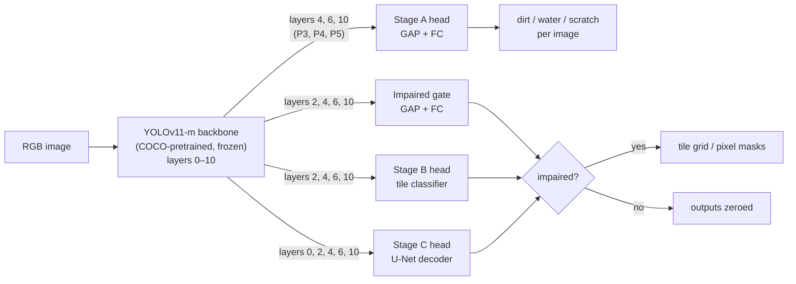

<a name="readme-top"></a>

# Camera-Lens Distortion Detection — Stages A, B and C

Master's thesis project (FAU Erlangen-Nürnberg): detecting **dirt, water and scratches** on the
protective glass in front of a camera, with a frozen YOLOv11 backbone and three small
"distortion heads" that answer three increasingly detailed questions:

| Stage | Question | Output |
|---|---|---|
| **A** — image level | *Is* there dirt / water / a scratch in this image? | 3 probabilities per image |
| **B** — tile level | *Roughly where*? | 3 probabilities per 32×32-px tile (16×16 grid) |
| **C** — pixel level | *Exactly where*? | 3 probability masks at full resolution |
| **Gate** | Is the image impaired at all? | 1 probability; clean images skip B/C output |

This branch (`feature/stages-a-b-c`) contains the complete development of all three stages and
the gate: data generation, models, training, evaluation, HPC job scripts, reports and tests.
A standing project goal is to also catch **faint** (low-severity) distortions, so every result
is reported per severity level as well.

<p align="right">(<a href="#readme-top">back to top</a>)</p>

---

## Table of contents

1. [Results at a glance](#results-at-a-glance)
2. [How it works](#how-it-works)
3. [Data](#data)
4. [Models](#models)
5. [Getting started](#getting-started)
6. [Usage](#usage)
7. [Running on the FAU HPC (TinyGPU)](#running-on-the-fau-hpc-tinygpu)
8. [Repository structure](#repository-structure)
9. [Development history](#development-history)
10. [Key design decisions](#key-design-decisions)
11. [Known limitations and next steps](#known-limitations-and-next-steps)
12. [Documentation](#documentation)
13. [References and acknowledgments](#references-and-acknowledgments)

---

## Results at a glance

All numbers are on the held-out **test split** (1400 images from 100 source photos never seen
in training), with per-class decision thresholds tuned on the validation split. AP = average
precision (area under the precision-recall curve); "faint" = low-severity distortions.

| Stage | Model | AP dirt / water / scratch | Faint AP dirt / water / scratch |
|---|---|---|---|
| **A** (image) | `stage_a_multiscale` — strides 8–32 | 0.975 / 0.979 / 0.937 | 0.861 / 0.886 / 0.732 |
| **B** (32-px tile) | `stage_b_h32` — strides 4–32, 32-ch head, flips | 0.933 / 0.921 / 0.829 | 0.808 / 0.774 / 0.666 |
| **C** (pixel, scored on 8×8 cells) | `stage_c_unet_t2` — U-Net, strides 2–32 | 0.901 / 0.890 / 0.780 | 0.735 / 0.686 / 0.557 |

**Gate** (`impaired_gate_multiscale`, strides 4–32): ROC-AUC 0.956; at threshold 0.140 it keeps
95.3% of impaired images and lets 31% of clean images through. With the gate, Stage B wrongly
flags 9% / 10% / 6% of clean test images (dirt / water / scratch), versus 15% / 15% / 14% without.

In short: dirt and water are found reliably at every level, also when faint. Scratch is the
hardest class — thin, and a small fraction of the image — and faint scratches remain the
weakest case in every stage.


*Stage C: original / distorted (with the gate's verdict) / ground-truth mask / predicted mask /
gated mask.*

<p align="right">(<a href="#readme-top">back to top</a>)</p>

---

## How it works



Backbone layers the heads read (map sizes for a 512×512 input; Stage A runs at 640×640, so its
maps are 80×80 / 40×40 / 20×20):

| Layer | Module | Stride | Map size | Channels | Used by |
|---|---|---|---|---|---|
| 0 | `Conv` | 2 | 256×256 | 64 | Stage C |
| 2 | `C3k2` | 4 | 128×128 | 256 | Stage B, Stage C, gate |
| 4 | `C3k2` (P3) | 8 | 64×64 | 512 | Stage A, Stage B, Stage C, gate |
| 6 | `C3k2` (P4) | 16 | 32×32 | 512 | Stage A, Stage B, Stage C, gate |
| 10 | `C2PSA` (P5, end of backbone) | 32 | 16×16 | 512 | all heads |

- The **backbone is never trained**; only the small heads are. This follows the "frozen
  backbone" option of [`architecture.md`](architecture.md) §3: the detection task the backbone
  serves can never be harmed by distortion training.
- Each head reads the backbone at the depths (*strides*) that suit its task. A stride-*s* map
  has one position per *s*×*s* image patch: deep maps (stride 32, "P5") carry abstract scene
  content, shallow maps (stride 2–8) still carry the fine textures that faint distortions and
  thin scratches leave. The finer the output, the finer the maps that help (see the layer
  study in [Development history](#development-history)).
- The **gate** is trained separately and zeroes Stage B/C predictions for images it considers
  clean, cutting false alarms on clean images.

<p align="right">(<a href="#readme-top">back to top</a>)</p>

---

## Data

**Source photos.** 1000 frames from the public **MIO-TCD** (Miovision Traffic Camera Dataset,
localization part), sampled reproducibly (seed 0) by `scripts/sample_mio_tcd.py` from the
official tar archive, which must be downloaded separately.

**Synthetic distortions.** The real two-camera capture rig (Part 1 of the thesis,
[`docs/data_collection_pipeline.md`](docs/data_collection_pipeline.md)) has not been used in the
field yet, so distortions are synthesized:

- **dirt** and **water** — from [`physical_lens_soiling`](https://github.com/JannLi/physical_lens_soiling),
  vendored in `third_party/` with the supervisor's permission;
- **scratch** — a custom procedural generator (broken streaks of varying width), since that
  repository has no scratch effect;
- **severity** — every effect is blended back toward the clean image at strength
  low 0.3 / medium 0.6 / high 1.0.

Each effect also returns its exact pixel mask, so **no manual annotation** is needed. Ground
truth is **severity-independent**: a faint patch is labeled exactly like a strong one, because
it still has to be found.

**Datasets** (git-ignored, regenerated by the builder scripts):

| Dataset | Used by | Content |
|---|---|---|
| `data/processed/stage_a` | Stage A | 14000 images at 640 px + image labels |
| `data/processed/stage_b` | Stage B, Stage C, gate | 14000 images at 512 px + 16×16 tile labels + full-resolution pixel masks |

Each source photo yields 14 variants: 1 clean, 9 single distortions (3 classes × 3
severities) and 4 combinations (dirt+water, dirt+scratch, water+scratch, all three). Splits are
made **by source photo** (no scene appears in two splits): **11200 / 1400 / 1400**
train / val / test. Model choices are made on the validation split; the test split is used
only for final numbers.

<p align="right">(<a href="#readme-top">back to top</a>)</p>

---

## Models

| Component | Architecture | Loss | Trained parameters |
|---|---|---|---|
| Backbone | Ultralytics YOLOv11-m, COCO weights, frozen | — | 0 |
| Stage A head | global-average-pool each tap → concat → FC(64) → FC(3) | BCE with `pos_weight` | ~99k |
| Stage B head | 1×1 conv per tap (32 ch) → pool to 16×16 grid → 3×3 fuse → 3 logits per tile | focal (α 0.75, γ 2) | ~95k |
| Stage C head | U-Net-style decoder over 5 taps, predicts at stride 2, upsampled to 512 px | Dice + BCE | ~452k |
| Gate | global-average-pool each tap → FC → 2-way softmax | class-weighted cross-entropy | ~115k |

Decision thresholds are tuned **per class** on the validation split (best F1). The gate's
threshold instead keeps ≥ 95% of impaired validation images, because its job is to drop clean
images without discarding real distortions.

Implementation: `src/models/backbone.py` (frozen backbone, multi-layer taps),
`src/models/distortion_head.py` (all heads), `src/models/losses.py`.

<p align="right">(<a href="#readme-top">back to top</a>)</p>

---

## Getting started

**Requirements:** Python 3.11+, PyTorch, Ultralytics, OpenCV and the packages in
[`requirements.txt`](requirements.txt). Training was done on NVIDIA A100 / RTX 3080 / RTX 2080 Ti
GPUs; the code also runs on CPU (slowly) for smoke tests.

```bash
git clone https://github.com/pelemele1/Farhad_Vaseghi_MA.git
cd Farhad_Vaseghi_MA
git checkout feature/stages-a-b-c
python -m venv .venv && source .venv/bin/activate    # Windows: .venv\Scripts\activate
pip install -r requirements.txt
python -m pytest -q tests                             # ~235 tests
```

Download the COCO-pretrained YOLOv11-m weights (`yolo11m.pt`, from the Ultralytics releases) to
`weights/yolo11m.pt`. Then build the data:

```bash
python scripts/sample_mio_tcd.py --tar <path>/MIO-TCD-Localization.tar --out data/raw/mio_tcd --n 1000 --seed 0
python scripts/build_stage_a_dataset.py --source data/raw/mio_tcd/images \
    --out data/processed/stage_a --variants 14 --include-combos --include-severity
python scripts/build_stage_b_dataset.py --source data/raw/mio_tcd/images \
    --out data/processed/stage_b --variants 14 --include-combos --include-severity \
    --dirt-threshold 0.20 --water-threshold 0.25 --scratch-threshold 0.015 --save-pixel-masks
```

<p align="right">(<a href="#readme-top">back to top</a>)</p>

---

## Usage

Every training script keeps the epoch with the best validation loss and writes it to `--out`.
Add `--smoke-test` to any training script for a 1-epoch CPU run on 8 images.

**Stage A**
```bash
python scripts/train_stage_a.py --data data/processed/stage_a --taps 8,16,32 --epochs 20 \
    --img-size 640 --device cuda --out checkpoints/stage_a_multiscale
python scripts/evaluate_stage_a.py --checkpoint checkpoints/stage_a_multiscale/stage_a_head.pt \
    --data data/processed/stage_a --split test --tune-thresholds --by-severity
```

**Gate**
```bash
python scripts/train_impaired_gate.py --data data/processed/stage_b --arch multiscale \
    --img-size 512 --epochs 20 --device cuda --out checkpoints/impaired_gate_multiscale
python scripts/evaluate_impaired_gate.py --checkpoint checkpoints/impaired_gate_multiscale/impaired_gate_head.pt \
    --data data/processed/stage_b --split test --tune-thresholds --recall-target 0.95
```

**Stage B**
```bash
python scripts/train_stage_b.py --data data/processed/stage_b --arch multiscale --hflip \
    --hidden-dim 32 --fuse-kernel 3 --epochs 40 --loss focal --focal-alpha 0.75 --focal-gamma 2.0 \
    --device cuda --out checkpoints/stage_b_h32
python scripts/evaluate_stage_b.py --checkpoint checkpoints/stage_b_h32/stage_b_head.pt \
    --data data/processed/stage_b --split test --tune-thresholds --by-severity \
    --gate-checkpoint checkpoints/impaired_gate_multiscale/impaired_gate_head.pt --gate-threshold 0.140
```

**Stage C**
```bash
python scripts/train_stage_c.py --data data/processed/stage_b --arch unet --taps 2,4,8,16,32 \
    --epochs 25 --batch-size 16 --img-size 512 --device cuda --out checkpoints/stage_c_unet_t2
python scripts/evaluate_stage_c.py --checkpoint checkpoints/stage_c_unet_t2/stage_c_head.pt \
    --data data/processed/stage_b --split test --tune-thresholds --by-severity \
    --gate-checkpoint checkpoints/impaired_gate_multiscale/impaired_gate_head.pt --gate-threshold 0.140
```

**Report figures** — `scripts/visualize_stage_{a,b,c}_results.py` and
`scripts/visualize_stage_a_class_examples.py`; `scripts/hpc/regenerate_report_figures.sh`
rebuilds every figure used in the reports in one go.

Useful options: `--taps` (backbone strides a head reads), `--class-weights` (per-class loss
weights), `--low-severity-weight` (oversample faint images), and for Stage B `--hflip`,
`--weight-decay`, `--dropout`, `--hidden-dim`, `--fuse-kernel`.

<p align="right">(<a href="#readme-top">back to top</a>)</p>

---

## Running on the FAU HPC (TinyGPU)

All final models were trained on NHR@FAU's TinyGPU cluster. Setup and job submission are
described in [`docs/hpc_stage_a.md`](docs/hpc_stage_a.md); job scripts live in `scripts/hpc/`:

- `setup_env.sh` — one-time conda environment;
- `run_python.slurm` / `run_shell.slurm` — run any command (or "train && evaluate") on a GPU node;
- `layer_study.sh`, `stage_b_regularization.sh`, `stage_b_small_head.sh` — the experiment
  sweeps behind the reports;
- `regenerate_report_figures.sh` — all report figures.

Practical notes: a100 jobs need a typed GPU request (`--gres=gpu:a100:1`); V100 nodes cannot be
used (the environment's PyTorch build lacks their kernels); Slurm scripts must have LF line
endings and use `python3 -u` so logs appear immediately. The raw stdout of every job behind the
reported numbers is kept at the repository root (`*_<jobid>.out`) and in `study_logs/`.

<p align="right">(<a href="#readme-top">back to top</a>)</p>

---

## Repository structure

```text
.
├── architecture.md          # design concept: shared backbone + distortion head, Stages A/B/C
├── overview.md, setup.md    # thesis overview; two-camera rig (Part 1)
├── src/
│   ├── data/                # MIO-TCD sampling, Stage A/B/C datasets
│   ├── soiling/             # distortion effects, dataset builder, tile labels
│   ├── models/              # frozen backbone, all heads, losses
│   └── eval/                # metrics, threshold tuning, gate, severity breakdown
├── scripts/                 # build_*, train_*, evaluate_*, visualize_*, diagnostics
│   └── hpc/                 # TinyGPU Slurm/shell scripts
├── tests/                   # pytest suite (~235 tests)
├── docs/
│   ├── stage_a_final_report.md, stage_b_final_report.md, stage_c_final_report.md
│   ├── development_log.md   # full session-by-session history
│   ├── data_collection_pipeline.md, hpc_stage_a.md
│   ├── diagrams/            # architecture diagram (draw.io)
│   └── images/              # all report figures
├── third_party/physical_lens_soiling/   # vendored dirt/water generator
├── notebooks/               # Colab notebook used for one Stage B run
├── study_logs/, *_<jobid>.out           # raw HPC job logs behind the reported numbers
├── raw/, wiki/              # personal reading knowledge base (see CLAUDE.md), not code
└── data/, checkpoints/, weights/        # git-ignored: datasets, trained heads, YOLO weights
```

<p align="right">(<a href="#readme-top">back to top</a>)</p>

---

## Development history

The full record — every decision, dead end and intermediate number — is in
[`docs/development_log.md`](docs/development_log.md). In summary:

| When | Sessions | What was done |
|---|---|---|
| 2026-08-23 | 1–5 | Scope set to Stage A on MIO-TCD. 1000-image pilot subset. `physical_lens_soiling` vendored for dirt/water; custom scratch generator built and tuned against a real scratched-lens photo. |
| 2026-08-24 | 6–14 | Dataset builder; frozen YOLOv11-m + Stage A head; training script; TinyGPU setup and first real runs (three hardware-specific bugs fixed); evaluation script; first Stage A report; field protocol for the real two-camera capture. |
| 2026-08-31 – 09-04 | 15–18 | **Stage B** tile classification. Scratch tiles are rare (~1–2%), so plain BCE over-predicted scratch everywhere; **focal loss** (α 0.75) fixed it. Remediation experiments; Stage A qualitative examples. |
| 2026-09-17 – 09-25 | 19–20 | Supervisor feedback: architecture diagram, ROC/PR curves, per-class thresholds, a localized sum-of-squares loss (compared, not adopted), **multi-distortion combos**, the **impaired gate** as a real inference-time filter, tile-threshold recalibration, and **balanced low/medium/high severities**. |
| 2026-09-26 | 21 | **Stage C** pixel segmentation, v1 (decoder on P5 only — scratch AP 0.17). |
| 2026-09-26 | 22 | Full audit. Main bug: ground truth had been scaled by severity, labeling most of a faint patch as clean — fixed to **severity-independent** labels. Multi-scale Stage B head and **U-Net** Stage C decoder; gate calibration fixed (resolution mismatch; threshold by recall target). |
| 2026-09-26/27 | 23 | **Layer study** for every stage, plus a new stride-2 tap: A best at strides 8–32, B at 4–32, C at 2–32, gate at 4–32. Extra loss weight on scratch tested and rejected (it hurt faint dirt/water). |
| 2026-09-27 | 24–25 | **Stage B overfitting**: train/val gap from too few distinct scenes. Weight decay and dropout only delayed it; horizontal flips plus a **smaller 32-channel head** keep validation loss improving to epoch 38, at −0.005 AP, and cut clean-image false alarms (water 42% → 15%). |
| 2026-09/10 | — | Report figures cleaned up (legends, titles, axis labels); branch renamed from `feature/stage-a-mio-tcd` to `feature/stages-a-b-c`. |

Effect of the main improvements on faint-distortion AP (test split, dirt / water / scratch):

| Stage | Before | After |
|---|---|---|
| A | 0.702 / 0.773 / 0.665 (P5 only) | 0.861 / 0.886 / 0.732 (strides 8–32) |
| B | 0.27 / 0.24 / 0.20 (P5-only head) | 0.808 / 0.774 / 0.666 (multi-scale, flips, 32 ch) |
| C | scratch AP 0.17 overall (P5-only decoder) | 0.735 / 0.686 / 0.557 (U-Net, strides 2–32) |

<p align="right">(<a href="#readme-top">back to top</a>)</p>

---

## Key design decisions

- **Frozen backbone** — no risk of degrading the primary detection task; only 0.1–0.45M
  parameters per head are trained.
- **Multi-layer taps instead of P5 only** — deviates from the literal `architecture.md` Stage A
  design (kept as `--taps 32` for reference) because the finer maps roughly triple faint-distortion
  AP in Stage B, make thin scratches segmentable in Stage C, and add +0.13 faint AP in Stage A.
- **Severity-independent ground truth** — required for the faint-distortion goal.
- **Focal loss for Stage B** — handles the extreme tile-level imbalance of scratches.
- **Per-class thresholds** tuned on validation; **gate threshold by recall** (≥ 95%).
- **Selection on validation, reporting on test** — the test split never influenced a choice.
- **Stage B: flips + 32-channel head** — the best trade-off between accuracy and overfitting;
  other augmentations (color, crops, vertical flips) were ruled out because they would change
  what a faint distortion looks like or break the tile grid.

<p align="right">(<a href="#readme-top">back to top</a>)</p>

---

## Known limitations and next steps

- **Synthetic distortions only.** Nothing has been measured on real soiled-lens photos; the real
  two-camera capture (Part 1) is the natural next step, with Stage C pseudo-masks from
  difference images as `architecture.md` §5 describes.
- **Small pilot dataset** — 1000 source scenes. Stage B still shows a small train/val gap that
  only more distinct scenes (e.g. more MIO-TCD images) would close without losing accuracy.
- **Faint scratches** are the weakest case in every stage (faint AP 0.56–0.73).
- **Grey haze**: dirt and water share a fog-texture family and are sometimes confused.
- **The gate** occasionally erases a correct scratch detection (Stage B scratch AP 0.829 → 0.789
  with the gate).
- **Backbone never fine-tuned** — joint training (`architecture.md` §3, option 2) is untested.

<p align="right">(<a href="#readme-top">back to top</a>)</p>

---

## Documentation

| Document | Content |
|---|---|
| [`docs/stage_a_final_report.md`](docs/stage_a_final_report.md) | Stage A and the gate: method, layer study, results per severity, figures |
| [`docs/stage_b_final_report.md`](docs/stage_b_final_report.md) | Stage B: tile labels, layer study, overfitting study, results, figures |
| [`docs/stage_c_final_report.md`](docs/stage_c_final_report.md) | Stage C: U-Net decoder, layer study, pooled-cell evaluation, results, figures |
| [`docs/development_log.md`](docs/development_log.md) | Complete chronological development history (Sessions 1–25) |
| [`architecture.md`](architecture.md) | Design concept the stages follow |
| [`docs/data_collection_pipeline.md`](docs/data_collection_pipeline.md) | Field protocol for the real two-camera dataset (Part 1) |
| [`docs/hpc_stage_a.md`](docs/hpc_stage_a.md) | How to run on NHR@FAU TinyGPU |

Each report ends with the exact commands that reproduce its numbers and figures.

<p align="right">(<a href="#readme-top">back to top</a>)</p>

---

## References and acknowledgments

- **MIO-TCD** — Luo et al., "MIO-TCD: A New Benchmark Dataset for Vehicle Classification and
  Localization", IEEE TIP 2018.
- **physical_lens_soiling** — https://github.com/JannLi/physical_lens_soiling (dirt and water
  effects, vendored with permission).
- **YOLOv11** — Ultralytics, https://github.com/ultralytics/ultralytics.
- **OmniDet** — Kumar et al., RA-L 2021 (shared encoder, soiling decoder, frozen-encoder training).
- **SoilingNet** — Uricár et al., 2019 (tile-level soiling classification, the basis of Stage B).
- **Focal loss** — Lin et al., "Focal Loss for Dense Object Detection", ICCV 2017.
- **U-Net** — Ronneberger et al., MICCAI 2015.

Computing resources: NHR@FAU (TinyGPU cluster), Friedrich-Alexander-Universität
Erlangen-Nürnberg.

**Author:** Farhad Vaseghi — Master's thesis, FAU Erlangen-Nürnberg.

<p align="right">(<a href="#readme-top">back to top</a>)</p>
