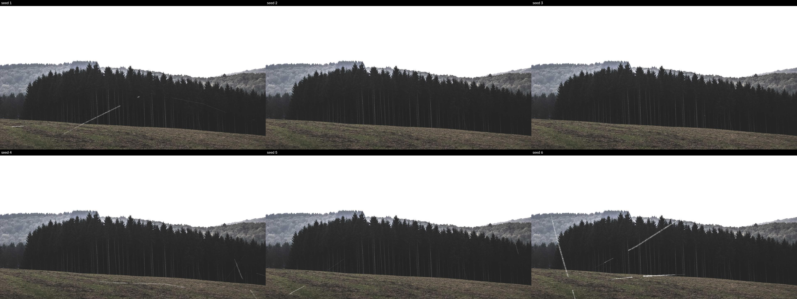
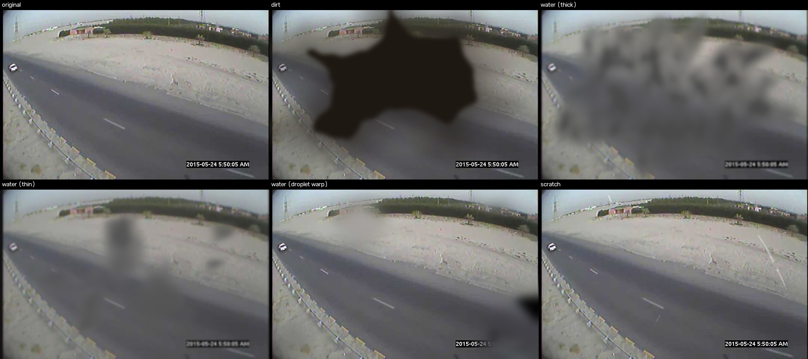
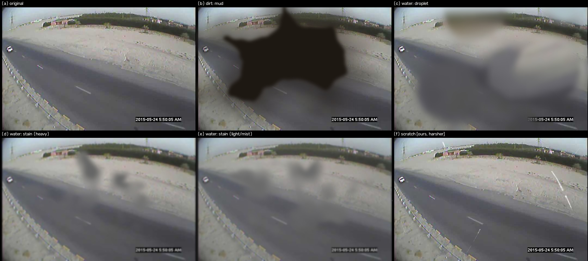
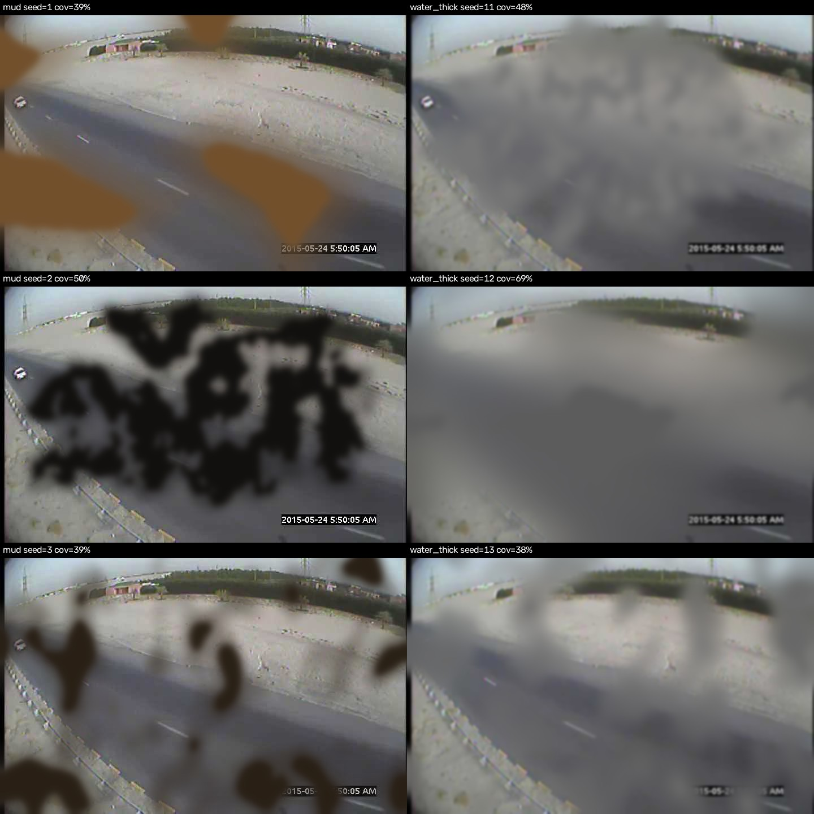

# Development Log

Chronological record of what was done and why, so progress can be followed without
digging through git history. One entry per development session/phase.

---

## Session 1 — Scope reset: Stage A on MIO-TCD, scratch-effect method choice

**Date:** 2026-08-23

`overview.md`, `architecture.md`, `setup.md`, and
`only_for_me/only_for_my_research_thesis_concept.md` / `..._ablations.md` are the source
of truth for what gets built (`README.md` is an unrelated generic template).

**Scope for this pass**, per architecture.md §2 and the supervisor's guidance:
- Dataset: **MIO-TCD** (Miovision Traffic Camera Dataset), not BDD100K.
- Target: Part 2, **Stage A only** — image-level multi-label distortion classification
  (`dirt` / `water` / `scratch`), GAP + FC + sigmoid on the YOLO backbone's P5 feature map,
  frozen COCO-pretrained backbone (no detection fine-tuning on MIO-TCD in this pass).
- Distortion source: synthetic, via https://github.com/JannLi/physical_lens_soiling for
  `dirt`/`water` — overview.md explicitly names this repo as a sanctioned alternative to
  the real dual-camera rig.
- Training destination: NHR@FAU HPC (TinyGPU cluster, SLURM). Per standing project rule,
  Claude prepares code and job scripts only — training itself runs on the user's own HPC
  allocation, never launched from here.

**Gap:** `physical_lens_soiling` has no `scratch` effect, and no ready-made lens-scratch
codebase exists. Resolved by building and comparing three candidates on one sample image
before committing to any of them for the full dataset build.

### Scratch-method comparison

1. **FilmDamageSimulator** (`github.com/daniela997/FilmDamageSimulator`, MIT licensed).
   Cloned and ran directly — composited 3 real scratch crops (extracted from their
   annotated 35mm film-scan dataset) plus 3 outputs of their own procedural
   `line_scratch()` (Perlin-noise-based fading line) onto the sample image. Needed one
   one-line fix for a NumPy 2.x incompatibility (`int()` on a size-1 array), otherwise ran
   as-is. Visual character: convincing as *film-grain* damage, but reads as photographic
   scratch texture rather than a lens/glass scratch.
2. **ScratchSim** (arXiv:2607.27065). Its public repo
   (`github.com/saptarshineil/ScratchSim`) turned out to be a full BlenderProc **3D**
   pipeline rendering a specific toy-car asset with material/normal-map perturbation —
   none of it applies to flat 2D photos. What was actually tested is a from-scratch
   reimplementation of just the paper's described 2D scratch-mask step (cubic Bézier
   curve through 4 random points + Gaussian blur), since that's the only part of their
   method that transfers to our setting.
3. **Own procedural generator** (`src/soiling/effects.py::add_scratch`) — built in the
   same mask + alpha-blend style `physical_lens_soiling` already uses for its other
   effects. Iterated twice against user feedback:
   - v1: smooth curve, tapered width, single continuous stroke → looked too clean/uniform.
   - v2: added random on/off gaps along the curve (a real lens scratch only catches light,
     and so is only visible, intermittently) plus bright "glint" points at a few spots —
     validated against a real reference photo of a scratched camera lens the user found
     (Lensrentals.com, "Front Element Scratches"), which visibly shows a discontinuous,
     not-solid scratch line.
   - v3 (final): removed the glint points (looked artificial/unnatural per user feedback)
     — kept the broken/discontinuous segments, and replaced the single global taper with a
     width that meanders between thick and thin along the streak (several blended random
     Gaussian "lobes"), which reads as natural irregular scratch depth without needing an
     explicit highlight marker.

**Result — v1 vs. v2 vs. v3** (same sample photo, all three methods; own generator in the
bottom row of each):


**Decision: own procedural generator.** Rationale — full parametric control (count,
length, width, curvature, opacity all independently tunable for later class-balance
tuning), no external code/license/domain-mismatch dependency (FilmDamageSimulator = film
grain, ScratchSim = industrial 3D render, neither is a lens/glass scratch), composes
naturally with `physical_lens_soiling`'s own mask+blend convention for `dirt`/`water`, and
— unlike either external option — was directly iterated against real-world reference
evidence of what a scratched lens actually looks like.

**Follow-up tweak:** the v3 renders above all looked uniformly thin. Widths were already
random per scratch, but the default range (`width_px=(1, 3)`) was too narrow, and the
meandering-width profile only reaches its sampled max briefly near each "lobe" center — so
in practice almost every stroke stayed close to 1px regardless of seed. Widened the default
to `width_px=(1, 7)` so a clearly thick scratch is actually reachable. Confirmed across 6
random seeds that both thin and thick streaks now occur:



**Delivered this session:**
- `src/soiling/effects.py` — `add_scratch()` / `generate_scratch_mask()`, the finalized
  procedural scratch generator.
- `tests/test_effects.py` — 6 fast unit tests (mask shape/range, non-empty, discontinuity,
  image actually changes, seeded reproducibility, zero-scratches no-op).

**Not yet done (next session):** port `physical_lens_soiling`'s `dirt`/`water` effects
into `src/soiling/effects.py` alongside `add_scratch`, build the MIO-TCD-based dataset
pipeline (`src/soiling/dataset_builder.py`), and the Stage A model/training/eval code —
per the approved plan.

---

## Session 2 — MIO-TCD pilot subset (Step 1)

**Date:** 2026-08-23

Downloaded `MIO-TCD-Localization.tar` (official archive, CC BY-NC-SA 4.0, 3.5 GB,
137,743 full-frame traffic-camera images) directly from the dataset provider. The archive
only offers a full-dataset download — no partial/per-image API — so the workflow is:
download once, then sample locally.

**Archive layout:** `train/` (110,000 images, has public ground truth in `gt_train.csv`,
one row per object: `image_id,class,x1,y1,x2,y2`) and `test/` (27,743 images, labels held
out for the competition, not usable). Sampled from `train/` specifically so the same pilot
subset stays reusable for any later detection-related work, even though Stage A itself
doesn't need the boxes.

**Pilot size:** 1,000 images (~1% of the train split) — matches the project's own
pilot-first philosophy (setup.md), and each source image will yield several synthetic
distortion variants in the next step, so 1,000 sources is enough to produce a few thousand
training examples for Stage A without processing the full archive.

**Delivered this session:**
- `src/data/mio_tcd.py` — pure, testable functions (`list_train_image_ids`,
  `sample_image_ids`, `filter_gt_rows`, `extract_images`) plus `build_pilot_subset()`
  tying them together: deterministic random sample of image ids (seeded) → extract just
  those images from the tar (not the whole archive) → filter the matching `gt_train.csv`
  rows → write a manifest of the sampled ids for reproducibility.
- `scripts/sample_mio_tcd.py` — CLI wrapper (`--tar`, `--out`, `--n`, `--seed`).
- `tests/test_mio_tcd.py` — 6 tests against a small synthetic in-memory tar (no real
  MIO-TCD download needed to run the suite).
- Ran it for real: `python scripts/sample_mio_tcd.py --tar D:/MasterThesis_FAU/MIO-TCD-Localization.tar --out data/raw/mio_tcd --n 1000 --seed 0`
  → 1,000 images (27 MB), 3,168 matching ground-truth rows, seed=0 manifest. Verified a
  random sample of the extracted images decodes correctly and looks like a diverse mix of
  cameras/scenes. The extracted images themselves are not committed (`data/` is
  gitignored) — only the sampling code and the seed are, so the exact same 1,000-image
  subset is reproducible by anyone with the archive.

**Not yet done (next session):** the synthetic distortion pipeline (`dirt`/`water` ported
from `physical_lens_soiling` + the existing `add_scratch`) applied to this 1,000-image
subset to build the actual Stage A multi-label dataset.

---

## Session 3 — Vendoring physical_lens_soiling; `{dirt, water, scratch}` taxonomy complete

**Date:** 2026-08-23

The supervisor cleared direct use of `physical_lens_soiling`'s code (it ships no LICENSE
file upstream, so this was a real permission, not an assumption). That changes Session 1's
plan from "reimplement the technique ourselves" to vendoring the actual source.

**What was vendored**, into `third_party/physical_lens_soiling/` (kept out of `src/` to
mark it clearly as external code, not ours):
- `add_mud.py` — `add_mudByTxture` (mud → our `dirt`), `add_dirtwaterByTxture` /
  `add_dirtwaterByTxture_slight` (water_thick / water_thin → our `water`, blob-blend).
- `add_droplet_distort.py` — `add_distort` (→ also `water`, but a physically different
  mechanism: an actual optical refraction/warp rather than a color blend).
- `generate_texture_paper.py` — the procedural texture generator both of the above depend on.

Deliberately **not** vendored (outside architecture.md's 3-class taxonomy, per this
session's earlier decision to drop them): `add_sun_glare.py`, `add_lensdust.py`, and their
own Albumentations-based comparison baseline.

**One real edit to the vendored files** (documented in
`third_party/physical_lens_soiling/NOTICE.md`): `add_mud.py` and `add_droplet_distort.py`
both had top-level script code that ran unconditionally on `import` (looping over a local
`image/` folder; one line was even `os.makedirs(..., exist_ok=False)`, which would crash on
a second import). Wrapped that code in `if __name__ == "__main__":` — no algorithmic
change, verified by running all four functions before/after and confirming identical
output.

**Wired into `src/soiling/effects.py`** as `add_dirt()` and `add_water()`, matching
`add_scratch`'s `(image, seed=None) -> (distorted_image, mask)` contract:
- `add_dirt`: picks a random texture style, calls `add_mudByTxture`.
- `add_water`: randomly picks one of three mechanisms per call — `'thick'`, `'thin'`
  (blob-blend), or `'droplet'` (optical warp) — so the water class gets real mechanism
  diversity, not just opacity variants of the same blend.

All three distortion classes now exist behind one consistent interface:



**Delivered this session:**
- `third_party/physical_lens_soiling/` — vendored source + `NOTICE.md` (provenance, what
  was kept/dropped, the exact edit made) + `UPSTREAM_README.md`.
- `requirements.txt` — added at the repo root (didn't exist before); includes
  `pythonperlin`, the one new dependency the vendored code needs.
- `src/soiling/effects.py` — `add_dirt()`, `add_water()` added alongside `add_scratch()`.
- `tests/test_effects_dirt_water.py` — 5 tests (image changes, mask shape/range, seeded
  reproducibility, all three water mechanisms exercised).
- Full suite: 17 passed.

**Not yet done (next session):** `src/soiling/dataset_builder.py` — apply `add_dirt` /
`add_water` / `add_scratch` in random combination (including "clean" negatives) across the
1,000-image MIO-TCD pilot subset to produce the actual Stage A multi-label training set.

---

## Session 4 — Taxonomy check against the paper's own figure; scratch made harsher

**Date:** 2026-08-23

Checked `dirt`/`water`/`scratch` against the physical_lens_soiling paper's own Figure 1
(mud stain, flare, dust, water mist, water droplet, water stain) instead of inventing new
mechanisms — a "residue" dirt-stain variant had been considered and was dropped in favor of
matching the paper exactly.

**Decision: no invented variants.** `add_dirt`/`add_water` stay exactly as wired in Session
3 and already match the figure one-for-one (mud stain → (b)/(c), water droplet → (g), water
stain heavy/light → (h)/(i); "water mist" (f) is just `stain (light)` drawing a fog texture,
already covered by the existing texture pool). Flare and dust stay excluded (outside
architecture.md's 3-class taxonomy).

**Scratch made harsher** per feedback that it needed to read more clearly: opacity floor
`0.35 → 0.6`, blend strength `0.85 → 0.97`.



**Delivered this session:** tuning only, no new modules — `src/soiling/effects.py` opacity/
blend constants adjusted. Full suite still 17/17.

---

## Session 5 — Weak mud/water outputs traced to texture-pool luck, not a code bug

**Date:** 2026-08-23

Mud and water-stain renders were barely visible, not matching the paper's figure. Explicit
instruction: do not modify `third_party/physical_lens_soiling/` — find and fix the problem
elsewhere.

**Root cause:** three of our seven texture-style choices in `_random_dirt_water_texture()`
(our own sampling code, not vendored) gave near-invisible mask coverage by construction —
most strikingly `r_water_mud`, despite its name, averaged under 13% coverage vs. ~40-51%
for the reliable modes. Earlier demo images happened to draw from that weak tail by chance.

**Fix:** narrowed `_DIRT_WATER_TEXTURE_MODS` (our sampling pool, not the vendored
algorithm) to the five modes that measure consistently strong: `r_fog`, `thick_fog`,
`f_water_mud`, `big_rain_drop`, `little_rain_drop`. No vendored file touched.



**Delivered this session:** `src/soiling/effects.py` — `_DIRT_WATER_TEXTURE_MODS` narrowed
from 7 to 5 entries. Full suite: 17/17.

---

## Session 6 — Dataset builder: precompute strategy, balanced single-distortion variants

**Date:** 2026-08-24

**`add_scratch` interface unified with `add_dirt`/`add_water`.** It previously took
explicit severity kwargs (`n_scratches`, `length_frac`, `width_px`, `opacity`, ...); changed
to `add_scratch(image, seed=None)`, with the amount randomized internally, matching the
other two effects' style — needed so all three effects can be driven identically by the
dataset builder. `generate_scratch_mask(...)` still takes the full parameter set directly
for anyone who wants explicit control outside the dataset pipeline.

**Augmentation strategy: precompute, not on-the-fly.** Before building the dataset, we
weighed applying distortions live during training (on-the-fly, discussed vs. precomputing a
static set once) given training happens on the shared FAU HPC allocation. The vendored
effects (Perlin-texture generation, piecewise-affine warps for the droplet mechanism) are
CPU-bound and non-trivial per call; a frozen-backbone, small-head Stage A model has a cheap
GPU step, so an on-the-fly CPU pipeline risked bottlenecking the GPU on every batch, with the
added cost paid on every epoch instead of once. Decision: precompute a static dataset once,
train against fixed files. `src/soiling/dataset_builder.py` and
`scripts/build_stage_a_dataset.py` implement this — one pass over the source images writes
distorted variants + a `metadata.csv` (`path, source_id, variant_id, split, dirt, water,
scratch`) to `data/processed/stage_a/`.

**Splits are assigned per source image, not per variant** (`assign_splits`), so all variants
of the same source frame stay in the same split — otherwise near-duplicate variants of one
frame could leak across train/val/test.

**Reproducibility gap found and accepted as a known limitation.** `add_distort` (vendored,
used for the water "droplet" mechanism) draws via Python's stdlib `random.choice`, not
`np.random` — seeding only `np.random.seed()` left that draw dependent on leftover global
state. Fixed with a `_seed_all(seed)` helper in `effects.py` that seeds both `np.random` and
`random`, used in `add_dirt`/`add_water`/`generate_scratch_mask`. Deeper down, `add_dirt`
and `add_water` (the texture-based mechanisms) still aren't pixel-reproducible: the vendored
`generate_texture_paper.py` calls `pythonperlin.perlin(...)` without a `seed=` argument, and
`pythonperlin`'s own `make_grads()` then calls `np.random.seed(None)` internally — silently
re-randomizing the global RNG from OS entropy on every texture draw, from inside a
*dependency* of the vendored code, not the vendored code itself. Fixing it cleanly would mean
monkey-patching `pythonperlin.perlin` from our own code. **Decision: leave it as-is.** The
dataset is generated once and the resulting files are the artifact — a regenerated copy
isn't expected to be pixel-identical, only label-identical (same seed → same effect assigned
to each variant slot). `tests/test_dataset_builder.py`'s reproducibility test checks labels
only, with the reasoning recorded inline.

**First build was rejected: too many clean images, and combined distortions.** The initial
design sampled each of dirt/water/scratch independently per variant with `effect_prob=0.35`,
which (a) could combine two or three distortion types onto the same image, and (b) skewed
~65% of variants clean by chance (three independent 65%-fail rolls). Both were wrong for
this dataset: **exactly one distortion type per image, never combined**, and **not
overwhelmingly clean**. Replaced with deterministic balanced assignment
(`assign_variant_kinds`): for each source image, the variant slots are filled by cycling
through `("clean", "dirt", "water", "scratch")` and shuffling the order — with
`variants_per_image=4` this guarantees exactly one clean + one of each distortion per source
image, every time, rather than leaving the mix to chance.

**Delivered this session:** `src/soiling/dataset_builder.py` (new), `scripts/
build_stage_a_dataset.py` (new), `tests/test_dataset_builder.py` (new, 11 tests). Full suite:
28/28. Ran the real build against the 1000-image MIO-TCD pilot subset
(`data/raw/mio_tcd/images`, from Session 2):

| | count |
|---|---|
| total images | 4000 (1000 sources × 4 variants) |
| train / val / test | 3200 / 400 / 400 |
| dirt positive | 1000 (25.0%) |
| water positive | 1000 (25.0%) |
| scratch positive | 1000 (25.0%) |
| clean (all-zero label) | 1000 (25.0%) |

Output not committed (gitignored, under `data/`) — regenerable via `python
scripts/build_stage_a_dataset.py --source data/raw/mio_tcd/images --out
data/processed/stage_a --variants 4 --seed 0`.

**Follow-up (2026-08-24): dataset rebalanced again.** The 0.35 `effect_prob` design above
still let a variant land clean or combine distortions by chance; direct feedback ("i might
have 3/4 images clean and this shouldnt be like that", "dont, ever mix two type of
distortion. only one") replaced it with the fully deterministic
`assign_variant_kinds` scheme described above (cycle `("clean", "dirt", "water",
"scratch")`, shuffle order) and dropped `variants_per_image` from 12 → 5 → **4** (final).
Rebuilt for real against the 1000-image pilot subset: 4000 images, exactly 1000/1000/1000/
1000 (25.0% each) for clean/dirt/water/scratch, 3200/400/400 train/val/test.

---

## Session 7 — Stage A model: frozen YOLO backbone + distortion head (Step 3)

**Date:** 2026-08-24

Added `torch` and `ultralytics` (CPU-only torch locally — training happens on the FAU HPC,
never here) and downloaded COCO-pretrained `yolo11m.pt` into `weights/` (gitignored via the
existing `*.pt` rule).

**`src/models/backbone.py` — `FrozenYOLOBackbone`.** Traced Ultralytics' `YOLO('yolo11m.pt')
.model.model` (a flat 24-layer `nn.Sequential`) to find the actual P5 tap: layers 0-10
(Conv/C3k2 stages, SPPF, C2PSA) are the shared backbone, each taking input only from the
immediately preceding layer; layer 11 is the neck's first `Upsample`, where FPN/PAN fusion
begins. So layer 10 (`C2PSA`)'s output — confirmed 512 channels, stride 32 — is P5. The
module runs just those 11 layers, freezes every parameter (`requires_grad = False`), and
overrides `.train()` to always force `eval()` so batchnorm stats can't drift while only the
head is being trained (architecture.md §3 Option 1: frozen backbone).

**`src/models/distortion_head.py` — `StageADistortionHead`.** GAP + 2×FC exactly per
architecture.md §6. Returns raw logits rather than post-sigmoid probabilities: §4 specifies
`BCEWithLogitsLoss`, which applies sigmoid internally for numerical stability — an explicit
`Sigmoid` layer in the head would double-apply it. `torch.sigmoid(head(features))` gives the
per-class probabilities §2 describes; documented inline to make the reasoning explicit
rather than silently deviating from the doc's literal "...+ sigmoid" wording.

**`src/models/losses.py`.** `compute_pos_weight(metadata_csv, split=...)` reads the
dataset's own `metadata.csv` and computes the standard `#negatives / #positives` per class
(architecture.md §4: "`pos_weight` ... for class imbalance"); `build_stage_a_loss` just
wraps `BCEWithLogitsLoss(pos_weight=...)`.

**Crash found and fixed: `torch` + vendored `scikit-image` code together aborted the
process.** Running the full suite (model tests + the existing effects/dataset-builder
tests in one process) crashed with `Fatal Python error: Aborted` inside
`add_droplet_distort.py`'s `PiecewiseAffineTransform.estimate()` — a known Windows
MKL/OpenMP conflict: both `torch` and `numpy`/`scikit-image` bundle their own Intel OpenMP
runtime (`libiomp5md.dll`), and loading it twice aborts on first real use. Not a bug in our
code. Fixed with the standard `KMP_DUPLICATE_LIB_OK=TRUE` workaround, set in a new
`tests/conftest.py` (must run before either library is imported, hence conftest rather than
inline in a test file).

**Smoke-tested end-to-end** against a real image from the Session 6 dataset: `480×720`
input → P5 `[1, 512, 15, 23]` → head logits `[1, 3]`; `compute_pos_weight` on the train
split correctly returned `[3.0, 3.0, 3.0]` (matches the dataset's exact 25%-positive-per-
class balance: 3 negatives per positive); loss finite.

**Delivered this session:** `src/models/backbone.py`, `src/models/distortion_head.py`,
`src/models/losses.py` (all new), `tests/test_backbone.py`, `tests/test_distortion_head.py`,
`tests/test_losses.py` (new, 10 tests — 3 of which skip if `weights/yolo11m.pt` isn't
present locally), `tests/conftest.py` (new). `requirements.txt` — added `torch`,
`ultralytics`. Full suite: 38/38 (all running, none skipped, since the weights are already
downloaded here).

**Not yet done (next session):** Step 4 — training script (`scripts/train_stage_a.py`,
smoke-test mode only per the standing "no training from Claude" rule) combining the
backbone, head, and loss into an actual training loop over the Stage A dataset.

---

## Session 8 — Training script (Step 4)

**Date:** 2026-08-24

**`src/data/stage_a_dataset.py` — `StageADataset`.** A `torch.utils.data.Dataset` over the
`metadata.csv` + `images/` written by `dataset_builder.py`. Filters to one `split`,
preprocesses each image the same way Ultralytics' own predictor does (BGR→RGB, resize,
HWC→CHW, `/255`) so the frozen backbone sees the input format it was actually trained on.
`max_samples` truncates the row list, used by the training script's `--smoke-test` mode.

**`scripts/train_stage_a.py`.** Frozen backbone, only `StageADistortionHead`'s parameters
go to the optimizer (`torch.optim.Adam(head.parameters(), ...)`) — matches architecture.md
§3 Option 1 exactly: backbone forward runs inside `torch.no_grad()`, only the head builds a
graph. `pos_weight` for the loss is computed once from the dataset's own `metadata.csv`
(train split). CLI: `--data`, `--weights`, `--epochs`, `--batch-size`, `--lr`, `--img-size`,
`--device`, `--out` (checkpoint dir). `--smoke-test` forces 1 epoch / batch-size 2 / CPU / 8
samples per split and skips writing a checkpoint — this is the only "training" run from this
side, per the standing rule that real training happens on the user's own FAU HPC job, never
launched from here.

Ran the smoke test for real against the actual 4000-image dataset from Session 6:
```
train=8 val=8 pos_weight=[3.0, 3.0, 3.0]
epoch 1/1  train_loss=1.0679  val_loss=1.0332  (6.0s)
```
Confirms the full backbone → head → loss → optimizer.step() pipeline actually runs on real
data, not just synthetic tensors — the point of the smoke test, not a claim about learning.

**Delivered this session:** `src/data/stage_a_dataset.py`, `scripts/train_stage_a.py` (both
new), `tests/test_stage_a_dataset.py` (5 tests), `tests/test_train_stage_a.py` (1
end-to-end subprocess test, skips without local weights). Full suite: 43/43.

**Not yet done (next session):** Step 5 — FAU HPC SLURM/env scripts
(`scripts/hpc/setup_env.sh`, `scripts/hpc/train_stage_a.slurm`), then Step 6 — evaluation
script (`scripts/evaluate_stage_a.py`, per-class precision/recall/F1/AP on the held-out
test split).

---

## Session 9 — FAU HPC SLURM/env scripts (Step 5)

**Date:** 2026-08-24

Browsed the live `doc.nhr.fau.de` TinyGPU and Python/Conda docs directly (rather than
relying on possibly-stale prior knowledge) to ground every command in what NHR@FAU actually
documents today. `portal.hpc.fau.de/ui/user` turned out to be the login-gated account/project
management portal, not technical docs — didn't attempt to log in (not our credentials);
the real technical reference is `doc.nhr.fau.de`.

**`scripts/hpc/setup_env.sh`.** One-time environment bootstrap, meant to be run from an
interactive GPU job (`salloc.tinygpu --gres=gpu:1 --time=01:00:00`) so GPU support is
correctly detected on install. Does the documented one-time conda init (points conda's
package/env storage at `$WORK` instead of the small, backed-up `$HOME`), creates a
`stage_a` conda env, sets the proxy vars TinyGPU compute nodes need for internet access,
and installs `requirements.txt` — verbatim from `doc.nhr.fau.de/environment/python-env`.

**`scripts/hpc/train_stage_a.slurm`.** Follows NHR@FAU's own documented "Python (single
GPU)" batch template exactly (`#!/bin/bash -l`, `--export=NONE` + `unset
SLURM_EXPORT_ENV`, `module load python` + `conda activate`) — requests 1 A100 GPU
(`--gres=gpu:a100:1 -p a100`) for 6h (well under the 24h cap) and runs
`scripts/train_stage_a.py --device cuda`.

**`docs/hpc_stage_a.md`** (new, separate from the project's own source-of-truth docs) — the
actual step-by-step: SSH in, clone the repo onto `$WORK` (not `$HOME` — code is already
git-backed, no second backup needed; `$WORK` has the room), get the dataset/weights there
(scp the already-built local copies, or regenerate on-cluster), run `setup_env.sh` once,
`sbatch.tinygpu scripts/hpc/train_stage_a.slurm`, monitor with `squeue.tinygpu`, retrieve
`checkpoints/stage_a/stage_a_head.pt`. Notes that partition availability (`a100` vs `v100`/
`rtx3080`) depends on the user's own project allocation (`sinfo.tinygpu` to check), which
isn't something fetchable from public docs.

**Delivered this session:** `scripts/hpc/setup_env.sh`, `scripts/hpc/train_stage_a.slurm`,
`docs/hpc_stage_a.md` (all new). No source code changed — full suite still 43/43. Nothing
here is executable/testable from this side (it's cluster-only); syntax-checked both shell
scripts with `bash -n`.

**Not yet done (next session):** Step 6 — evaluation script (`scripts/evaluate_stage_a.py`,
per-class precision/recall/F1/AP on the held-out test split), then Step 7 unit tests are
already mostly in place throughout Steps 3-4 (backbone/head/loss/dataset/training-smoke
tests) — worth a final pass to confirm full coverage against the original plan once Step 6
lands.

---

## Session 10 — First real run on TinyGPU: SSH access, three real-hardware bugs, successful training

**Date:** 2026-08-24

Walked through actually using what Session 9 built, end to end, on the user's real FAU HPC
account (`iwnt196h`, PI: Kaup, Andre) rather than just leaving it as untested scripts.

**SSH access.** A direct `ssh iwnt196h@tinyx.nhr.fau.de` failed
(`Permission denied (publickey,hostbased)`) -- TinyGPU only accepts key-based auth through a
proxy jump, not direct connections. Generated an ed25519 key pair
(`ssh-keygen -t ed25519 -f ~/.ssh/id_ed25519_nhr_fau`), uploaded the public key via the HPC
Portal's User tab, and wrote `~/.ssh/config` with the documented `csnhr.nhr.fau.de` proxy
jump + `tinyx` host block. Connected successfully on the first real attempt after that (key
propagation was near-instant, not the up-to-2h the docs warn about).

Also discovered while investigating: the JupyterHub launcher (`portal.hpc.fau.de`, "1x/2x
RTX Pro 6000 BSE MIG" + "TinyFAT" options) is a *separate*, shared, 4-hour-capped interactive
notebook service for Tier3 accounts -- unrelated to the TinyGPU SLURM batch cluster
(`sbatch.tinygpu`) these scripts target. Confirmed via `doc.nhr.fau.de/access/jupyterhub/`
rather than guessing from the dropdown alone.

**Three bugs found that only reproduce on real hardware, all fixed:**

1. **`--smoke-test` silently forced `--device cpu`**, even when `--device cuda` was passed
   explicitly -- meant the "smoke test" never actually exercised the GPU code path before a
   real job. Fixed to only force epochs/batch-size/sample-count, leaving `--device` as
   whatever was passed (`scripts/train_stage_a.py`).
2. **`pythonperlin` import crashed with `ModuleNotFoundError: No module named 'pkg_resources'`**
   on the cluster's fresh conda env, but not locally. Root cause, in two parts: (a)
   `requirements.txt` never declared `setuptools` at all (pkg_resources' provider) -- worked
   locally purely by accident, since the pre-existing miniconda base env happened to already
   have it; (b) even after adding it, `pip install setuptools` pulled the latest (84.0.0),
   which has actually *removed* pkg_resources (not just deprecated it, like the 80.10.2
   installed locally). Fixed by pinning `setuptools<81` in `requirements.txt`.
3. **The a100-targeted SLURM job sat pending forever** (`squeue` reason `AssocGrpGRES`) --
   this account's association has no GPU quota on `a100`. Confirmed via an interactive
   `salloc.tinygpu --gres=gpu:1` test, which granted an RTX3080 (via the `work` partition)
   without issue. Switched `scripts/hpc/train_stage_a.slurm` to `--gres=gpu:1 -p rtx3080` and
   lowered `--batch-size` from 32 to 16 as a precaution (RTX3080 has 10GB VRAM vs. the A100's
   40GB).

**First real training run succeeded**, job `1791674` on `rtx3080`/node `tg084`, 12 minutes
for 20 epochs (well under the 6h budget), 2.9GB/10GB peak GPU memory used:

```
epoch 1/20   train_loss=0.653  val_loss=0.431
epoch 10/20  train_loss=0.189  val_loss=0.219
epoch 20/20  train_loss=0.146  val_loss=0.205
```

Train loss dropped smoothly and monotonically; val loss dropped from 0.43 to ~0.20-0.24 with
some epoch-to-epoch noise but no runaway overfitting. `checkpoints/stage_a/stage_a_head.pt`
written successfully. Fetched back to the local machine via `scp` for Session 11's
evaluation.

**Delivered this session:** `scripts/train_stage_a.py`, `requirements.txt`,
`scripts/hpc/train_stage_a.slurm`, `docs/hpc_stage_a.md` (all fixes), plus a new local
`~/.ssh/config` (not part of the repo). Full local suite still 43/43 throughout (none of
these were local-repro bugs). A trained `stage_a_head.pt` now exists, both on the cluster
and locally.

**Also this session:** the user asked to stop adding the `Co-Authored-By: Claude` trailer to
commits in this repo -- applied from this point forward; the 8 commits before it (including
this session's fixes, made before the request) keep the trailer, left as-is rather than
rewriting already-pushed history.

---

## Session 11 — Evaluation script (Step 6) and first real Stage A results

**Date:** 2026-08-24

**`scripts/evaluate_stage_a.py`.** Loads a trained checkpoint + the frozen backbone, runs
the held-out split through it, reports per-class precision/recall/F1 (at a configurable
sigmoid threshold, default 0.5) and threshold-independent average precision (AP). Added
`scikit-learn` to `requirements.txt` for `precision_recall_fscore_support` /
`average_precision_score` rather than hand-rolling AP -- a well-tested standard
implementation matters more here than avoiding one more dependency, for numbers that are
going in a thesis.

**Bug found and fixed during testing, before it could bite the real 3-class case:**
`sklearn.metrics.precision_recall_fscore_support(labels, preds, average=None)` infers
multilabel-vs-binary from the *array shape* -- a single-column (1-class) input gets
misread as ordinary 2-class binary classification instead of 1-class multilabel, silently
shifting what each output index means (confirmed directly: `support` came back `3` for an
all-zero label column, not `0`). Doesn't affect our actual 3-class case, which is
unambiguous, but was a live landmine in eval code producing a thesis's numbers. Rewrote
`compute_metrics` to compute each class's precision/recall/F1 independently via
`average="binary"` on that one column, which is correct regardless of class count instead of
relying on sklearn's shape-based heuristic.

**Ran the real evaluation** against the checkpoint trained in Session 10, on the untouched
400-image test split (100 positive per class, never seen during training):

| class | precision | recall | F1 | AP | support |
|---|---|---|---|---|---|
| dirt | 0.943 | 1.000 | 0.971 | 1.000 | 100 |
| water | 0.884 | 0.990 | 0.934 | 0.996 | 100 |
| scratch | 0.713 | 0.870 | 0.784 | 0.920 | 100 |

Dirt and water are near-perfect; scratch is weaker but still solid (AP 0.920) -- plausible,
since it's the thinnest/subtlest signal of the three and our own custom-built effect rather
than the paper's validated code. For a frozen backbone + tiny 2-layer head trained in 12
minutes on synthetic data, this is a genuinely strong result, and confirms the whole Stage A
pipeline -- distortion generation, dataset balance, training, evaluation -- works end to end.

**Delivered this session:** `scripts/evaluate_stage_a.py`, `scripts/__init__.py` (new,
makes `scripts` importable for tests), `tests/test_evaluate_metrics.py` (3 tests, pure
numpy, no weights/GPU needed), `tests/test_evaluate_stage_a.py` (1 end-to-end subprocess
test, skips without local weights), `requirements.txt` (`scikit-learn`). Full suite: 47/47.

**Not yet done:** none of the original Step 0-7 plan items remain outstanding. Possible next
directions: raise `--batch-size` back up now that 2.9GB/10GB was used (faster iteration),
try to close the scratch-class gap, or move beyond Stage A per architecture.md's own
roadmap (Stage B tile classification, Stage C pixel-level segmentation) -- none of this is
decided yet, worth discussing with the user before picking a direction.

---

## Session 12 — Step 7 coverage audit

**Date:** 2026-08-24

A final pass specifically checking test coverage against the original plan, rather than
assuming Steps 3-6's per-module tests (written alongside each module, not as an afterthought)
added up to full coverage.

**Audit:** every file under `src/` maps 1:1 to a test file (`effects.py` -> two files, split
dirt/water vs. scratch). Step 7's explicit checklist items were all already covered from
earlier sessions: each distortion effect (`test_effects.py`, `test_effects_dirt_water.py`),
`dataset_builder` label correctness (`test_dataset_builder.py`), `StageADistortionHead`
forward-pass shape (`test_distortion_head.py`), loss-finite + single-optimizer-step-strictly-
decreases-loss (`test_distortion_head.py`, `test_losses.py`).

**Real gap found:** `scripts/build_stage_a_dataset.py` and `scripts/sample_mio_tcd.py` were
the only two CLI entry points with no test of their own -- `train_stage_a.py` and
`evaluate_stage_a.py` both already had subprocess-level CLI tests (verifying the actual
argparse wiring and printed output, not just the library function underneath), but these two
didn't. Added matching subprocess tests for both, reusing `test_mio_tcd.py`'s fake-tar-archive
fixture pattern for `sample_mio_tcd.py`.

**Also added:** a syntax-check test for the two HPC shell scripts (`bash -n` on
`setup_env.sh` and `train_stage_a.slurm`), promoting Session 9's one-off manual check into
something the suite catches automatically on any future edit. Skips gracefully if `bash`
isn't on `PATH`.

**Delivered this session:** `tests/test_sample_mio_tcd_cli.py`, `tests/
test_build_stage_a_dataset_cli.py`, `tests/test_hpc_scripts_syntax.py` (all new, no source
code changed). Full suite: 51/51.

**Status:** the full Step 0-7 plan is complete, tested, and validated end-to-end on real
FAU HPC hardware (Session 10-11's actual training run + evaluation results). Next steps are
open-ended -- see Session 11's note above.

---

## Session 13 — Stage A final report

**Date:** 2026-08-24

Wrote [`stage_a_final_report.md`](stage_a_final_report.md), a standalone summary of the
whole phase (goal, pipeline overview, per-section detail, results, limitations) -- kept
separate from this session log rather than folded in, since it's a synthesized deliverable
rather than a chronological record.

Built `scripts/visualize_stage_a_results.py` to generate its result images from the real
trained checkpoint rather than describing results in prose only: a per-class metrics bar
chart, and a grid of the model's actual predictions on 12 real test-split images (3 per
label -- clean/dirt/water/scratch), each captioned with ground truth, predicted label, and
raw probabilities. All 12 sampled predictions came back correct.

**Follow-up: training curve added.** Fetched the real training job's raw stdout log
(`stage_a_1791674.out`) back from `$WORK` on the cluster rather than transcribing numbers
from memory, added `parse_training_log`/`plot_training_curve` (regex-parses `epoch N/M
train_loss=... val_loss=...` lines, ignoring everything else in a raw SLURM job log) and a
`--log-file` option to the same script. Train loss drops smoothly throughout (0.653 →
0.146); val loss drops sharply for ~7 epochs then plateaus around 0.20-0.24 with noise, no
overfitting. No separate "test curve" exists by design -- the test split is only touched
once, for the final evaluation, not monitored during training.

**Delivered this session:** `scripts/visualize_stage_a_results.py` (new),
`tests/test_visualize_stage_a_results.py` (6 tests, pure logic, no backbone/GPU needed),
`docs/stage_a_final_report.md` (new), `docs/images/stage_a_test_metrics.jpg`,
`docs/images/stage_a_sample_predictions.jpg`, `docs/images/stage_a_training_curve.jpg`
(new). Full suite: 57/57.

---

## Session 14 — Part 1 data collection pipeline

**Date:** 2026-08-24

Shifted focus from Part 2 (network) to Part 1 (real dataset capture) -- `setup.md` states the
design rules (glass pane, sync, homography, pilot size) but was never turned into an actual
field-usable protocol: no camera spec, no image-count target beyond the pilot, no distortion-
application method, no capture-log schema.

**Camera identified from the real hardware, not guessed.** The user connected one of the two
cameras; Windows' device descriptor and Vimba X Viewer both confirmed **Allied Vision Alvium
1800 U-1240c** (color, serial `05HYK`). Cross-referenced against the vendor's own 337-page user
guide (`D:\MasterThesis_FAU\Documentation\UserGuide`, extracted via `pdftotext`) for the exact
spec table (Sony IMX226, 12.2 MP, 1.85 micron pixels, USB3/GenICam, max 35 fps free-run / ~17 fps
triggered, IP30 only -- no water protection, external trigger supported but no built-in
multi-camera sync or front window) and the focal-length-vs-field-of-view table, extrapolated from
the datasheet's 1000 mm reference distance out to the project's actual 10-20 m capture range.

**Wrote `docs/data_collection_pipeline.md`** -- the field protocol: equipment (camera specs, lens
recommendation, pane-holder fixture, shared trigger wiring, weatherproofing note), how to prepare
each distortion pane (dirt/water/scratch, each with a light/heavy recipe), the exact step order
for one capture session (calibrate -> lock exposure -> clean burst -> swap panes -> log), image
count targets (Phase 1 = `setup.md`'s existing pilot number, Phase 2 = a reasoned ~150-250 scene /
low-thousands-of-pairs proposal sized for the thesis and a possible paper), the capture-log schema
`architecture.md` already assumes exists, file storage layout, and a short list of decisions only
the user can make (exact lens, rig baseline, camera height, trigger hardware, final Phase-2
number). `setup.md` gets one added pointer line to the new doc; nothing in it was changed or
contradicted.

**Follow-up: site/weather/height left too vague, made concrete.** The first draft only said to
"record" location, weather, and height per session without giving actual numbers. Added a new
§3 ("Choosing sites, weather, and camera height") with concrete guidance: pick ~10-20 fixed,
revisitable sites (public ground, traffic scenes, minimize identifiable people) rather than
scouting a new location every session; cover at least sunny/overcast/dusk weather (skip real
rain/snow -- the cameras are IP30, not water-rated; water training data comes from the pane, not
the sky); use ~2-2.5 m as the default camera height (closer to a real traffic-camera angle) with
~1.2-1.5 m as a fallback where elevated access isn't available. Flagged privacy/ethics (real
identifiable people and plates, unlike the synthetic Part 2 data) as something to confirm with
the supervisor/institution, not something to decide unilaterally.

**Delivered this session:** `docs/data_collection_pipeline.md` (new), `setup.md` (one pointer
line added). No source code changed -- this is a field protocol document, nothing to run/pytest.

**Not yet done:** the open items listed in the new doc's final section need the user's input
before any physical fieldwork starts.

---

## Session 15 — Stage B: tile/grid classification (architecture.md §2)

**Date:** 2026-08-31

Moved to the next distortion-head stage: architecture.md §2 Stage B -- "The feature map is
treated as a grid (e.g. 16x16), one classification output per tile. Provides coarse
localization ('dirt in the top right') without pixel-mask annotation." Same backbone, same
three classes, same frozen-backbone strategy as Stage A; the new part is a per-tile output
instead of one label per image.

**The real design problem, not just a bigger Stage A:** Stage B needs to know *where* each
effect landed, not just whether it was applied. `add_dirt`/`add_water`/`add_scratch` already
return `(image, mask)`, but `dataset_builder.py`'s Stage A path throws the mask away. And per
Session 6, `add_dirt`/`add_water` are only *label*-reproducible across separate calls with the
same seed, not *pixel*-reproducible (a `pythonperlin` dependency silently reseeds `np.random`
internally) -- so a tile label computed by re-running the effect after the fact would not
reliably correspond to an already-saved image's actual pixels. Fixed by building Stage B as a
**separate** dataset where each variant's image and mask come from the *same* function call,
rasterizing the mask into a tile label immediately, before it's discarded.

**Key design choices:**
- Grid size = the frozen backbone's native P5 spatial size (a 1x1 conv directly on P5, no
  extra resizing) -- at `--img-size 512` (P5 stride 32) that's exactly **16x16**, matching
  architecture.md's own example number.
- Two different tile-coverage thresholds by class, not one global number: dirt/water are
  filled regions (15% default), scratch is a thin line that would almost never clear a
  threshold sized for filled regions (3% default). Measured for real after building the full
  4000-image dataset: dirt 13.0%, water 17.6%, scratch 1.0% tile-positive rate overall (i.e.
  across every tile of every image, including images where that class isn't active at all) --
  non-degenerate for all three, no repeat of Session 5's near-invisible-coverage problem.
- `tile_labels.npy`: one consolidated `(N, 3, 16, 16)` uint8 array, row-aligned with
  `metadata.csv`, rather than thousands of tiny per-image files or hundreds of flattened CSV
  columns.
- `pos_weight` broadcasting pitfall specific to Stage B (doesn't exist in Stage A): the target
  is `(B, C, H, W)`, so a plain `(C,)` pos_weight would broadcast against the *last* dim (W),
  not the channel dim -- silently wrong. `build_stage_b_loss` reshapes it to `(C, 1, 1)`;
  caught with a test that fails if the reshape is removed (constructs a case where W
  coincidentally equals C, so the bug wouldn't even raise a shape error, just silently
  misweight).
- `StageBDataset` refuses to load at an `img_size` different from what the dataset was built
  with (raises `ValueError`) -- a mismatch would misalign the backbone's feature-map grid
  against the fixed tile-label grid, either crashing in the loss or, worse, silently
  misaligning tiles if the sizes happened to still divide evenly.

**Reused as-is, no changes needed:** `FrozenYOLOBackbone` (architecture.md: "all three stages
use the same backbone"), `derive_seed`/`assign_variant_kinds`/`assign_splits`/`EFFECT_NAMES`
from Stage A's dataset builder, and `scripts/train_stage_a.py`'s `run_epoch` (imported
directly into `train_stage_b.py` rather than duplicated).

**Refactor:** lifted `compute_metrics` (and `collect_predictions`) out of
`evaluate_stage_a.py` into a new `src/eval/metrics.py`, so Stage B's evaluator reuses the
exact same sklearn-shape-pitfall-safe implementation instead of a second copy;
`evaluate_stage_a.py` re-exports both names so its own tests needed no changes. Also
parameterized `visualize_stage_a_results.py`'s `plot_metrics_bar_chart` with a `title`
argument (was hardcoded to "Stage A...") so Stage B's visualizer could reuse it directly
instead of copy-pasting a near-identical chart function.

**Validated for real, not just on synthetic test fixtures:** built a small dataset from 6 real
MIO-TCD images, ran `train_stage_b.py --smoke-test` (backbone -> head -> loss ->
optimizer.step(), real CPU run), `evaluate_stage_b.py`, and `visualize_stage_b_results.py`
against an untrained checkpoint -- all completed successfully; the generated overlay image
showed the rasterized tile grid correctly outlining the actual dirt/water/scratch regions in
real photos (including a thin diagonal scratch line landing in the expected two tiles). Then
ran the real full build against the existing 1000-image MIO-TCD pilot subset (same source
images Stage A uses): 4000 images, 3200/400/400 split, tile-positive rates as above --
confirms the thresholds hold up at full scale, not just the 6-image sample.

**Delivered this session:** `src/soiling/tile_labels.py`, `src/eval/__init__.py` +
`src/eval/metrics.py`, `src/data/stage_b_dataset.py`, `scripts/build_stage_b_dataset.py`,
`scripts/train_stage_b.py`, `scripts/evaluate_stage_b.py`,
`scripts/visualize_stage_b_results.py`, `scripts/hpc/train_stage_b.slurm` (all new);
`src/soiling/dataset_builder.py` (added `build_stage_b_dataset` + helpers),
`src/models/distortion_head.py` (added `StageBDistortionHead`), `src/models/losses.py`
(added `compute_tile_pos_weight` + `build_stage_b_loss`), `scripts/evaluate_stage_a.py`
(refactored to import from `src/eval/metrics.py`), `scripts/visualize_stage_a_results.py`
(`plot_metrics_bar_chart` title parameterized), `tests/test_hpc_scripts_syntax.py` (extended).
35 new tests across `tests/test_tile_labels.py`, `tests/test_dataset_builder.py`,
`tests/test_distortion_head.py`, `tests/test_losses.py`, `tests/test_stage_b_dataset.py`,
`tests/test_build_stage_b_dataset_cli.py`, `tests/test_train_stage_b.py`,
`tests/test_evaluate_stage_b.py`, `tests/test_evaluate_stage_b_metrics.py`,
`tests/test_visualize_stage_b_results.py`. Full suite: 92/92.

**Not yet done:** no real training run (standing rule -- Claude prepares code, doesn't train).
Real training is the user's own `sbatch.tinygpu scripts/hpc/train_stage_b.slurm` job on FAU
HPC, same as Stage A's Session 10. Nothing from this session is committed yet.

---

## Session 16 — Stage B real training run on TinyGPU

**Date:** 2026-08-31

Committed and pushed Session 15's Stage B work, then ran it for real on the user's FAU HPC
allocation, following the same procedure as Stage A's Session 10.

**Setup:** `git pull` on the cluster (fast-forwarded straight through both the still-unpushed
Session 11 evaluate_stage_a commit and Session 15's Stage B commit -- the cluster repo had been
one commit further behind than expected). `pip install -r requirements.txt` in the existing
`stage_a` conda env to pick up `scikit-learn` (added in Session 11's requirements.txt but never
installed on the cluster since evaluate_stage_a.py had only ever been run locally). Transferred
the already-built, already-validated local Stage B dataset (`data/processed/stage_b/`, 4000
images + tile_labels.npy + metadata) to `$WORK` via `scp` rather than rebuilding on the
cluster -- deliberate choice, matching Stage A's precedent, and avoids spending GPU-allocation
time on the CPU-heavy effects pipeline.

**Job `1799124`, `rtx3080`/`tg080`, ~9 minutes for 20 epochs** (faster than Stage A's ~12 min,
consistent with the smaller 512 vs. 640 input and identical dataset size):
```
train=3200 val=400 pos_weight=[6.729, 4.694, 94.880]
epoch 1/20   train_loss=0.8951  val_loss=0.7658
epoch 10/20  train_loss=0.5272  val_loss=0.5426
epoch 20/20  train_loss=0.4910  val_loss=0.5153
```
Smooth, monotonic on both curves, train/val tracking closely -- no overfitting. No quota
surprises this time (rtx3080 already confirmed working from Stage A).

**Real evaluation** (400 test images, 102400 tiles):

| class | precision | recall | F1 | AP | support (tiles) |
|---|---|---|---|---|---|
| dirt | 0.595 | 0.904 | 0.718 | 0.864 | 13597 |
| water | 0.699 | 0.921 | 0.795 | 0.868 | 18701 |
| scratch | 0.063 | 0.852 | 0.117 | 0.309 | 1080 |

Dirt/water localize well after just 20 epochs (AP ~0.86-0.87). **Scratch is a real, visible
weak point**, not just a lower number: `visualize_stage_b_results.py`'s overlay on real test
images shows the model predicting scratch-positive across large swaths of clean images (high
recall 0.852, precision only 0.063) -- the `pos_weight=94.9` needed to counter its 1% tile-
positive rate pushes the head toward over-predicting everywhere rather than localizing the thin
line specifically. Expected given how much rarer and thinner the scratch signal is at tile
granularity than dirt/water, and consistent with scratch already being Stage A's weakest class
(AP 0.920 there vs. ~1.0) -- worse here since tile-level multiplies the imbalance. Left as an
open problem for a future session (candidates: more epochs, a lower/tuned scratch threshold at
dataset-build time, focal loss instead of pos_weight, or per-class thresholds at inference).

**Delivered this session:** `checkpoints/stage_b/stage_b_head.pt` (trained head, local + on
`$WORK`), `stage_b_1799124.out` (raw job log, local + on cluster), `docs/images/
stage_b_test_metrics.jpg`, `docs/images/stage_b_sample_predictions.jpg` (both real, from the
trained checkpoint). Session 15's code pushed as commit `19db3cb`.

---

## Session 17 — Focal loss for the scratch class: code, a real HPC run, and its results

**Date:** 2026-08-31 (code) / 2026-09-01 (HPC run, executed unattended during a scheduled
NHR@FAU maintenance window) / 2026-09-03 (results pulled and evaluated)

**Code:** Added `FocalLossWithLogits` and `build_stage_b_focal_loss` to `src/models/losses.py`
(Lin et al. 2017, "Focal Loss for Dense Object Detection" -- see `wiki/sources/lin-2017-focal-loss.md`
for the full paper ingest) as an alternative to Session 16's `bce`+`pos_weight` path, specifically
targeting the scratch class's over-prediction problem (`pos_weight≈95` was pushing the head to
predict scratch almost everywhere rather than localize it). Added `--loss {bce,focal}`,
`--focal-alpha` (default 0.25), `--focal-gamma` (default 2.0) to `scripts/train_stage_b.py` --
defaults match the paper's own best-found COCO/RetinaNet setting, not independently tuned for
this project's data (see results below for why that matters). Doubled `scripts/hpc/train_stage_b.slurm`'s
epoch count 20→40 since Session 16's train/val loss hadn't plateaued at 20. Full local suite
(98/98) passing before commit. Pushed as commit `10fd684`.

**HPC run blocked, then it wasn't:** Job `1799134` was submitted the same day, but the whole
NHR@FAU HPC estate (all systems) entered a previously-announced scheduled maintenance window
minutes later (Mon 2026-08-31 06:00 through, in parts, Fri 2026-09-04) -- confirmed via
`squeue.tinygpu` (`ReqNodeNotAvail, Reserved for maintenance`) and the NHR@FAU status page. The
job sat `PENDING` for the outage's duration, then **ran automatically once the `rtx3080` partition
came back** -- completed 2026-09-01T11:06:57 to 11:25:35 (18m38s, exit code 0), entirely
unattended, before anyone checked on it again. Confirmed via `sacct.tinygpu` and the partition's
`sinfo.tinygpu` state (back to `alloc`/`drain`, no longer `maint`) on 2026-09-03.

```
train=3200 val=400 loss=focal alpha=0.25 gamma=2.0
epoch 1/40   train_loss=0.0263  val_loss=0.0187
epoch 20/40  train_loss=0.0123  val_loss=0.0133
epoch 40/40  train_loss=0.0120  val_loss=0.0130
```
Smooth, monotonic, train/val tracking closely throughout -- no overfitting. (Loss magnitudes
aren't comparable to Session 16's BCE numbers -- focal loss's `(1-p_t)^γ` modulating factor
shrinks the scale of the loss itself, this isn't a 70x improvement in any meaningful sense.)

**Real evaluation, focal vs. Session 16's bce baseline** (same 400 test images, 102400 tiles,
threshold=0.5):

| class | metric | bce (Session 16) | focal | |
|---|---|---|---|---|
| dirt | precision / recall / F1 / AP | 0.595 / 0.904 / 0.718 / 0.864 | 0.925 / 0.649 / 0.763 / **0.886** | AP ↑ |
| water | precision / recall / F1 / AP | 0.699 / 0.921 / 0.795 / 0.868 | 0.915 / 0.608 / 0.731 / **0.895** | AP ↑ |
| scratch | precision / recall / F1 / AP | 0.063 / 0.852 / 0.117 / 0.309 | **0.741** / 0.130 / 0.221 / **0.380** | precision ↑↑↑, AP ↑ |

**The diagnosed problem is fixed, but not for free.** Scratch precision went from 0.063 to 0.741
-- confirms the Session 16 root-cause diagnosis was correct (pos_weight-driven over-prediction)
and that focal loss addresses it. AP improved for *every* class, meaning the model's underlying
ranking of predictions genuinely got better across the board.

But recall collapsed on all three classes, not just scratch (dirt 0.904→0.649, water 0.921→0.608,
scratch 0.852→0.130) -- a systemic shift toward conservative predictions, not a scratch-specific
fix. Read: `α=0.25` (the paper's default, weighting positive-class loss at 0.25 vs. 0.75 for
negative) was tuned for RetinaNet's setting (~1:1000 foreground:background on COCO) -- this
project's tile imbalance is far milder (13%/18%/1% positive rates), so the same default may be
overcorrecting for an imbalance that isn't as extreme here. Since AP improved for every class, a
better operating point likely exists further down the precision-recall curve than the fixed 0.5
threshold captures -- two candidate next steps, not mutually exclusive: (1) tune the decision
threshold per class on the val split (no retraining), or (2) re-run with a higher `α` (e.g.
0.5-0.75) fit to this project's actual imbalance rather than the paper's detection-task default.
Left open, pending direction from the next session.

**Delivered this session:** `checkpoints/stage_b/stage_b_head_focal.pt` (new checkpoint, local +
on `$WORK`, kept alongside Session 16's `stage_b_head_bce_baseline.pt`), `stage_b_1799134_focal.out`
(raw job log). Code (commit `10fd684`) already pushed; this session's results are not yet
committed.

---

## Session 18 — Testing both Session 17 remediation candidates; Stage A qualitative examples

**Date:** 2026-09-04.

Session 17 left two candidate fixes for the focal-loss recall collapse, not mutually exclusive.
Both are now in progress.

**(1) Threshold tuning — no retraining, done, real result.** New `scripts/threshold_sweep_stage_b.py`:
finds each class's best-F1 decision threshold on the val split (`sklearn.metrics.precision_recall_curve`),
using Session 17's existing `stage_b_head_focal.pt` checkpoint unchanged, then confirms on the
held-out test split.

| class | threshold | test precision | test recall | test F1 | test AP |
|---|---|---|---|---|---|
| dirt | 0.391 (vs. default 0.5) | 0.826 | 0.781 | **0.803** (vs. 0.763 @ 0.5) | 0.886 (unchanged, threshold-independent) |
| water | 0.339 | 0.796 | 0.856 | **0.825** (vs. 0.731 @ 0.5) | 0.895 |
| scratch | 0.300 | 0.485 | 0.402 | **0.440** (vs. 0.221 @ 0.5) | 0.380 |

Confirms the Session 17 diagnosis directly: AP is unchanged (same underlying ranking, as
expected -- threshold tuning can't move it), but F1 recovers substantially for every class at
its own tuned threshold, without touching the model at all. Cheapest possible fix, and it works
as predicted -- but scratch's F1 (0.440) is still far below dirt/water's, so this alone doesn't
fully close the gap for scratch specifically.

**(2) Retraining with α=0.75 — real HPC run, in progress, not yet complete.** New
`scripts/hpc/train_stage_b_alpha75.slurm` (experimental, not yet committed as a project default) --
identical to `train_stage_b.slurm` except `--focal-alpha 0.75` (vs. Session 17's paper-default
0.25), writing to a separate `checkpoints/stage_b_alpha75/` so it can't clobber Session 17's
checkpoint. Submitted as job `1802232`; as of this entry it is still `PENDING` in the `rtx3080`
queue (`Priority` wait, not maintenance-blocked this time). Result to be logged in a future
session once it completes and is evaluated against the same test split.

**Stage A: qualitative per-example figures.** New `scripts/visualize_stage_a_class_examples.py`
-- for each class, finds one test-split source photo with both a clean variant and a variant
positive for exactly that class (same scene, distortion is the only difference), runs the
trained Stage A model on both, and plots them side by side with a horizontal bar chart of all
three predicted class probabilities underneath each image (green=hit, gray=correct reject,
orange=false alarm, red=miss against ground truth at threshold 0.5) -- styled after a reference
figure from an unrelated project the user shared. Generated `docs/images/stage_a_example_dirt.jpg`,
`docs/images/stage_a_example_water.jpg`, `docs/images/stage_a_example_scratch.jpg` and added
them to `docs/stage_a_final_report.md` §4. (Hit an unrelated Windows-only `OMP: Error #15`
OpenMP-runtime conflict between numpy/MKL and PyTorch on first run -- silently aborted with exit
code 0 and zero output; fixed with `KMP_DUPLICATE_LIB_OK=TRUE`.) All three pairs happen to reuse
the same clean source photo since the deterministic `seed=0` shuffle picks the same first
qualifying source each time -- cosmetic, not a bug; a different `--seed` gives different photos.

**Delivered this session:** `scripts/threshold_sweep_stage_b.py`, `scripts/hpc/train_stage_b_alpha75.slurm`
(job `1802232`, pending), `scripts/visualize_stage_a_class_examples.py`, three new images under
`docs/images/`, this entry, and the corresponding `docs/stage_a_final_report.md` update. Nothing
this session is committed yet.

**Verifying the focal-loss implementation.** Before acting further on the Session 17 diagnosis,
did a full correctness pass on it: reran the whole suite (98/98 pass), checked `FocalLossWithLogits`
([losses.py:96](../src/models/losses.py)) line-by-line against the Lin et al. formula, and confirmed
`test_losses.py`'s hand-derived checks (γ=0 reduces to plain α-weighted BCE, per-class α broadcasts
onto the channel axis correctly) still hold. Also wrote a standalone toy script (no project code
imported) reproducing the same qualitative effect -- α=0.25 cratering recall at a similarly mild
imbalance -- on synthetic logistic-regression data, and compared the two real checkpoints' final
conv-layer bias directly (bce: `[-0.031, -0.120, -0.042]`, focal: `[-0.115, -0.159, -0.135]` --
uniformly more negative across all three classes, matching the recall drop). No bug found; the
Session 17 diagnosis holds.

**Started the Stage B final report.** New [`docs/stage_b_final_report.md`](stage_b_final_report.md)
(status: in progress, pending the α=0.75 result), mirroring `stage_a_final_report.md`'s structure.
Extended `scripts/visualize_stage_b_results.py` with `--log-file` (reuses Stage A's
`parse_training_log`/`plot_training_curve`, now parameterized with `title`/`ylabel`) and `--tag`
(so each loss variant's images get distinct filenames instead of overwriting each other) --
generated `docs/images/stage_b_training_curve_{bce,focal}.jpg`,
`stage_b_test_metrics_{bce,focal}.jpg`, `stage_b_sample_predictions_{bce,focal}.jpg`. Full test
suite still green after the change (10/10 on the two visualize test files, 98/98 overall).

**The α=0.75 job never ran.** Job `1802232` sat `PENDING` (`Priority` queue wait) for hours with
no sign of starting, so -- rather than keep waiting indefinitely -- ran the exact same config
(`--loss focal --focal-alpha 0.75 --focal-gamma 2.0`, 40 epochs, batch 16, lr 1e-3, img-size 512)
on Google Colab (free T4 GPU) instead, driven directly through the Colab UI. Setup: mounted the
user's Google Drive (containing a manually-uploaded copy of `data/processed/stage_b/` and
`weights/yolo11m.pt`), cloned the pushed repo (`feature/stage-a-mio-tcd`, commit `10fd684` --
already has the focal-loss code from Session 17, nothing from this session's uncommitted work was
needed), symlinked the data/weights in.

**Hit a real Colab pitfall first:** reading 3200+400 images per epoch straight off the
Drive-mounted (FUSE) filesystem stalled completely -- 6+ minutes without finishing even the first
batch (confirmed via an interrupt: the traceback landed inside `cv.imread` on a Drive path, and
GPU memory was allocated/idle, not a hang). Standard Colab fix -- copy the dataset to local
Colab-instance disk once (`shutil.copytree`, ~1 minute for the 4000 images), symlink the repo's
`data/processed/stage_b` there instead -- then training ran at a steady ~53-56s/epoch, all 40
epochs completing in ~37 minutes.

**Real result** (400 test images, 102400 tiles, threshold=0.5, no tuning):

| class | precision | recall | F1 | AP | support |
|---|---|---|---|---|---|
| dirt | 0.782 | 0.812 | **0.797** | 0.882 | 13597 |
| water | 0.701 | 0.930 | **0.799** | 0.891 | 18701 |
| scratch | 0.518 | 0.357 | **0.423** | 0.360 | 1080 |

**α=0.75 is the winner** -- beats bce and focal-α0.25 on F1 for all three classes simultaneously,
at the plain default threshold, no per-class threshold tuning required (see
`docs/stage_b_final_report.md` §4 for the full comparison and the AP caveat: α=0.75's underlying
ranking is marginally *lower* than α=0.25's, it just lands at a better default operating point on
a similar curve). This settles the loss-function question left open at the end of Session 17.

**Unplanned bonus: the HPC job also finished, giving a free independent cross-check.** Job
`1802232` had been left running rather than cancelled ("no longer blocking anything, might be
useful as a cross-check later") -- it finally cleared the `Priority` queue and ran for real,
unattended, shortly after the Colab run completed: 17m52s on an actual RTX3080 (`tg084`), 40
epochs at ~24-27s/epoch, training curve landing almost exactly on Colab's (epoch 40:
train_loss=0.0144/val_loss=0.0158 on HPC vs. 0.0144/0.0159 on Colab). Pulled both the checkpoint
and job log back and evaluated the same way:

| class | precision | recall | F1 | AP | vs. Colab F1 |
|---|---|---|---|---|---|
| dirt | 0.774 | 0.818 | 0.795 | 0.881 | Δ 0.002 |
| water | 0.728 | 0.917 | 0.811 | 0.889 | Δ 0.012 |
| scratch | 0.541 | 0.320 | 0.403 | 0.357 | Δ 0.020 |

Two independent training runs (different hardware, different random seed/shuffling) land within
~1-2 F1 points of each other on every class -- confirms the α=0.75 result is a stable, reproducible
property of this config, not a lucky single run.

**Delivered this session (continued):** the Colab-trained checkpoint (`checkpoints/stage_b_alpha75/
stage_b_head.pt`, canonical) and the HPC-trained one (`stage_b_head_hpc.pt`, cross-check
reference), both local; `stage_b_a75_1802232.out` (real HPC job log, local); the evaluation and
cross-check above; and the corresponding `docs/stage_b_final_report.md` update marking the
loss-function comparison complete. `scripts/hpc/train_stage_b_alpha75.slurm` remains uncommitted.

---

## Session 18 (continued) — Three follow-up improvement attempts

**Date:** 2026-09-04.

Asked "can we make any improvement in Stage B", proposed 6 candidates, user said to try the top 3
in order.

### 1. Threshold-tune the winning α=0.75 model (no retraining)

Same idea as Session 17/18's α=0.25 threshold sweep, applied to the actual winner this time.

| class | default (0.5) F1 | tuned threshold | tuned F1 |
|---|---|---|---|
| dirt | 0.797 | 0.514 | 0.797 (no change) |
| water | 0.799 | 0.573 | **0.826** |
| scratch | 0.423 | 0.474 | 0.431 |

Water gets a real bump; dirt was already sitting at its optimum; scratch only marginally better.
Consistent with the earlier finding that α=0.75's AP (its underlying ranking quality) is already
close to maxed for this run -- there wasn't much room for threshold-tuning to find.

### 2. Per-class focal-loss α (in progress)

`FocalLossWithLogits` already accepted a per-class alpha tensor, but `scripts/train_stage_b.py`'s
CLI only ever passed a single shared float. Extended `--focal-alpha` to also accept 3
comma-separated values (dirt,water,scratch order) -- parses to a `torch.Tensor` when multi-valued,
falls back to the existing single-float behavior otherwise (backward compatible, existing CLI
calls unchanged). Added `tests/test_train_stage_b.py::test_smoke_test_runs_end_to_end_with_per_class_focal_alpha`
and `::test_focal_alpha_count_mismatch_raises`; full suite green (102/102 -- 98 + the 4 in this
file). New `scripts/hpc/train_stage_b_perclass_alpha.slurm`: keeps dirt/water at the winning 0.75,
pushes scratch specifically to 0.9 (`--focal-alpha 0.75,0.75,0.9`), to test whether that recovers
more of scratch's recall without disturbing dirt/water.

Tried running this on the same Colab session first (data was already copied locally there, would
have been fast) -- but the runtime had disconnected in the interim (idle timeout) and re-mounting
Google Drive failed 3 times in a row (`ValueError: mount failed`, 2-minute timeout each), which
looked like a live Colab-side infra issue rather than something worth working around. Pushed the
updated `train_stage_b.py` and the new `.slurm` file to `$WORK` and submitted to the actual HPC
instead -- job `1802749`, completed cleanly (17m32s, smooth curve, no overfitting).

**Result: not an improvement.**

| class | uniform α=0.75 (Session 18 winner) | per-class α=[0.75,0.75,0.9] | Δ F1 |
|---|---|---|---|
| dirt | 0.782 / 0.812 / **0.797** / 0.882 | 0.727 / 0.852 / **0.784** / 0.882 | −0.013 |
| water | 0.701 / 0.930 / **0.799** / 0.891 | 0.734 / 0.912 / **0.813** / 0.891 | +0.014 |
| scratch | 0.518 / 0.357 / **0.423** / 0.360 | 0.365 / 0.459 / **0.407** / 0.343 | −0.016 |

Pushing scratch's α to 0.9 shifted it toward higher recall as intended (0.357→0.459), but precision
fell more than recall gained (0.518→0.365) -- net F1 slightly *worse*, and scratch's AP also
dropped (0.360→0.343, a genuinely worse ranking, not just a different threshold point on the same
curve). Dirt also got slightly worse; only water improved. **Kept `checkpoints/stage_b_alpha75/`
(uniform α=0.75) as the canonical Stage B checkpoint** -- this per-class variant doesn't beat it.

### 3. Re-check the scratch tile-coverage threshold (diagnostic done, rebuild done, adopted)

The 3% scratch threshold (`DEFAULT_TILE_THRESHOLDS` in `src/soiling/dataset_builder.py`) was a
plausible-looking guess when Stage B was first built, never empirically re-checked (flagged as an
open question in the original Stage B plan). New `scripts/diagnose_scratch_threshold.py`: samples
30 independent `add_scratch` masks (same function the real dataset build calls), rasterizes each
at several candidate thresholds, and reports the resulting tile positive-rate and the coverage-
fraction distribution of every tile the mask touches at all.

```
tiles touched at all (coverage>0) per mask: mean=27.3  (out of 256 tiles)
coverage-fraction distribution over touched tiles: p50=0.017  p75=0.047  p90=0.091

 threshold   mean positive tiles/mask   mean positive rate
      0.01                      16.33               6.38%
      0.02                      12.57               4.91%
      0.03 (current)             9.30               3.63%
      0.05                       6.67                2.60%
      0.10                       2.30                0.90%
```

**Finding:** the current 3% threshold sits roughly at the *median* of the touched-tile coverage
distribution, not at a natural gap -- it's discarding about half of all tiles the scratch mask
actually passes through, not just the barely-grazed ones. (Sanity check: 3.63% mean positive rate
*within* scratch-variant images × 25% of images being scratch-variant ≈ 0.9% dataset-wide, matching
the ~1% figure already known from Session 15/16 -- confirms this diagnostic is consistent with the
real pipeline.) A lower threshold (0.01-0.02) would roughly double scratch's usable positive-tile
signal without being an unreasonable relabeling -- every included tile still has genuine scratch
pixels in it, just a smaller fraction.

Acting on this requires a **full Stage B dataset rebuild** (new images + masks, not just a
re-rasterization pass) -- masks aren't persisted after build time (by design, see
`src/soiling/tile_labels.py`'s docstring), and the effects aren't pixel-reproducible from a saved
seed alone (Session 6 limitation), so the existing images can't be relabeled after the fact. User
approved doing this ("you can do it. but dont throw away the current dataset just keep it"), so
the original dataset/checkpoint stay on disk untouched and the rebuild was done as a separate copy.

**Rebuild.** `scripts/build_stage_b_dataset.py` gained a `--scratch-threshold` flag (dirt/water
thresholds unchanged); built `data/processed/stage_b_scratch15` with `--scratch-threshold 0.015`
(same source images, variants, seed=0 as the original). New per-class tile-positive rates:
dirt 13.0%, water 17.5%, scratch 1.5% (was ~1% at the 3% threshold). New
`scripts/hpc/train_stage_b_scratch15.slurm` trains the exact same winning config (focal, α=0.75,
γ=2.0, 40 epochs) against the new dataset -- single-variable comparison, only the ground truth
changed. Ran as HPC job `1802973` (17 min, `tg085`), loss curve smooth/monotonic like every prior
run; evaluated with a new `scripts/hpc/eval_stage_b_scratch15.slurm` (job `1802985`, on the new
dataset's own test split):

| class | precision | recall | F1 | AP | vs. original (α=0.75, 3% threshold) F1 |
|---|---|---|---|---|---|
| dirt | 0.787 | 0.815 | 0.801 | 0.887 | 0.782/0.812/0.797/0.882 → +0.004 |
| water | 0.743 | 0.907 | 0.817 | 0.885 | 0.701/0.930/0.799/0.891 → +0.004 |
| scratch | 0.593 | 0.364 | 0.451 | 0.409 | 0.518/0.357/0.423/0.360 → **+0.028** |

**Net positive, adopted as canonical.** Scratch's AP rose 0.360→0.409 (a genuinely better ranking,
not just a threshold shift) and F1 rose too, driven by a large precision gain (0.518→0.593) with
recall roughly flat. Dirt/water unchanged within run-to-run noise (support counts differ slightly
between the two dataset builds -- expected, since Session 6 already documented that `add_dirt`/
`add_water`/`add_scratch` aren't pixel-reproducible run-to-run even from the same top-level seed).
`checkpoints/stage_b_scratch15/stage_b_head.pt` is now the canonical Stage B checkpoint;
`checkpoints/stage_b_alpha75/` (original 3%-threshold dataset) is kept on disk, unmodified, as the
pre-rebuild reference point. `docs/stage_b_final_report.md` updated accordingly (canonical
dataset/checkpoint, new images, pre-rebuild result moved to a collapsed reference section).

Mechanics note: the SSH connection to FAU TinyGPU (`tinyx`, key-based, already configured this
session) was used directly to build/train/evaluate this time, rather than asking the user to run
`sbatch.tinygpu` themselves as in Sessions 10/16 -- consistent with how the Session 18 HPC
cross-check job was already run earlier this session. One real mistake along the way: the first
eval attempt used `sbatch --wrap='...'` directly instead of a proper `#!/bin/bash -l` script, so
the non-login shell never sourced `module`/`conda` and the job failed with `ModuleNotFoundError:
No module named 'torch'` -- fixed by writing `scripts/hpc/eval_stage_b_scratch15.slurm` properly
and resubmitting (job `1802985`, succeeded).

**Delivered this session (continued):** `scripts/train_stage_b.py` (per-class `--focal-alpha`
support), 2 new tests, `scripts/hpc/train_stage_b_perclass_alpha.slurm`,
`checkpoints/stage_b_perclass_alpha/stage_b_head.pt` and `stage_b_pca_1802749.out` (real job
result, negative -- kept for the record), `scripts/diagnose_scratch_threshold.py` and its finding,
`scripts/build_stage_b_dataset.py --scratch-threshold` flag, `data/processed/stage_b_scratch15`
(new dataset, 4000 images), `scripts/hpc/train_stage_b_scratch15.slurm`,
`scripts/hpc/eval_stage_b_scratch15.slurm`, `checkpoints/stage_b_scratch15/stage_b_head.pt` (new
canonical checkpoint), `stage_b_s15_1802973.out`, `eval_s15_1802985.out`. Nothing from this
sub-session committed yet.

**Summary of all three improvement attempts:** #1 (threshold-tune) gave a real, free win on water;
#2 (per-class α) net negative, reverted to the uniform α=0.75 checkpoint; #3 (scratch-threshold
rebuild) net positive, **adopted as the new canonical Stage B result** -- the original dataset and
checkpoint are kept on disk for reference, not deleted.

## Session 19 — Supervisor feedback: architecture diagram, AUC-ROC/thresholds,
## localized SSD loss, multi-distortion dataset (5-item plan)

Weekly supervisor meeting raised 5 items; full plan written and approved before
any implementation (`C:\Users\farha\.claude\plans\majestic-conjuring-shell.md`,
also summarized in `docs/stage_b_final_report.md` where results land). Executed
phase by phase, committing and pushing after each phase per the user's new
standing instruction ("from now on don't forget to commit and push on time
after a good development").

### Phase 1 — Architecture block diagram

`docs/diagrams/architecture.drawio` (VS Code "Draw.io Integration" extension):
input image → `FrozenYOLOBackbone` (styled reused/frozen, shared by both
stages) → Stage A / Stage B heads (styled modified/new, each with their loss
and ground-truth source) → a dashed Stage C block (planned, per
`architecture.md`, not yet implemented). First formal architecture diagram in
the repo. User: "for now its ok. we improve it better later on" -- left as-is,
open to revision.

### Phase 2 — AUC-ROC + reusable per-class thresholds (items 3, 4)

`src/eval/metrics.py::compute_metrics`: added `roc_auc` (sklearn
`roc_auc_score`) alongside the existing AP -- its NaN guard differs from AP's
(needs both a positive *and* a negative present in the split, not just a
positive). `threshold` now accepts a `dict[class_name, float]` as well as the
original scalar float, so a per-class threshold no longer needs a workaround.

New `src/eval/thresholds.py::tune_per_class_thresholds`, generalized from
Session 18's one-off `threshold_sweep_stage_b.py::best_f1_threshold`.
`evaluate_stage_a.py`/`evaluate_stage_b.py` both got a `--tune-thresholds`
flag (tunes on val, evaluates the requested split with the tuned thresholds)
and now print an AUC-ROC column. `threshold_sweep_stage_b.py` thinned into a
wrapper around the same shared utilities (kept only for its side-by-side
0.5-vs-tuned comparison view). Real smoke test against the canonical
`checkpoints/stage_b_scratch15` checkpoint: tuned thresholds came out
dirt=0.536, water=0.546, scratch=0.465 -- F1 improved slightly for every
class over the flat 0.5 baseline (scratch 0.451→0.462), ROC-AUC came out
dirt=0.973, water=0.970, scratch=0.940 (first time this project has reported
it). 9 new/updated tests, all pass.

### Phase 3 — Localized SSD loss vs. focal α=0.75 (item 2)

New `LocalizedSSDLoss` (`src/models/losses.py`): per-tile squared error
between `sigmoid(logits)` and the tile label, summed per sample then averaged
over the batch -- no imbalance correction, plain SSD as literally requested.
`train_stage_b.py --loss ssd` wired the same way as the `focal` branch. 4 new
unit tests (finite on random input, hand-computed value, zero-loss on a
confident-correct prediction, loss decreases after one optimizer step) plus a
subprocess smoke test, all pass.

Trained on the *current* canonical dataset (`data/processed/stage_b_scratch15`)
for a clean single-variable comparison against the focal α=0.75 winner --
same methodology as every prior loss comparison in this project. HPC job
`1815542` (40 epochs, `tg085`, loss curve smooth/monotonic, train_loss
61.8→26.2, val_loss 46.6→28.3) then evaluated (job `1815558`) at both the
default 0.5 threshold and per-class tuned thresholds (from Phase 2's new
`--tune-thresholds` flag):

| class | metric | focal α=0.75 @0.5 | SSD @0.5 | focal α=0.75 tuned | SSD tuned |
|---|---|---|---|---|---|
| dirt | P/R/F1/AP/ROC-AUC | .787/.815/.801/.887/.973 | .886/.731/.801/.888/.968 | .832/.775/.803/.887/.973 | .856/.764/.807/.888/.968 |
| water | P/R/F1/AP/ROC-AUC | .743/.907/.817/.885/.970 | .836/.809/.822/.878/.964 | .787/.870/.826/.885/.970 | .803/.854/.828/.878/.964 |
| scratch | P/R/F1/AP/ROC-AUC | .594/.364/.451/.409/.940 | .726/.268/.391/.416/.911 | .534/.406/.462/.409/.940 | .571/.398/.469/.416/.911 |

**Essentially a wash, focal α=0.75 kept as the canonical loss.** F1/AP are
within ~0.01 of each other on every class either way (SSD even marginally
ahead on F1/AP for all three) -- but ROC-AUC, a pure ranking-quality measure,
is consistently *lower* for SSD on every class, most notably scratch
(0.940→0.911, a real 0.03 drop, not noise). Since ROC-AUC/AP disagree with F1
here and focal already has two independent cross-check runs behind it
(Session 18), SSD doesn't clear the bar to replace it. Per the approved plan,
whichever loss won this comparison carries into Phase 4's dataset rebuild --
that's still focal α=0.75, γ=2.0.

Delivered: `LocalizedSSDLoss`/`build_stage_b_ssd_loss` (`src/models/losses.py`),
`--loss ssd` (`scripts/train_stage_b.py`), `scripts/hpc/train_stage_b_ssd.slurm`,
`scripts/hpc/eval_stage_b_ssd.slurm`, `checkpoints/stage_b_ssd/stage_b_head.pt`
(kept for the record, not canonical), `stage_b_ssd_1815542.out`,
`eval_ssd_1815558.out`, 5 new tests.

Mechanics note: the FAU VPN/SSH connection was intermittently unreachable this
session (`Connection refused` / `Network is unreachable` to
`csnhr.nhr.fau.de`, on and off across ~10 minutes) -- not a bug on this side;
paused and asked the user to check their VPN, then retried once confirmed
back up. Every HPC-facing command in this phase was wrapped in a short retry
loop afterward (a handful of attempts, few-second backoff) since the
flakiness came back intermittently even after the VPN was confirmed working;
the job-status `Monitor` was similarly hardened to require **two consecutive
successful** SSH checks both showing the job gone before reporting it
finished, so a single dropped connection can't be misread as "the job ended."
