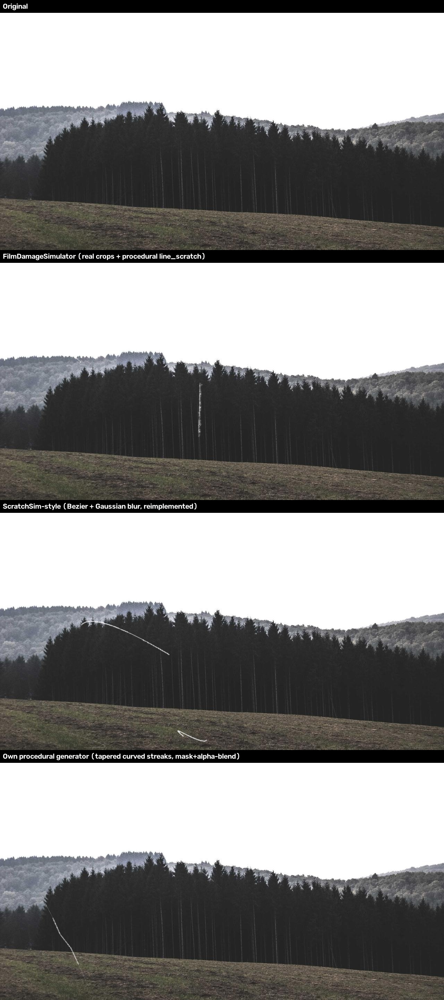
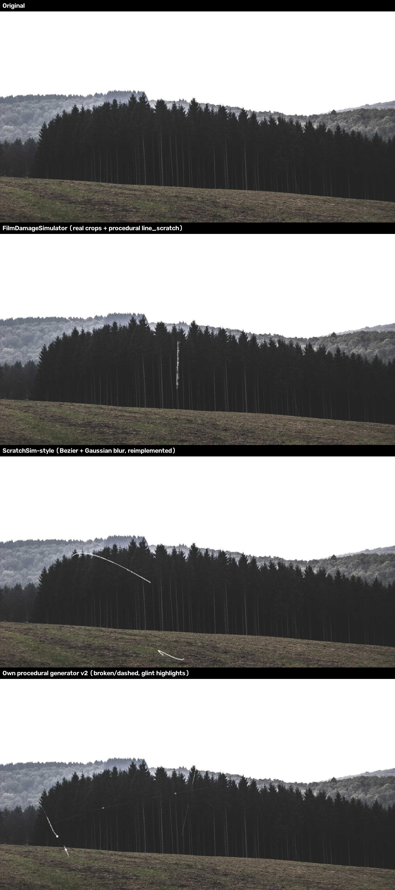
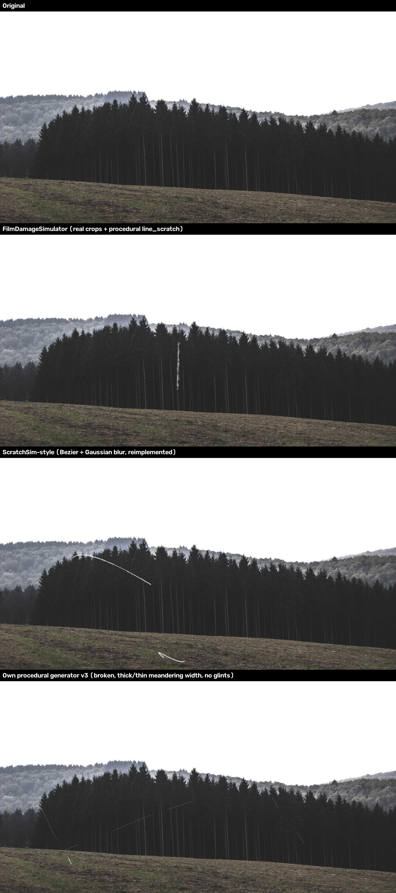

# Development Log

Chronological record of what was done and why, so progress can be followed without
digging through git history. One entry per development session/phase.

---

## Session 1 — Scope reset: Stage A on MIO-TCD, scratch-effect method choice

**Date:** 2026-08-23

`overview.md`, `architecture.md`, `setup.md`, and
`only_for_me/only_for_my_research_thesis_concept.md` / `..._ablations.md` are the source
of truth for what gets built (`README.md` is an unrelated generic template).

**Scope for this pass**, per architecture.md §2 and the supervisor's guidance:
- Dataset: **MIO-TCD** (Miovision Traffic Camera Dataset), not BDD100K.
- Target: Part 2, **Stage A only** — image-level multi-label distortion classification
  (`dirt` / `water` / `scratch`), GAP + FC + sigmoid on the YOLO backbone's P5 feature map,
  frozen COCO-pretrained backbone (no detection fine-tuning on MIO-TCD in this pass).
- Distortion source: synthetic, via https://github.com/JannLi/physical_lens_soiling for
  `dirt`/`water` — overview.md explicitly names this repo as a sanctioned alternative to
  the real dual-camera rig.
- Training destination: NHR@FAU HPC (TinyGPU cluster, SLURM). Per standing project rule,
  Claude prepares code and job scripts only — training itself runs on the user's own HPC
  allocation, never launched from here.

**Gap:** `physical_lens_soiling` has no `scratch` effect, and no ready-made lens-scratch
codebase exists. Resolved by building and comparing three candidates on one sample image
before committing to any of them for the full dataset build.

### Scratch-method comparison

1. **FilmDamageSimulator** (`github.com/daniela997/FilmDamageSimulator`, MIT licensed).
   Cloned and ran directly — composited 3 real scratch crops (extracted from their
   annotated 35mm film-scan dataset) plus 3 outputs of their own procedural
   `line_scratch()` (Perlin-noise-based fading line) onto the sample image. Needed one
   one-line fix for a NumPy 2.x incompatibility (`int()` on a size-1 array), otherwise ran
   as-is. Visual character: convincing as *film-grain* damage, but reads as photographic
   scratch texture rather than a lens/glass scratch.
2. **ScratchSim** (arXiv:2607.27065). Its public repo
   (`github.com/saptarshineil/ScratchSim`) turned out to be a full BlenderProc **3D**
   pipeline rendering a specific toy-car asset with material/normal-map perturbation —
   none of it applies to flat 2D photos. What was actually tested is a from-scratch
   reimplementation of just the paper's described 2D scratch-mask step (cubic Bézier
   curve through 4 random points + Gaussian blur), since that's the only part of their
   method that transfers to our setting.
3. **Own procedural generator** (`src/soiling/effects.py::add_scratch`) — built in the
   same mask + alpha-blend style `physical_lens_soiling` already uses for its other
   effects. Iterated twice against user feedback:
   - v1: smooth curve, tapered width, single continuous stroke → looked too clean/uniform.
   - v2: added random on/off gaps along the curve (a real lens scratch only catches light,
     and so is only visible, intermittently) plus bright "glint" points at a few spots —
     validated against a real reference photo of a scratched camera lens the user found
     (Lensrentals.com, "Front Element Scratches"), which visibly shows a discontinuous,
     not-solid scratch line.
   - v3 (final): removed the glint points (looked artificial/unnatural per user feedback)
     — kept the broken/discontinuous segments, and replaced the single global taper with a
     width that meanders between thick and thin along the streak (several blended random
     Gaussian "lobes"), which reads as natural irregular scratch depth without needing an
     explicit highlight marker.

**Result — v1 vs. v2 vs. v3** (same sample photo, all three methods; own generator in the
bottom row of each):

**Decision: own procedural generator.** Rationale — full parametric control (count,
length, width, curvature, opacity all independently tunable for later class-balance
tuning), no external code/license/domain-mismatch dependency (FilmDamageSimulator = film
grain, ScratchSim = industrial 3D render, neither is a lens/glass scratch), composes
naturally with `physical_lens_soiling`'s own mask+blend convention for `dirt`/`water`, and
— unlike either external option — was directly iterated against real-world reference
evidence of what a scratched lens actually looks like.

**Delivered this session:**
- `src/soiling/effects.py` — `add_scratch()` / `generate_scratch_mask()`, the finalized
  procedural scratch generator.
- `tests/test_effects.py` — 6 fast unit tests (mask shape/range, non-empty, discontinuity,
  image actually changes, seeded reproducibility, zero-scratches no-op).

**Not yet done (next session):** port `physical_lens_soiling`'s `dirt`/`water` effects
into `src/soiling/effects.py` alongside `add_scratch`, build the MIO-TCD-based dataset
pipeline (`src/soiling/dataset_builder.py`), and the Stage A model/training/eval code —
per the approved plan.
