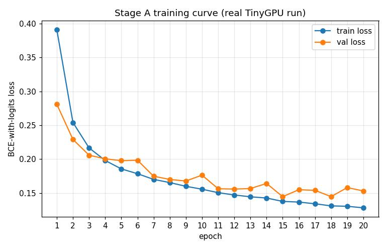
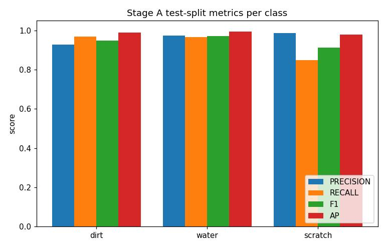
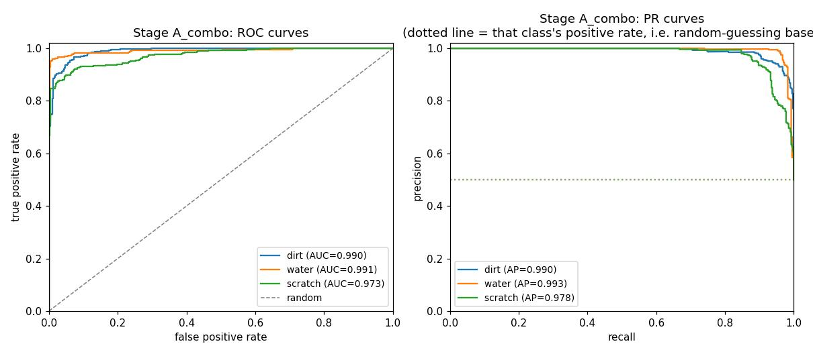
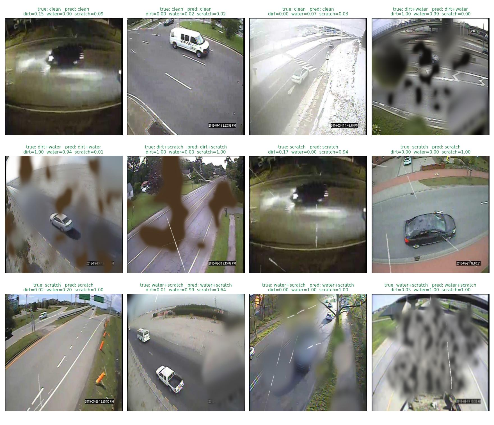
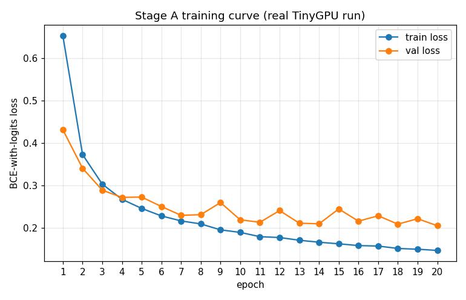
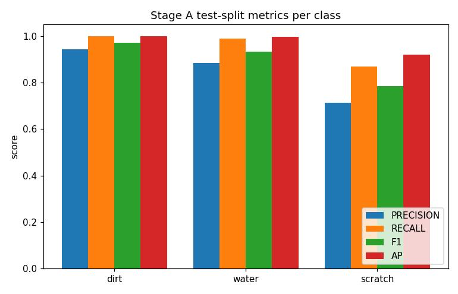
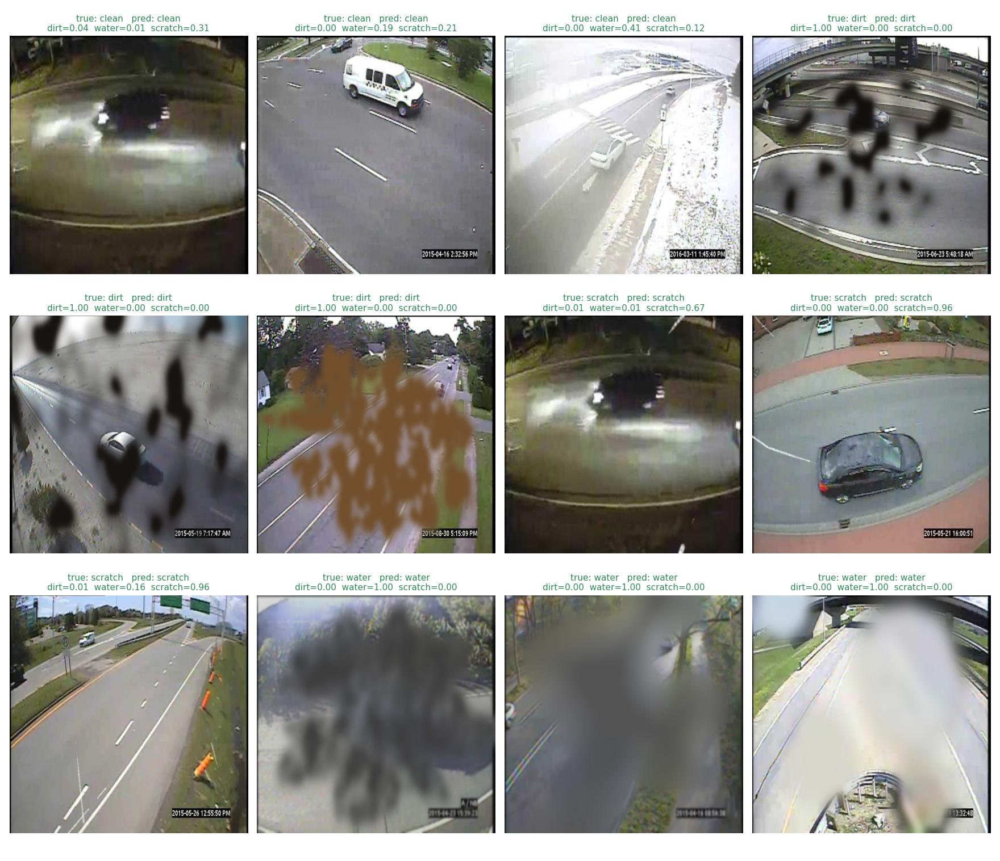
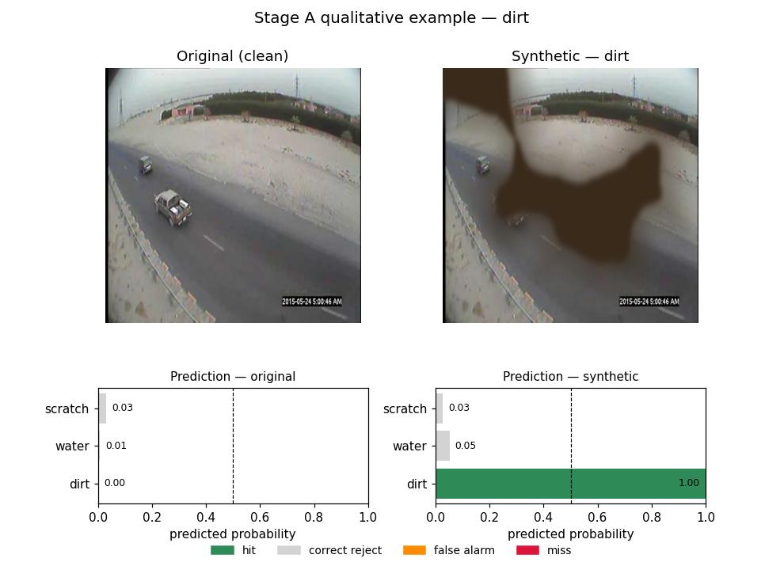
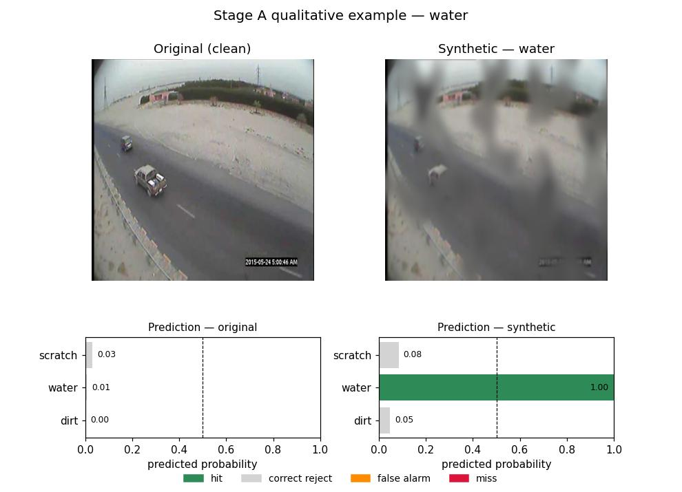
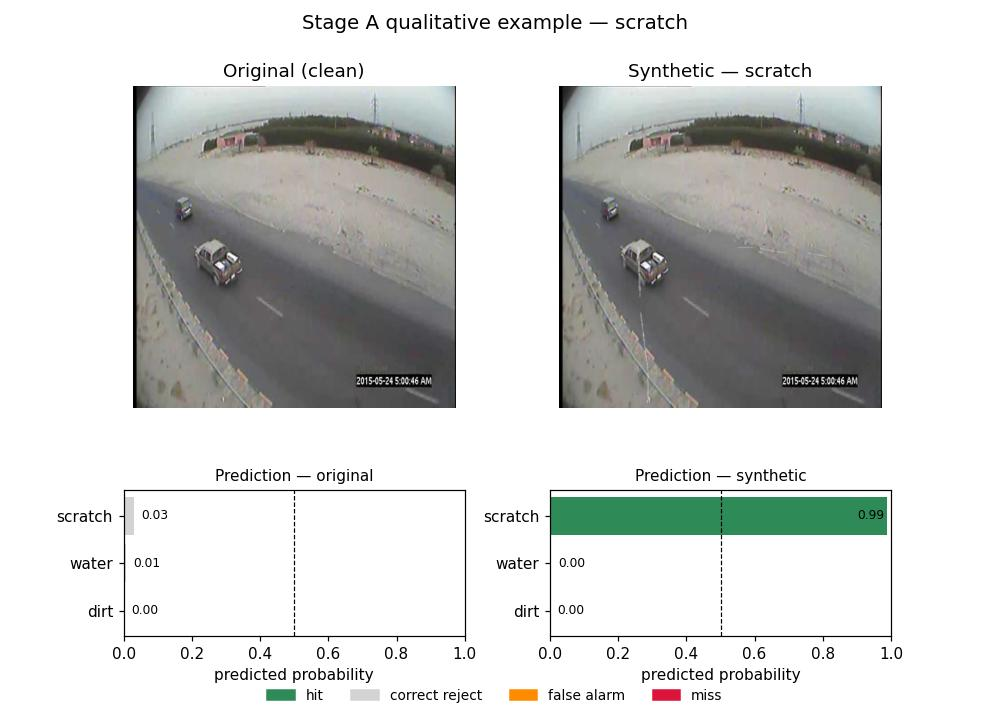

# Stage A Final Report — Image-Level Distortion Classification

**Status:** complete, then extended (Session 19+, supervisor item 5): the dataset was rebuilt to
also include multi-distortion (combo) variants and the model retrained on it — **the current
canonical result is the combo-dataset retrain** (`data/processed/stage_a`,
`checkpoints/stage_a_combo/stage_a_head.pt`). The original single-distortion-only result is kept
below as a historical reference (§4). **Date:** 2026-09-18.

This is a standalone summary of Part 2, Stage A — distinct from
[`development_log.md`](development_log.md)'s chronological session-by-session record. See
the log for the full narrative (decisions, dead ends, exact bugs and fixes); this document
is the result.

---

## 1. Goal

Per `architecture.md` §2, Stage A is the first and simplest of three planned distortion-head
designs: **image-level multi-label classification** of camera-lens soiling — `dirt`, `water`,
`scratch` — using global average pooling over a shared backbone's deepest feature map, a
small classification head, and a **frozen** (not fine-tuned) COCO-pretrained YOLO backbone
(architecture.md §3, "Option 1"). The purpose is explicitly to validate the whole pipeline
cheaply before any heavier investment (Stage B tile classification, Stage C pixel-level
segmentation, or unfreezing the backbone).

Concretely, this phase had to answer: **given a single traffic-camera image, can a
lightweight model reliably say whether the lens shows dirt, water, and/or a scratch?**

---

## 2. Pipeline overview

| Step | What | Where |
|---|---|---|
| 0 | Scratch-effect method decision | `src/soiling/effects.py` |
| 1 | MIO-TCD pilot subset (1000 images) | `src/data/mio_tcd.py`, `scripts/sample_mio_tcd.py` |
| 2 | Distortion synthesis (dirt/water vendored, scratch custom) | `src/soiling/effects.py`, `third_party/physical_lens_soiling/` |
| 3 | Stage A dataset builder (balanced variants, optionally including multi-distortion combos) | `src/soiling/dataset_builder.py`, `scripts/build_stage_a_dataset.py` |
| 4 | Model: frozen backbone + distortion head + loss | `src/models/backbone.py`, `distortion_head.py`, `losses.py` |
| 5 | Training script | `scripts/train_stage_a.py` |
| 6 | FAU HPC (TinyGPU) setup/submission | `scripts/hpc/`, `docs/hpc_stage_a.md` |
| 7 | Evaluation (precision/recall/F1/AP/ROC-AUC, scalar or per-class tuned thresholds) | `scripts/evaluate_stage_a.py`, `src/eval/metrics.py`, `src/eval/thresholds.py` |
| 8 | Qualitative clean-vs-distorted examples | `scripts/visualize_stage_a_class_examples.py` |
| 9 | Test coverage audit | `tests/` (51 tests) |

---

## 3. Key details per section

### Distortion synthesis

- **`dirt`** and **`water`** (three mechanisms: thick stain, thin stain, droplet refraction)
  come directly from `physical_lens_soiling` (github.com/JannLi/physical_lens_soiling),
  vendored into `third_party/` with the supervisor's explicit permission — not
  reimplemented, only wired into a consistent interface.
- **`scratch`** has no equivalent in that repo. After comparing it against two external
  candidates (FilmDamageSimulator, ScratchSim — neither transferred cleanly to a flat lens
  scratch), a custom procedural generator was built instead: broken/discontinuous streaks
  (validated against a real photo of a scratched camera lens) with width that meanders
  between thin and thick along each streak, rather than a single uniform stroke.
- All three effects share one interface — `add_dirt(image, seed=None)`,
  `add_water(image, seed=None)`, `add_scratch(image, seed=None)` — each returning
  `(distorted_image, mask)`, with severity randomized internally rather than as call-time
  parameters.

### Dataset

- 1000 MIO-TCD traffic-camera frames (reproducibly sampled from the official
  `MIO-TCD-Localization` archive, seed=0). **Originally** (Sessions 1-18): exactly 4 variants
  per source photo — one clean + one each of dirt/water/scratch, never combined on the same
  image (an explicit design requirement at the time) — 4000 images, exact 25% positive rate
  per class.
- **Session 19+ (current, supervisor item 5):** rebuilt with `--include-combos` — 8 variants
  per source photo (clean, 3 single effects, the 3 pairwise combos, and the full triple) —
  **8000 images total**, split **6400 / 800 / 800**, exact **50%** positive rate per class
  (each class appears in exactly 4 of the 8 kinds). Same source photos, same
  source-photo-level split (no leakage) as before.

**Distribution by kind (exact, by construction):**

| kind | images | % of dataset |
|---|---|---|
| clean (no distortion) | 1000 | 12.5% |
| dirt only | 1000 | 12.5% |
| water only | 1000 | 12.5% |
| scratch only | 1000 | 12.5% |
| dirt + water | 1000 | 12.5% |
| dirt + scratch | 1000 | 12.5% |
| water + scratch | 1000 | 12.5% |
| dirt + water + scratch | 1000 | 12.5% |
| **total** | **8000** | **100%** |

Each class (dirt/water/scratch) is therefore *present* — alone or combined with another — in
exactly 4000/8000 images (50%), since it appears in 4 of the 8 kinds above.

### Model

- **Backbone:** Ultralytics YOLOv11-m, COCO-pretrained, entirely frozen (`requires_grad =
  False` on every parameter, permanently kept in `eval()`). Traced its internal layer graph
  to confirm the true P5 tap: layer 10 (`C2PSA`) is the last purely-sequential layer before
  the FPN/PAN neck begins — 512 channels, stride 32.
- **Head:** GAP → FC(512→64) → ReLU → FC(64→3), returning raw logits (architecture.md §6:
  "GAP + 2× FC + sigmoid" — the sigmoid is applied by the loss function during training and
  explicitly at inference, not as a layer in the head, since `BCEWithLogitsLoss` needs
  logits for numerical stability).
- **Loss:** `BCEWithLogitsLoss` with `pos_weight` computed directly from the training
  split's own class frequencies (came out to `[3.0, 3.0, 3.0]`, matching the exact 25%
  positive rate per class).
- Only the head's parameters are ever passed to the optimizer.

### Decision threshold (per class, no retraining)

The model outputs a probability per class; a **decision threshold** is the cutoff above which
that probability counts as "yes, this image has this distortion" — precision/recall/F1 depend
on where that cutoff sits, while AP and ROC-AUC don't (they rank probabilities, not compare
them against a cutoff). Rather than one shared threshold (0.5) for all three classes, **each
class gets its own**: swept on the **val** split (never test, which is only evaluated once the
threshold is fixed) for the highest-F1 cutoff, then applied to **test**. Implemented in
`src/eval/thresholds.py::tune_per_class_thresholds`, exposed as `evaluate_stage_a.py
--tune-thresholds` (added Session 19+, shared with Stage B's evaluator). The actual tuned
values are in the `threshold` column of §4's results table below, alongside the plain
0.5-threshold row for comparison.

### Training

- Ran for real on the user's NHR@FAU TinyGPU allocation (account `iwnt196h`), one RTX3080
  GPU, 20 epochs, **12 minutes** wall-clock, 2.9 GB / 10 GB peak GPU memory.
- Train loss: **0.653 → 0.146** (smooth, monotonic). Val loss: **0.431 → 0.205** (noisy
  epoch-to-epoch but no runaway overfitting).
- Three real environment bugs were found and fixed only by actually running on the cluster
  (not reproducible locally) — a `--smoke-test` flag silently forcing CPU even with
  `--device cuda`, a missing `setuptools` pin (`pythonperlin` needs `pkg_resources`, which
  newer `setuptools` releases have removed entirely), and an `a100`-partition job that sat
  pending forever because this account's allocation has no GPU quota there. All three are
  documented in `development_log.md` Session 10.

---

## 4. Results

### Canonical result (Session 19+): combo dataset retrain



Train loss: 0.391 → 0.128, smooth and monotonic. Val loss: 0.281 → 0.153, noisy but no
runaway overfitting — same qualitative shape as the original run, just over 20 epochs on 8000
images instead of 4000.

**Per-class metrics (held-out test split, 800 images, 400 positive per class)**



| class | threshold | precision | recall | F1 | AP | ROC-AUC | support |
|---|---|---|---|---|---|---|---|
| dirt | 0.5 (default) | 0.928 | 0.968 | 0.947 | 0.990 | 0.990 | 400 |
| water | 0.5 (default) | 0.975 | 0.965 | 0.970 | 0.993 | 0.991 | 400 |
| scratch | 0.5 (default) | 0.985 | 0.848 | 0.911 | 0.978 | 0.973 | 400 |
| dirt | 0.438 (tuned) | 0.909 | 0.970 | 0.938 | 0.990 | 0.990 | 400 |
| water | 0.814 (tuned) | 0.995 | 0.945 | 0.969 | 0.993 | 0.991 | 400 |
| scratch | 0.220 (tuned) | 0.929 | 0.912 | 0.921 | 0.978 | 0.973 | 400 |



The curves behind the AP/ROC-AUC numbers above: every class hugs the top-left corner of the ROC
panel (far from the diagonal "random guessing" line) and stays near the top of the PR panel
across nearly the whole recall range, confirming these are high scores because the ranking is
genuinely good, not an artifact of an easy default threshold.

**Noticeably stronger across the board than the original single-distortion result** (§4
"Pre-combo result" below) — scratch F1 rose from 0.784 to 0.911-0.921, dirt/water both landed
above 0.94. The most likely driver isn't the combos themselves teaching anything new about
*localizing* a distortion (Stage A has no spatial output to begin with) — it's that each class's
positive rate doubled (25%→50%), giving the small head roughly twice the positive training
signal per class to learn from. This is a real, useful result either way (more usable at
default threshold, AUC-ROC in the high 0.97-0.99 range for every class), but the *why* is worth
being explicit about in case it comes up.

**Predictions on real test images**



Sampled by "first active class" per row (a combo row like dirt+water is bucketed under
"dirt") — see `scripts/visualize_stage_a_results.py::select_diverse_sample_indices`; the
combo-specific visual proof (multiple classes lighting up on one image) lives in the Stage B
report instead, since Stage A has no spatial grid to show it on.

<details>
<summary>Pre-combo result (original single-distortion-only dataset, superseded — kept for reference)</summary>

### Training curve (real TinyGPU run, job 1791674)



Train loss drops smoothly and monotonically throughout (0.653 → 0.146). Val loss drops
sharply for the first ~7 epochs (0.431 → 0.229), then plateaus around 0.20-0.24 with
epoch-to-epoch noise rather than continuing to fall or turning upward — the head has
essentially converged by epoch ~10-14, and the remaining epochs mostly fine-tune within that
band rather than overfitting. There's no held-out **test**-split curve during training by
design (standard practice: the test split is only touched once, for the final evaluation
below, not monitored during training where it could otherwise influence decisions).

### Per-class metrics (held-out test split, 400 images, 100 positive per class)



| class | precision | recall | F1 | AP | support |
|---|---|---|---|---|---|
| dirt | 0.943 | 1.000 | 0.971 | 1.000 | 100 |
| water | 0.884 | 0.990 | 0.934 | 0.996 | 100 |
| scratch | 0.713 | 0.870 | 0.784 | 0.920 | 100 |

**dirt** and **water** are effectively solved by this frozen-backbone + tiny-head setup.
**scratch** is measurably weaker — plausible, since it's both the subtlest visual signal of
the three (thin lines vs. large textured regions) and the one custom-built effect rather
than the paper's validated code.

### Predictions on real test images

12 test-split images the model never saw during training, 3 per label (clean/dirt/water/
scratch), each captioned with its ground-truth label, the model's prediction at threshold
0.5, and the raw per-class probabilities:



All 12 are classified correctly, most with high-confidence probabilities near 0.0 or 1.0.

</details>

### Qualitative examples: clean vs. distorted, per class

For each class, one source photo that has both a clean variant and a variant positive for
exactly that class (same underlying scene, only the synthetic distortion differs) — clean and
distorted image side by side, each with the model's per-class predicted probability underneath.
Bars are colored against ground truth at threshold 0.5: green = hit, gray = correct reject,
orange = false alarm, red = miss.





All three pairs happen to reuse the same clean source photo (deterministic seed=0 picks the
first source in the test split that has variants for all three classes) — this is incidental,
not a limitation of the method. Regenerated against the current combo checkpoint/dataset
(Session 19+); regenerate with a different `--seed` for different examples:

```bash
python scripts/visualize_stage_a_class_examples.py \
    --checkpoint checkpoints/stage_a_combo/stage_a_head.pt \
    --data data/processed/stage_a --split test --device cpu \
    --out-dir docs/images
```

---

## 5. Known limitations

- **The backbone was never fine-tuned.** All learning happened in a ~33k-parameter head on
  top of frozen COCO features — the strong scores say those generic features already
  separate these distortion types well, not that the backbone understands lens soiling.
- **Combos now included, but untested against real multi-distortion photos.** As of Session
  19+, training does include multi-distortion (combo) variants (dirt+water, dirt+scratch,
  water+scratch, all three) — the "untested territory" caveat from earlier sessions is
  resolved for *synthetic* combos. What's still untested is how this generalizes to a real
  photo with two distortions at once, since all training data remains synthetic (next point).
- **Purely synthetic distortions.** `physical_lens_soiling`'s renders (and this project's
  own scratch generator) are a physics-inspired approximation, not real camera captures.
  There's an unmeasured domain gap between this and an actual soiled lens.
- **Small pilot dataset.** 1000 source photos, 8000 total training images (Session 19+) —
  enough to validate the pipeline, well short of the scale a production model would use.

---

## 6. Reproducing this report

```bash
# canonical (combo dataset)
python scripts/build_stage_a_dataset.py --source data/raw/mio_tcd/images \
    --out data/processed/stage_a --variants 8 --include-combos
python scripts/evaluate_stage_a.py --checkpoint checkpoints/stage_a_combo/stage_a_head.pt \
    --data data/processed/stage_a --split test --tune-thresholds
python scripts/visualize_stage_a_results.py --checkpoint checkpoints/stage_a_combo/stage_a_head.pt \
    --data data/processed/stage_a --split test --log-file stage_a_combo_1815700.out --tag _combo
python scripts/visualize_stage_a_class_examples.py --checkpoint checkpoints/stage_a_combo/stage_a_head.pt \
    --data data/processed/stage_a --split test --device cpu --out-dir docs/images

# pre-combo result (original single-distortion-only dataset, superseded, kept for reference)
python scripts/evaluate_stage_a.py --checkpoint checkpoints/stage_a/stage_a_head.pt \
    --data data/processed/stage_a --split test   # NOTE: data/processed/stage_a was replaced
    # in place by the combo rebuild -- this checkpoint can no longer be re-evaluated against
    # its original dataset locally; the numbers above are from before the rebuild.
```

`stage_a_1791674.out` (original run) and `stage_a_combo_1815700.out` (combo-dataset run) are
the raw stdout of the actual TinyGPU training jobs; `eval_a_combo_1815727.out` is the combo
checkpoint's evaluation job output. All exist locally and (job logs only, not the now-replaced
dataset) on the FAU HPC `$WORK` — see `docs/hpc_stage_a.md` for cluster paths.
