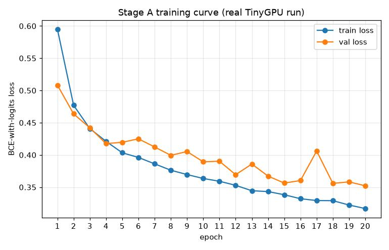
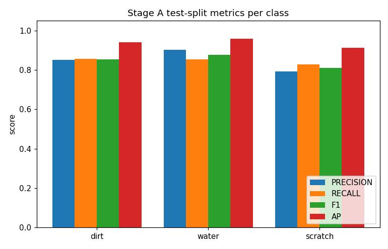
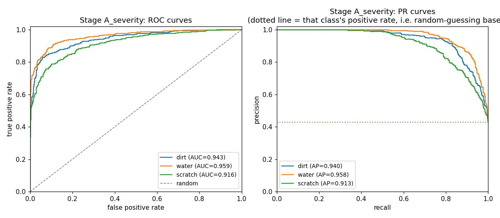
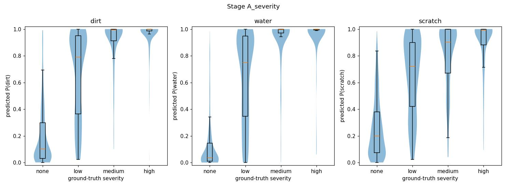
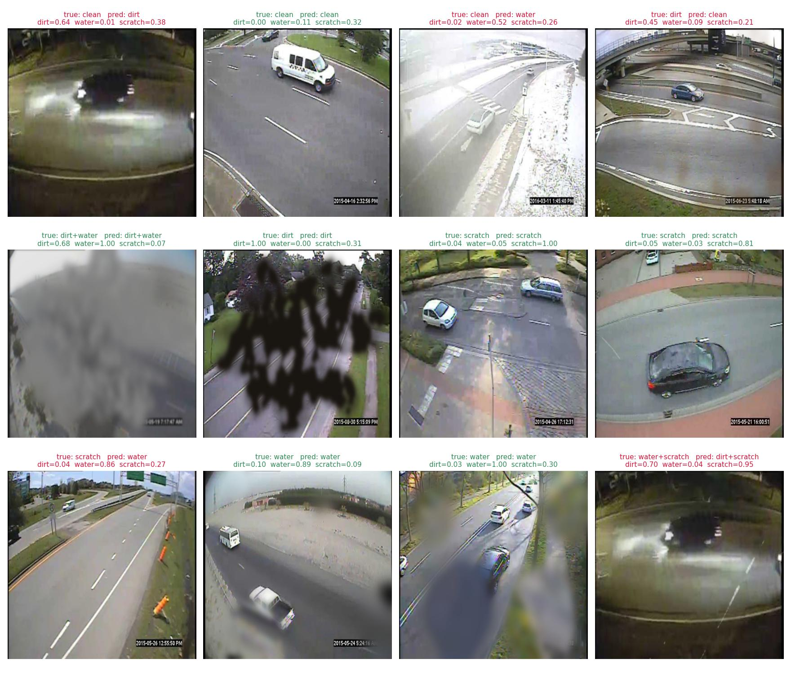

# Stage A Final Report — Image-Level Distortion Classification

**Status:** complete. Canonical checkpoint: `checkpoints/stage_a_severity/stage_a_head.pt`,
trained on `data/processed/stage_a` (14000 images, combo-inclusive, severity-balanced). A
companion image-level "impaired/not impaired" gate head (§5) is trained alongside it and used
as a real inference-time filter on Stage B's tile predictions — see
[`stage_b_final_report.md`](stage_b_final_report.md). For the full session-by-session history
of how this pipeline got here (design decisions, dead ends, superseded intermediate results),
see [`development_log.md`](development_log.md); this document reports only the current,
final result.

---

## 1. Goal

Per `architecture.md` §2, Stage A is the first and simplest of three planned distortion-head
designs: **image-level multi-label classification** of camera-lens soiling — `dirt`, `water`,
`scratch` — using global average pooling over a shared backbone's deepest feature map, a
small classification head, and a **frozen** (not fine-tuned) COCO-pretrained YOLO backbone
(architecture.md §3, "Option 1"). The purpose is explicitly to validate the whole pipeline
cheaply before any heavier investment (Stage B tile classification, Stage C pixel-level
segmentation, or unfreezing the backbone).

Concretely, this phase had to answer: **given a single traffic-camera image, can a
lightweight model reliably say whether the lens shows dirt, water, and/or a scratch — and how
does that reliability change with how severe the distortion is?**

---

## 2. Pipeline overview

| Step | What | Where |
|---|---|---|
| 1 | MIO-TCD pilot subset (1000 images) | `src/data/mio_tcd.py`, `scripts/sample_mio_tcd.py` |
| 2 | Distortion synthesis (dirt/water vendored, scratch custom, severity-scaled) | `src/soiling/effects.py`, `third_party/physical_lens_soiling/` |
| 3 | Dataset builder (balanced kinds: clean/combos/severity levels) | `src/soiling/dataset_builder.py`, `scripts/build_stage_a_dataset.py` |
| 4 | Model: frozen backbone + distortion head + loss | `src/models/backbone.py`, `distortion_head.py`, `losses.py` |
| 5 | Training | `scripts/train_stage_a.py` |
| 6 | FAU HPC (TinyGPU) submission | `scripts/hpc/`, `docs/hpc_stage_a.md` |
| 7 | Evaluation (precision/recall/F1/AP/ROC-AUC, tuned thresholds, per-severity breakdown) | `scripts/evaluate_stage_a.py`, `src/eval/` |
| 8 | Visualization | `scripts/visualize_stage_a_results.py`, `visualize_stage_a_class_examples.py` |
| 9 | Test coverage | `tests/` |

---

## 3. Key details

### Distortion synthesis

- **`dirt`** and **`water`** (three mechanisms: thick stain, thin stain, droplet refraction)
  come from `physical_lens_soiling` (github.com/JannLi/physical_lens_soiling), vendored into
  `third_party/` with the supervisor's explicit permission.
- **`scratch`** has no equivalent in that repo — a custom procedural generator instead:
  broken/discontinuous streaks (validated against a real photo of a scratched camera lens)
  with width that meanders between thin and thick along each streak.
- All three share one interface — `add_dirt(image, seed=None)`, `add_water(...)`,
  `add_scratch(...)` — each returning `(distorted_image, mask)`.
- **Severity**: a single, universal post-hoc alpha-blend (`SEVERITY_ALPHA = {"low": 0.3,
  "medium": 0.6, "high": 1.0}`) applied identically to all three effects, blending the
  full-strength output back toward the clean image and scaling the mask by the same factor —
  so a low-severity patch legitimately covers less/lighter ground truth too, not just looks
  fainter.

### Dataset

1000 MIO-TCD traffic-camera frames (reproducibly sampled, seed=0), **14000 images total**:
14 balanced kinds per source photo — clean, 9 single-effect×severity combinations
(`dirt:low`/`medium`/`high`, same for water/scratch), and 4 multi-distortion combos
(dirt+water, dirt+scratch, water+scratch, all three). Split by source photo (no leakage),
**11200 / 1400 / 1400** (train/val/test). Each class is present (alone or combined, any
severity) in exactly 6000/14000 images (42.9%); combo kinds get a severity per active effect
too, picked pseudo-randomly (deterministically seeded) rather than balanced, to avoid a
combinatorial explosion (3 effects × 3 levels for the triple-effect kind).

### Model

- **Backbone:** Ultralytics YOLOv11-m, COCO-pretrained, entirely frozen. Taps P5 (the last
  purely-sequential layer before the FPN/PAN neck, layer 10/`C2PSA`) — 512 channels, stride 32.
- **Head:** GAP → FC(512→64) → ReLU → FC(64→3), raw logits (sigmoid applied by the loss /
  at inference, not as a layer).
- **Loss:** `BCEWithLogitsLoss` with `pos_weight` from the training split's own class
  frequencies. Only the head's parameters are ever optimized.

### Decision threshold

Each class gets its **own** decision threshold rather than one shared 0.5: swept on the val
split for the highest-F1 cutoff (`src/eval/thresholds.py::tune_per_class_thresholds`, exposed
as `evaluate_stage_a.py --tune-thresholds`), then applied once to test.

---

## 4. Results

HPC job `1822358` (a100), 20 epochs, `checkpoints/stage_a_severity/stage_a_head.pt`. Train
loss converged to 0.317, no overfitting.



**Per-class metrics (held-out test split, 1400 images, tuned per-class thresholds)**



| class | threshold | precision | recall | F1 | AP | ROC-AUC | support |
|---|---|---|---|---|---|---|---|
| dirt | 0.445 | 0.824 | 0.875 | 0.849 | 0.940 | 0.943 | 600 |
| water | 0.547 | 0.914 | 0.835 | 0.873 | 0.958 | 0.959 | 600 |
| scratch | 0.540 | 0.811 | 0.813 | 0.812 | 0.913 | 0.916 | 600 |



**Per-severity breakdown** (`evaluate_stage_a.py --by-severity`) — the headline question this
dataset was built to answer: does the model do worse on subtle distortions than obvious ones?

| class | severity | precision | recall | F1 | AP | ROC-AUC | support |
|---|---|---|---|---|---|---|---|
| dirt | low | 0.564 | 0.694 | 0.622 | 0.702 | 0.869 | 209 |
| dirt | medium | 0.628 | 0.955 | 0.758 | 0.934 | 0.976 | 198 |
| dirt | high | 0.630 | 0.990 | 0.770 | 0.972 | 0.989 | 193 |
| water | low | 0.730 | 0.629 | 0.676 | 0.773 | 0.907 | 202 |
| water | medium | 0.790 | 0.917 | 0.849 | 0.960 | 0.983 | 193 |
| water | high | 0.807 | 0.961 | 0.878 | 0.975 | 0.989 | 205 |
| scratch | low | 0.521 | 0.670 | 0.586 | 0.665 | 0.846 | 185 |
| scratch | medium | 0.611 | 0.825 | 0.702 | 0.850 | 0.929 | 217 |
| scratch | high | 0.619 | 0.934 | 0.744 | 0.928 | 0.968 | 198 |

**Yes, clearly — a monotonic, physically sensible trend for all three classes.** AP drops
20-30 points from high to low severity (dirt 0.972→0.702, water 0.975→0.773, scratch
0.928→0.665). Visualized as a violin+box plot of predicted probability grouped by
ground-truth severity:



**Predictions on real test images**



### Qualitative examples: clean vs. distorted, per class

For each class, one source photo with both a clean variant and a variant positive for exactly
that class — clean/distorted side by side, model's predicted probability underneath (green =
hit, gray = correct reject, orange = false alarm, red = miss, at threshold 0.5):


```bash
python scripts/visualize_stage_a_class_examples.py \
    --checkpoint checkpoints/stage_a_severity/stage_a_head.pt \
    --data data/processed/stage_a --split test --device cpu --out-dir docs/images
```

---

## 5. Impaired/not-impaired gate

Supervisor feedback: the pipeline should first be able to say **whether an image is impaired
at all**, as a genuine binary decision, separate from *which* class(es) are present.

**Architecture:** `ImpairedGateHead` (`src/models/distortion_head.py`) — global average pooling
+ 2×FC with 2 mutually-exclusive logits (`not_impaired`, `impaired`), trained with **softmax +
class-weighted `nn.CrossEntropyLoss`** rather than sigmoid/BCE. Label (`impaired = 1` if any
of dirt/water/scratch is 1) is derived on the fly — no dataset rebuild needed. Unlike the
Stage A head above (which follows `architecture.md`'s "GAP over P5" literally), the canonical
gate pools **four backbone depths** (stride 4/8/16 and P5) and concatenates them, so it also
sees the finer layers where faint texture changes survive. It is trained at 512 px on the
Stage B/C dataset's images — the resolution it is applied at — from the same 1000 source
photos and splits.

**Training:** HPC job `1823027`, 20 epochs, best-validation epoch kept —
`checkpoints/impaired_gate_multiscale/impaired_gate_head.pt`.

**Choosing the threshold.** The gate is a filter: it should drop clean images without
discarding real distortions. Best-F1 is the wrong criterion here (with ~93% impaired images it
picks a near-zero threshold that lets almost every clean image through), so the threshold is
the highest one that keeps **≥95% of impaired val images**
(`evaluate_impaired_gate.py --recall-target 0.95`): **0.140**.

**Results (held-out test split, 1400 images, 1300 impaired / 100 clean)**

| gate | ROC-AUC | AP | threshold | impaired kept | clean passed |
|---|---|---|---|---|---|
| P5 only (earlier version, 640 px) | 0.927 | 0.994 | 0.159 | 94.6% | 48% |
| **multi-scale (canonical, 512 px)** | **0.956** | **0.997** | **0.140** | **95.3%** | **31%** |

Separating "any distortion" from "clean" is hard mainly because of faint, low-severity images;
the finer layers cut the clean images that slip through from about half to under a third.

**Used as a real inference-time gate:** `src/eval/gate.py::apply_gate` zeroes Stage B/C
predictions for any image this head calls "not impaired" — see
[`stage_b_final_report.md`](stage_b_final_report.md) for the measured effect and the tradeoff
(a gate false negative silently suppresses a genuine detection too).

```bash
python scripts/train_impaired_gate.py --data data/processed/stage_b --arch multiscale     --img-size 512 --epochs 20 --device cuda --out checkpoints/impaired_gate_multiscale
python scripts/evaluate_impaired_gate.py --checkpoint checkpoints/impaired_gate_multiscale/impaired_gate_head.pt     --data data/processed/stage_b --split test --tune-thresholds --recall-target 0.95
```

---

## 6. Known limitations

- **The backbone was never fine-tuned.** All learning happened in a ~33k-parameter head on
  top of frozen COCO features.
- **Low-severity distortions are measurably harder to detect than high** (§4) — AP drops
  20-30 points from high to low severity across all three classes. A real, quantified gap in
  the model's sensitivity to subtle distortions, not a limitation of the balancing itself.
- **Purely synthetic distortions**, untested against real multi-distortion photos — an
  unmeasured domain gap between this and an actual soiled lens remains.
- **Small pilot dataset.** 1000 source photos, 14000 total training images — enough to
  validate the pipeline, well short of production scale.

---

## 7. Reproducing this report

```bash
python scripts/build_stage_a_dataset.py --source data/raw/mio_tcd/images \
    --out data/processed/stage_a --variants 14 --include-combos --include-severity
python scripts/evaluate_stage_a.py --checkpoint checkpoints/stage_a_severity/stage_a_head.pt \
    --data data/processed/stage_a --split test --tune-thresholds --by-severity
python scripts/visualize_stage_a_results.py --checkpoint checkpoints/stage_a_severity/stage_a_head.pt \
    --data data/processed/stage_a --split test --log-file stage_a_severity_1822358.out \
    --tag _severity --out-dir docs/images
```

`stage_a_severity_1822358.out` (training), `build_a_severity_1822266.out` (dataset rebuild)
and `eval_stage_a_1823040.out` (the evaluation above, run on a GPU) are the raw stdout of the
actual TinyGPU jobs; both exist locally and (job logs only) on the
FAU HPC `$WORK` — see `docs/hpc_stage_a.md` for cluster paths. Earlier intermediate datasets/
checkpoints (pre-combo, combo-only pre-severity) are superseded and no longer on disk — their
numbers are preserved in `docs/development_log.md`, not reproducible locally anymore.
