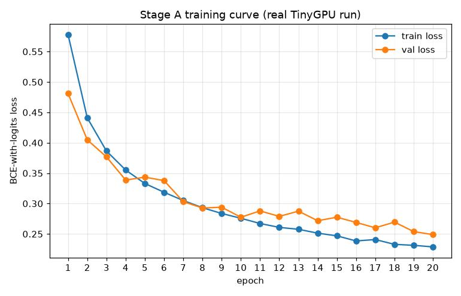
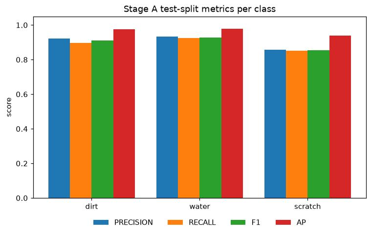
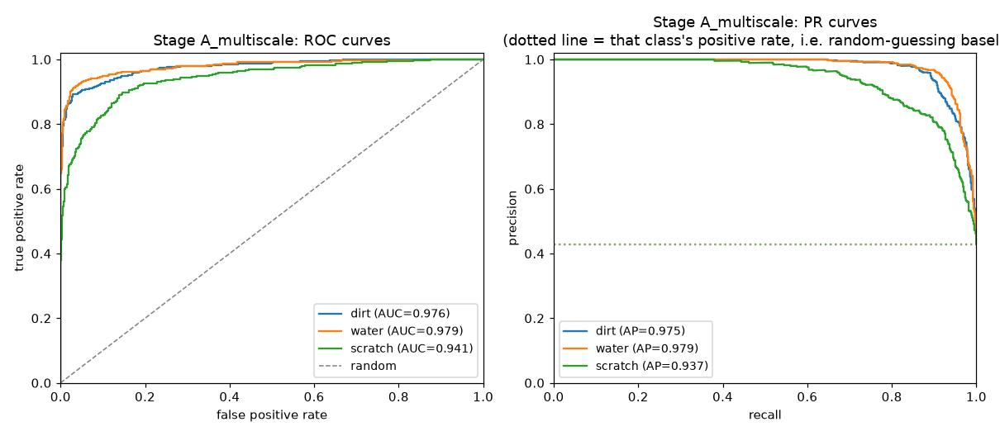
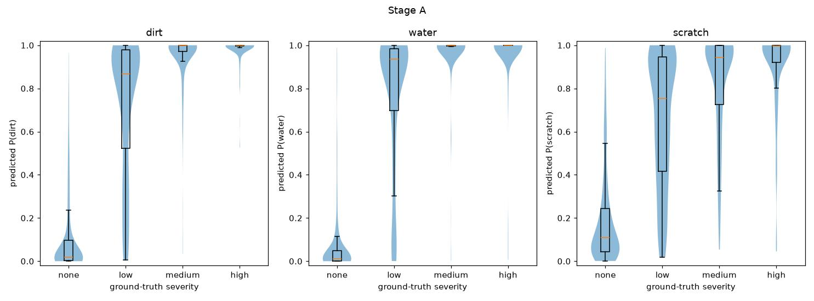
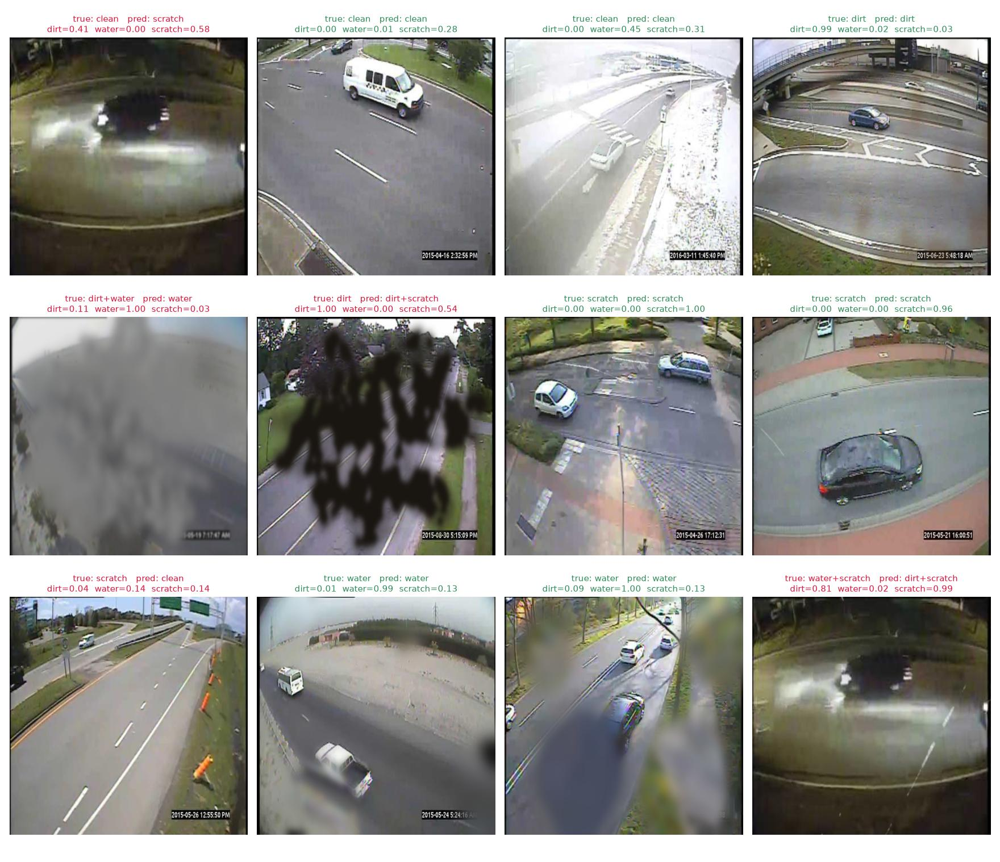
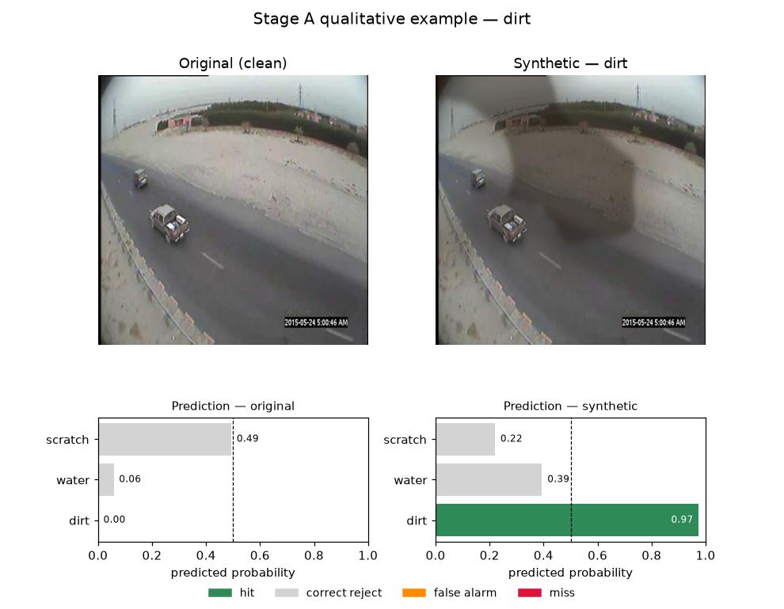
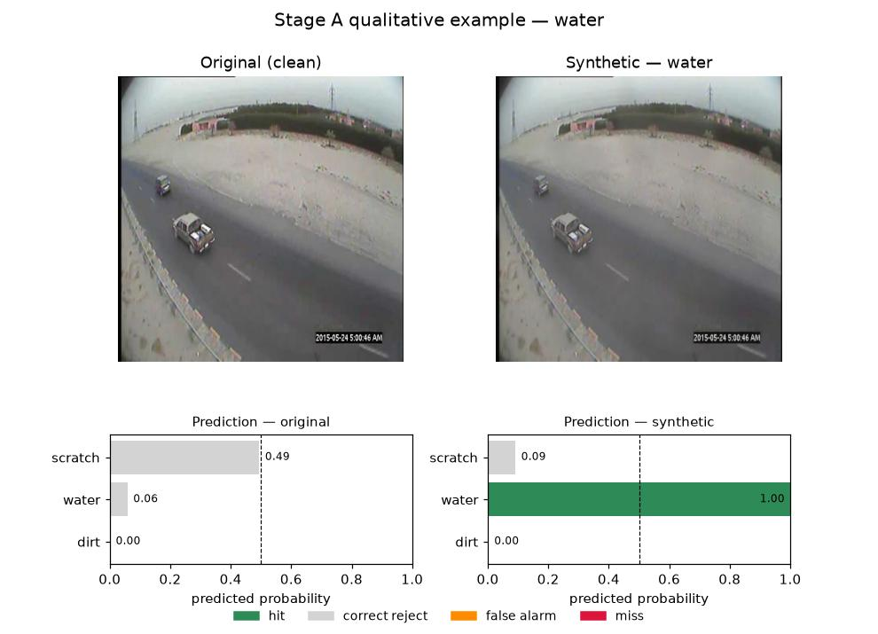
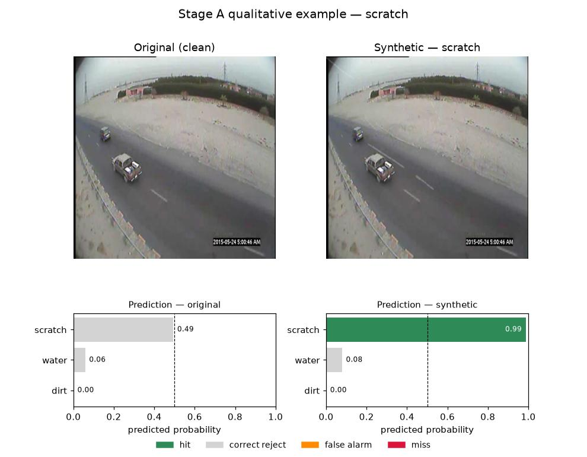

# Stage A Final Report — Image-Level Distortion Classification

**Status:** complete. Canonical checkpoint: `checkpoints/stage_a_multiscale_lf/stage_a_head.pt`
(backbone layers at strides 8, 16 and 32 — P3, P4, P5), trained on `data/processed/stage_a`
(14000 images, combo-inclusive, severity-balanced, labels audited in Session 26). A
companion image-level "impaired/not impaired" gate head (§5) is trained alongside it and used
as a real inference-time filter on Stage B's tile predictions — see
[`stage_b_final_report.md`](stage_b_final_report.md). For the full session-by-session history
of how this pipeline got here (design decisions, dead ends, superseded intermediate results),
see [`development_log.md`](development_log.md); this document reports only the current,
final result.

---

## 1. Goal

Per `architecture.md` §2, Stage A is the first and simplest of three planned distortion-head
designs: **image-level multi-label classification** of camera-lens soiling — `dirt`, `water`,
`scratch` — using global average pooling over the shared backbone's feature maps, a small
classification head, and a **frozen** (not fine-tuned) COCO-pretrained YOLO backbone
(architecture.md §3, "Option 1"). The purpose is explicitly to validate the whole pipeline
cheaply before any heavier investment (Stage B tile classification, Stage C pixel-level
segmentation, or unfreezing the backbone).

Concretely, this phase had to answer: **given a single traffic-camera image, can a
lightweight model reliably say whether the lens shows dirt, water, and/or a scratch — and how
does that reliability change with how severe the distortion is?**

---

## 2. Pipeline overview

| Step | What | Where |
|---|---|---|
| 1 | MIO-TCD pilot subset (1000 images) | `src/data/mio_tcd.py`, `scripts/sample_mio_tcd.py` |
| 2 | Distortion synthesis (dirt/water vendored, scratch custom, severity-scaled) | `src/soiling/effects.py`, `third_party/physical_lens_soiling/` |
| 3 | Dataset builder (balanced kinds: clean/combos/severity levels) | `src/soiling/dataset_builder.py`, `scripts/build_stage_a_dataset.py` |
| 4 | Model: frozen backbone + distortion head + loss | `src/models/backbone.py`, `distortion_head.py`, `losses.py` |
| 5 | Training | `scripts/train_stage_a.py` |
| 6 | FAU HPC (TinyGPU) submission | `scripts/hpc/`, `docs/hpc_stage_a.md` |
| 7 | Evaluation (precision/recall/F1/AP/ROC-AUC, tuned thresholds, per-severity breakdown) | `scripts/evaluate_stage_a.py`, `src/eval/` |
| 8 | Visualization | `scripts/visualize_stage_a_results.py`, `visualize_stage_a_class_examples.py` |
| 9 | Test coverage | `tests/` |

---

## 3. Key details

### Distortion synthesis

- **`dirt`** and **`water`** (three mechanisms: thick stain, thin stain, droplet refraction)
  come from `physical_lens_soiling` (github.com/JannLi/physical_lens_soiling), vendored into
  `third_party/` with the supervisor's explicit permission.
- **`scratch`** has no equivalent in that repo — a custom procedural generator instead:
  broken/discontinuous streaks (validated against a real photo of a scratched camera lens)
  with width that meanders between thin and thick along each streak.
- All three share one interface — `add_dirt(image, seed=None)`, `add_water(...)`,
  `add_scratch(...)` — each returning `(distorted_image, mask)`.
- **Severity**: a single, universal post-hoc alpha-blend (`SEVERITY_ALPHA = {"low": 0.3,
  "medium": 0.6, "high": 1.0}`) applied identically to all three effects, blending the
  full-strength output back toward the clean image. Severity only changes how visible a
  distortion is; the label stays "present" at every level (for Stages B/C, the ground-truth
  region also stays the same size — see `development_log.md` Session 22).

### Dataset

1000 MIO-TCD traffic-camera frames (reproducibly sampled, seed=0), **14000 images total**:
14 balanced kinds per source photo — clean, 9 single-effect×severity combinations
(`dirt:low`/`medium`/`high`, same for water/scratch), and 4 multi-distortion combos
(dirt+water, dirt+scratch, water+scratch, all three). Split by source photo (no leakage),
**11200 / 1400 / 1400** (train/val/test). Each class is present (alone or combined, any
severity) in exactly 6000/14000 images (42.9%); combo kinds get a severity per active effect
too, picked pseudo-randomly (deterministically seeded) rather than balanced, to avoid a
combinatorial explosion (3 effects × 3 levels for the triple-effect kind).

**Label audit (Session 26).** `scripts/audit_dataset_labels.py` checked every label against
the image. 44 scratch labels named a scratch that is practically invisible (fewer than 20
pixels change by more than 10 gray levels — mostly outside the frame, or a bright highlight on
white sky); `scripts/fix_dataset_labels.py` removed them (listed in the dataset's
`label_fixes.csv`), and the generator now re-draws such a scratch. All other labels were
correct. So 3 test images now count as clean, and scratch has 597 positive test images.

### Model

- **Backbone:** Ultralytics YOLOv11-m, COCO-pretrained, entirely frozen. The backbone processes
  an image in steps, and each step makes the representation smaller and more abstract. The
  *stride* says how much smaller: at stride 8, each position of the feature map covers an 8×8
  patch of the image. For Stage A's 640×640 input:

  | stride | name | map size | what it captures |
  |---|---|---|---|
  | 8 | P3 (layer 4) | 80×80 | fine textures and edges |
  | 16 | P4 (layer 6) | 40×40 | mid-level patterns |
  | 32 | P5 (layer 10, `C2PSA`) | 20×20 | coarse, abstract content of the scene |

  These are the three feature maps `architecture.md`'s diagram shows the backbone producing
  (P3/P4/P5); each has 512 channels.
- **Head:** each of the three maps is global-average-pooled to one 512-number summary, the
  three summaries are concatenated (1536 numbers), then FC(1536→64) → ReLU → FC(64→3), raw
  logits (sigmoid applied by the loss / at inference, not as a layer).
  `architecture.md` §2/§6 describes GAP over **P5 alone**; that design is kept as the
  reference (`--taps 32`) and was the canonical model until the layer study below showed the
  finer maps help, above all for faint distortions. P5 is the most abstract map and has
  largely lost the subtle texture changes a faint distortion causes; P3/P4 still carry them.
- **Loss:** `BCEWithLogitsLoss` with `pos_weight` from the training split's own class
  frequencies. Only the head's parameters are ever optimized.

### Layer study: which backbone layers help

Identical training (20 epochs, best-validation epoch kept) with different sets of backbone
layers, compared on the **validation** split so the test split stays untouched for the final
numbers (AP dirt / water / scratch):

| layers (strides) | AP | mean AP | faint (low-severity) AP | mean faint AP |
|---|---|---|---|---|
| 32 (P5 only, `architecture.md` design) | 0.935 / 0.962 / 0.907 | 0.935 | 0.688 / 0.786 / 0.682 | 0.719 |
| 16 + 32 | 0.969 / 0.983 / 0.934 | 0.962 | 0.831 / 0.899 / 0.760 | 0.830 |
| **8 + 16 + 32 (canonical)** | **0.977 / 0.983 / 0.940** | **0.967** | **0.870 / 0.908 / 0.776** | **0.851** |
| 4 + 8 + 16 + 32 | 0.975 / 0.983 / 0.931 | 0.963 | 0.851 / 0.910 / 0.754 | 0.838 |
| 2 + 4 + 8 + 16 + 32 | 0.968 / 0.982 / 0.930 | 0.960 | 0.824 / 0.905 / 0.743 | 0.824 |

Adding the mid-level maps (P4, then P3) raises faint-distortion AP by 0.13. The finest maps
(stride 4 and 2) add nothing for a whole-image decision: averaged over the entire image, their
fine detail mostly adds noise. (Stages B and C, which must say *where* a distortion is, do
benefit from the finest maps — see their reports.)

### Decision threshold

Each class gets its **own** decision threshold rather than one shared 0.5: swept on the val
split for the highest-F1 cutoff (`src/eval/thresholds.py::tune_per_class_thresholds`, exposed
as `evaluate_stage_a.py --tune-thresholds`), then applied once to test.

---

## 4. Results

HPC job `1834982` (V100), 20 epochs on the audited labels, best validation loss at epoch 19
(0.2471), `checkpoints/stage_a_multiscale_lf/stage_a_head.pt`.



**Per-class metrics (held-out test split, 1400 images, tuned per-class thresholds)**



| class | threshold | precision | recall | F1 | AP | ROC-AUC | support |
|---|---|---|---|---|---|---|---|
| dirt | 0.597 | 0.923 | 0.897 | 0.910 | 0.976 | 0.977 | 600 |
| water | 0.620 | 0.933 | 0.925 | 0.929 | 0.980 | 0.980 | 600 |
| scratch | 0.527 | 0.858 | 0.853 | 0.855 | 0.939 | 0.943 | 597 |

The same model trained before the label audit scores 0.975 / 0.979 / 0.937 on these labels; the
P5-only design scored 0.940 / 0.958 / 0.913.



**Per-severity breakdown** (`evaluate_stage_a.py --by-severity`) — the headline question this
dataset was built to answer: does the model do worse on subtle distortions than obvious ones?

| class | severity | precision | recall | F1 | AP | ROC-AUC | support |
|---|---|---|---|---|---|---|---|
| dirt | low | 0.774 | 0.737 | 0.755 | 0.867 | 0.940 | 209 |
| dirt | medium | 0.810 | 0.970 | 0.883 | 0.982 | 0.993 | 198 |
| dirt | high | 0.810 | 0.995 | 0.893 | 0.995 | 0.999 | 193 |
| water | low | 0.806 | 0.822 | 0.814 | 0.888 | 0.953 | 202 |
| water | medium | 0.825 | 0.979 | 0.896 | 0.986 | 0.993 | 193 |
| water | high | 0.833 | 0.976 | 0.899 | 0.986 | 0.994 | 205 |
| scratch | low | 0.611 | 0.717 | 0.660 | 0.737 | 0.889 | 184 |
| scratch | medium | 0.695 | 0.888 | 0.780 | 0.900 | 0.961 | 215 |
| scratch | high | 0.689 | 0.939 | 0.795 | 0.944 | 0.973 | 198 |

**Yes — a monotonic, physically sensible trend for all three classes**, but a much smaller gap
than with P5 alone: faint-distortion AP is 0.867 / 0.888 / 0.737 (P5 only: 0.702 / 0.773 /
0.665). Faint scratches remain the hardest case. Visualized as a violin+box plot of predicted
probability grouped by ground-truth severity:



**Predictions on real test images**



### Qualitative examples: clean vs. distorted, per class

For each class, one source photo with both a clean variant and a variant positive for exactly
that class — clean/distorted side by side, model's predicted probability underneath (green =
hit, gray = correct reject, orange = false alarm, red = miss, at threshold 0.5):





```bash
python scripts/visualize_stage_a_class_examples.py \
    --checkpoint checkpoints/stage_a_multiscale_lf/stage_a_head.pt \
    --data data/processed/stage_a --split test --device cpu --out-dir docs/images
```

---

## 5. Impaired/not-impaired gate

Supervisor feedback: the pipeline should first be able to say **whether an image is impaired
at all**, as a genuine binary decision, separate from *which* class(es) are present.

**Architecture:** `ImpairedGateHead` (`src/models/distortion_head.py`) — global average pooling
+ 2×FC with 2 mutually-exclusive logits (`not_impaired`, `impaired`), trained with **softmax +
class-weighted `nn.CrossEntropyLoss`** rather than sigmoid/BCE. Label (`impaired = 1` if any
of dirt/water/scratch is 1) is derived on the fly — no dataset rebuild needed. Like the
Stage A head above, the canonical gate pools **several backbone depths** (stride 4/8/16 and
P5) and concatenates them, so it also
sees the finer layers where faint texture changes survive. It is trained at 512 px on the
Stage B/C dataset's images — the resolution it is applied at — from the same 1000 source
photos and splits.

**Training:** HPC job `1834981` (V100), 20 epochs on the audited labels, best-validation epoch
kept — `checkpoints/impaired_gate_multiscale_lf/impaired_gate_head.pt`.

**Which layers?** The same layer study as for the Stage A head, on the **validation** split
before the label audit (threshold tuned to keep ≥95% of impaired images, as below):

| gate layers (strides) | ROC-AUC | clean images passed |
|---|---|---|
| 32 (P5 only) | 0.908 | 62% |
| 8 + 16 + 32 | 0.953 | 38% |
| **4 + 8 + 16 + 32 (canonical)** | **0.959** | **32%** |
| 2 + 4 + 8 + 16 + 32 | 0.953 | 35% |

The finer layers roughly halve the clean images that slip through; the top three settings are
close (the val split has only 100 clean images), so the existing stride-4–32 gate is kept.

**Choosing the threshold.** The gate is a filter: it should drop clean images without
discarding real distortions. Best-F1 is the wrong criterion here (with ~93% impaired images it
picks a near-zero threshold that lets almost every clean image through), so the threshold is
the highest one that keeps **≥95% of impaired val images**
(`evaluate_impaired_gate.py --recall-target 0.95`): **0.172**.

**Results (held-out test split, 1400 images, 1297 impaired / 103 clean after the audit)**

| gate | ROC-AUC | AP | threshold | impaired kept | clean passed |
|---|---|---|---|---|---|
| P5 only (earlier version, 640 px) | 0.927 | 0.994 | 0.159 | 94.6% | 48% |
| multi-scale, before the label audit | 0.956 | 0.997 | 0.140 | 95.3% | 31% |
| **multi-scale, audited labels (canonical)** | **0.953** | **0.996** | **0.172** | **94.4%** | **35%** |

The audit changed only 3 test labels the gate sees (images whose only, invisible scratch label
was removed); the two multi-scale gates are equal within noise.

Separating "any distortion" from "clean" is hard mainly because of faint, low-severity images;
the finer layers cut the clean images that slip through from about half to under a third.

**Used as a real inference-time gate:** `src/eval/gate.py::apply_gate` zeroes Stage B/C
predictions for any image this head calls "not impaired" — see
[`stage_b_final_report.md`](stage_b_final_report.md) for the measured effect and the tradeoff
(a gate false negative silently suppresses a genuine detection too).

```bash
python scripts/train_impaired_gate.py --data data/processed/stage_b --arch multiscale \
    --img-size 512 --epochs 20 --device cuda --out checkpoints/impaired_gate_multiscale_lf
python scripts/evaluate_impaired_gate.py --checkpoint checkpoints/impaired_gate_multiscale_lf/impaired_gate_head.pt \
    --data data/processed/stage_b --split test --tune-thresholds --recall-target 0.95
```

---

## 6. Known limitations

- **The backbone was never fine-tuned.** All learning happened in a ~99k-parameter head on
  top of frozen COCO features.
- **Faint distortions are still harder to detect than strong ones** (§4) — AP drops 10–21
  points from high to low severity (dirt 0.995→0.867, water 0.986→0.888, scratch
  0.944→0.737). Faint scratches are the weakest case.
- **Deviates from the literal `architecture.md` Stage A design** (GAP over P5 only) by also
  pooling P3/P4; the P5-only design is kept as `--taps 32` and its numbers are in §3.
- **Purely synthetic distortions**, untested against real multi-distortion photos — an
  unmeasured domain gap between this and an actual soiled lens remains.
- **Small pilot dataset.** 1000 source photos, 14000 total training images — enough to
  validate the pipeline, well short of production scale.

---

## 7. Reproducing this report

```bash
python scripts/build_stage_a_dataset.py --source data/raw/mio_tcd/images \
    --out data/processed/stage_a --variants 14 --include-combos --include-severity
python scripts/audit_dataset_labels.py --stage-a data/processed/stage_a --stage-b data/processed/stage_b
python scripts/train_stage_a.py --data data/processed/stage_a --taps 8,16,32 --epochs 20 \
    --img-size 640 --device cuda --out checkpoints/stage_a_multiscale_lf
python scripts/evaluate_stage_a.py --checkpoint checkpoints/stage_a_multiscale_lf/stage_a_head.pt \
    --data data/processed/stage_a --split test --tune-thresholds --by-severity
python scripts/visualize_stage_a_results.py --checkpoint checkpoints/stage_a_multiscale_lf/stage_a_head.pt \
    --data data/processed/stage_a --split test --tune-thresholds --log-file stage_a_lf_1834982.out \
    --tag _multiscale --out-dir docs/images
```

The layer study is `scripts/hpc/layer_study.sh` (its logs are in `study_logs/`).
`build_a_severity_1822266.out` (dataset build), `stage_a_lf_1834982.out` (training and test
evaluation), `gate_lf_1834981.out` (gate) and `eval_lf_1834990.out` (figures) are the raw stdout
of the TinyGPU jobs; the labels were fixed in place by `scripts/fix_dataset_labels.py`. The
pre-audit model (`checkpoints/stage_a_multiscale`), the earlier P5-only checkpoint
(`checkpoints/stage_a_severity`) and older intermediate results are recorded in
`docs/development_log.md`.
