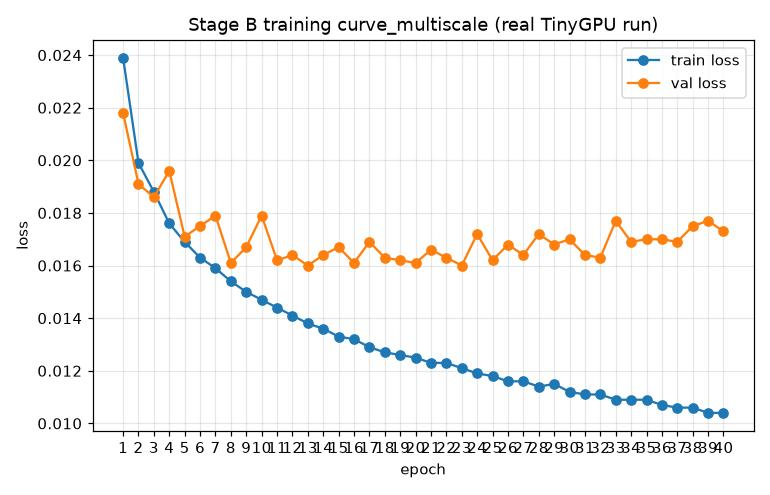
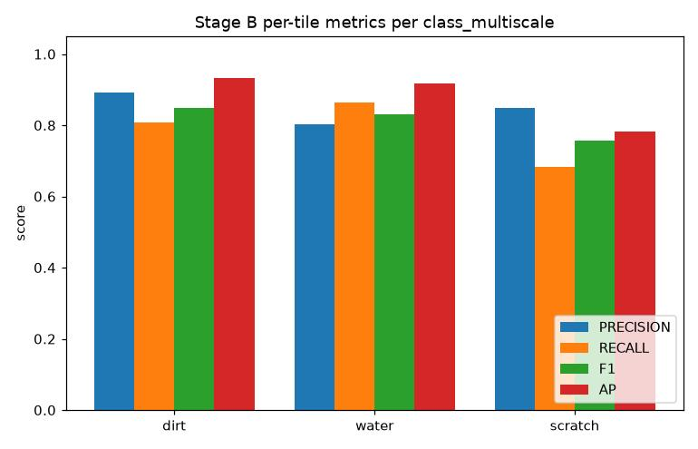
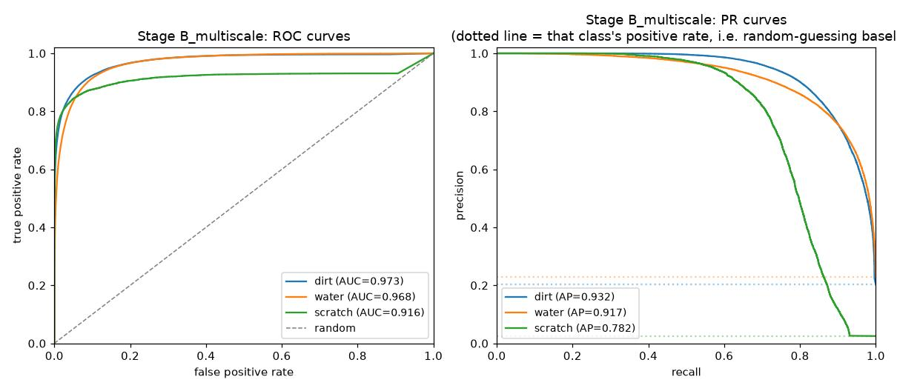
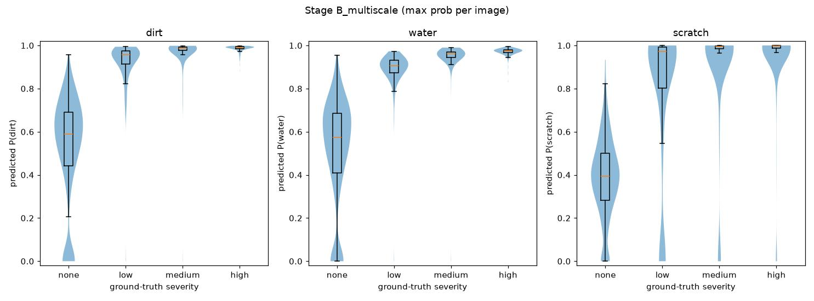
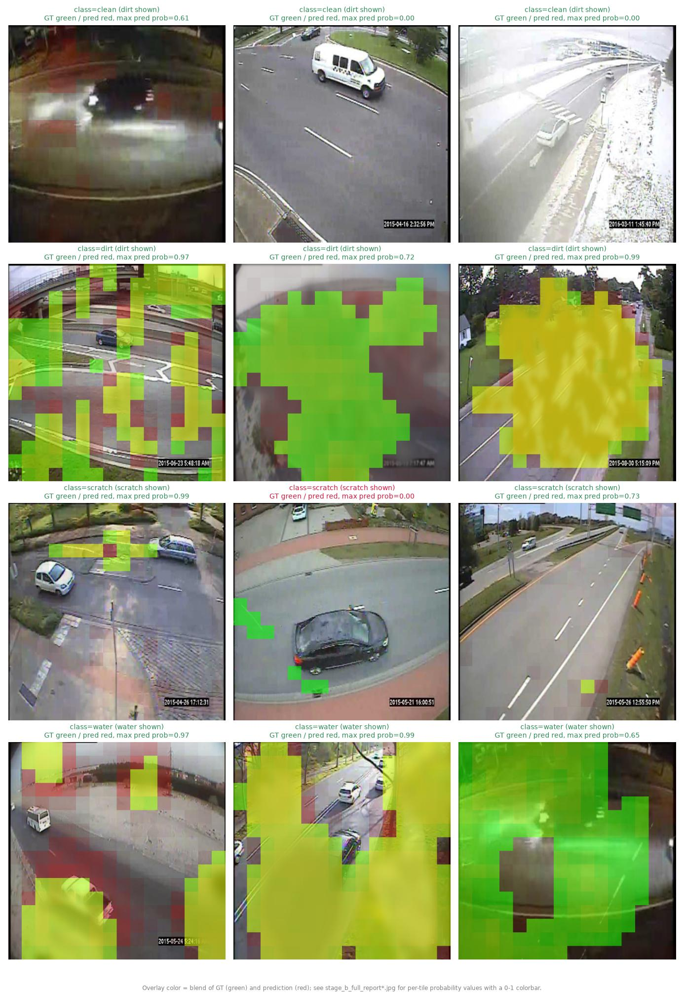
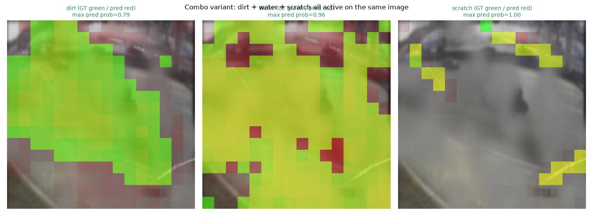
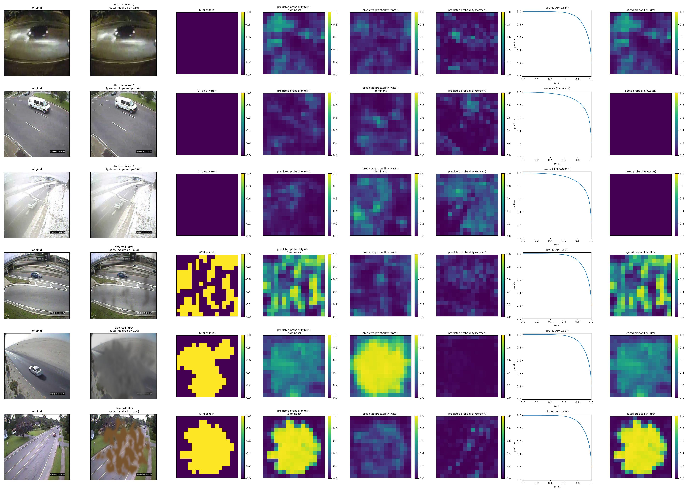
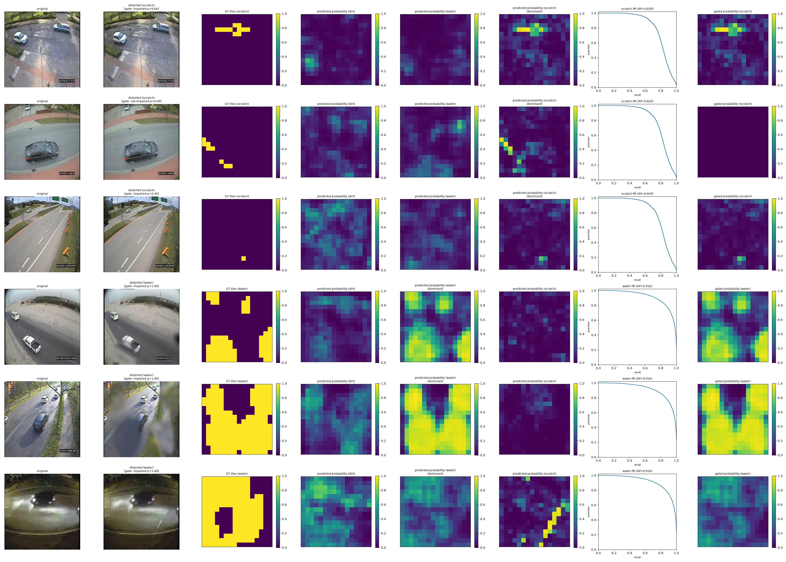

# Stage B Final Report — Tile/Grid Distortion Localization

**Status:** complete. Canonical checkpoint: `checkpoints/stage_b_multiscale/stage_b_head.pt`
(multi-scale tile head, focal loss α=0.75, γ=2.0), trained on `data/processed/stage_b_scratch15`
(14000 images, combo-inclusive, severity-balanced, severity-independent ground truth), gated at
inference time by `checkpoints/impaired_gate_multiscale/impaired_gate_head.pt` at threshold
**0.140** ([`stage_a_final_report.md`](stage_a_final_report.md) §5). The same dataset directory
also carries full-resolution pixel masks (`masks/`), which Stage C
([`stage_c_final_report.md`](stage_c_final_report.md)) trains against. For the full history
(loss-function iteration, threshold diagnostics, every intermediate checkpoint and dataset
rebuild, the Session 22 ground-truth fix), see [`development_log.md`](development_log.md); this
document reports only the current, final result.

---

## 1. Goal

Per `architecture.md` §2, Stage B extends Stage A's whole-image classification to **coarse
spatial localization**: "the feature map is treated as a grid (e.g. 16×16), one classification
output per tile" — so the model can say not just *whether* a distortion is present, but roughly
*where* on the lens, without needing pixel-mask annotation. Same frozen backbone and the same
three classes as Stage A; the output is one prediction per tile instead of one per image.

---

## 2. Pipeline overview

| Step | What | Where |
|---|---|---|
| 1 | Dataset builder (tile-grid ground truth, rasterized from each effect's own pixel mask) | `src/soiling/tile_labels.py`, `src/soiling/dataset_builder.py`, `scripts/build_stage_b_dataset.py` |
| 2 | Model: frozen multi-scale backbone + multi-scale tile head | `src/models/backbone.py`, `src/models/distortion_head.py::StageBMultiScaleHead` |
| 3 | Loss: focal (α=0.75, γ=2.0) | `src/models/losses.py` |
| 4 | Training (keeps the best-validation epoch) | `scripts/train_stage_b.py --arch multiscale` |
| 5 | FAU HPC (TinyGPU) submission | `scripts/hpc/train_stage_b_multiscale.slurm`, `evaluate_stage_b.slurm` |
| 6 | Evaluation (per-tile precision/recall/F1/AP/ROC-AUC, tuned thresholds, gate, per-severity) | `scripts/evaluate_stage_b.py`, `scripts/diagnose_clean_false_positives.py`, `src/eval/` |
| 7 | Visualization (overlay grid + 8-column per-sample report) | `scripts/visualize_stage_b_results.py` |

---

## 3. Key details

### Tile ground truth

Each effect's own full-strength `[0,1]` pixel mask is area-average-pooled to the backbone's P5
grid — **16×16** at `--img-size 512` — and thresholded per tile: **dirt 0.20, water 0.25,
scratch 0.015** (scratch is a thin line and needs a much lower coverage cutoff than dirt/water's
filled regions). Stored as `tile_labels.npy`, `(N, 3, 16, 16)` uint8, row-aligned with
`metadata.csv`. A combo variant can have several classes positive in the same tile.

**Ground truth is severity-independent:** a tile is positive wherever the distortion *is*,
regardless of how faint it is in the image. Severity only changes the image (an alpha-blend
toward the clean photo), so a faint distortion must still be found — the project's explicit
goal. (An earlier version also scaled the mask by the severity alpha, which labeled most of a
faint patch as clean; see `development_log.md` Session 22.)

### Model

`StageBMultiScaleHead`: the frozen YOLOv11-m backbone is tapped at four depths — stride 4, 8, 16
and 32 (P5). Each map is reduced to 64 channels by a 1×1 conv, area-pooled down to the 16×16
tile grid, concatenated, fused by a 3×3 conv and projected to 3 per-tile logits. It is still
exactly one classification output per P5 tile; the difference from a head on P5 alone is that
each tile also sees the finer layers, where faint texture changes are still present. P5 alone
is deep and semantic, and loses most of that signal — the P5-only head reached only 0.20–0.27 AP
on low-severity distortions (§4).

### Loss and decision threshold

**Focal loss (α=0.75, γ=2.0).** Tile-level class imbalance is severe (scratch tiles ~2%
positive); plain `BCEWithLogitsLoss(pos_weight=...)` over-predicted scratch almost everywhere,
and α=0.75 beat both RetinaNet's default α=0.25 and a sum-of-squared-differences alternative.
Each class gets its own decision threshold, tuned on the val split for best F1
(`src/eval/thresholds.py`), since the three classes' precision/recall curves differ a lot.

### Inference-time gate

The image-level impaired gate ([`stage_a_final_report.md`](stage_a_final_report.md) §5) zeroes
every tile of an image it calls "not impaired" (`src/eval/gate.py::apply_gate`). Its threshold
(**0.140**) is chosen on the val split to keep ≥95% of impaired images
(`evaluate_impaired_gate.py --recall-target 0.95`) — a gate's job is to drop clean images
without discarding real distortions, so best-F1 is the wrong criterion for it. A gate false
negative still silently suppresses a genuine detection; its measured cost is in §4.

---

## 4. Results

HPC job `1823015` (a100), 40 epochs, best validation loss at epoch 23 (0.0160).



**Per-tile metrics (held-out test split, 1400 images, 358400 tiles, tuned thresholds)**



| class | threshold | precision | recall | F1 | AP | ROC-AUC | support | gated F1 | gated AP | gated ROC-AUC |
|---|---|---|---|---|---|---|---|---|---|---|
| dirt | 0.643 | 0.891 | 0.811 | 0.849 | 0.934 | 0.975 | 72748 | 0.849 | 0.932 | 0.973 |
| water | 0.598 | 0.798 | 0.864 | 0.830 | 0.916 | 0.968 | 82441 | 0.831 | 0.917 | 0.968 |
| scratch | 0.585 | 0.844 | 0.712 | 0.773 | 0.820 | 0.976 | 9019 | 0.756 | 0.782 | 0.916 |



**Clean-image false positives** (`diagnose_clean_false_positives.py`: share of the 100 clean
test images with *any* of their 256 tiles above the class threshold — a strict measure):

| class | ungated | gated |
|---|---|---|
| dirt | 26% | **8%** |
| water | 46% | **14%** |
| scratch | 27% | **10%** |

The gate removes about two thirds of the clean-image false alarms at almost no cost for dirt
and water; scratch pays the most (gated AP 0.820→0.782), because the gate occasionally misses a
thin scratch.

**Per-severity breakdown** (`--by-severity`, ungated, per tile) — how well are faint
distortions found?

| class | severity | precision | recall | F1 | AP | ROC-AUC | support |
|---|---|---|---|---|---|---|---|
| dirt | low | 0.820 | 0.638 | 0.717 | 0.808 | 0.956 | 25387 |
| dirt | medium | 0.826 | 0.874 | 0.850 | 0.935 | 0.988 | 23960 |
| dirt | high | 0.841 | 0.935 | 0.885 | 0.968 | 0.995 | 23401 |
| water | low | 0.682 | 0.721 | 0.701 | 0.758 | 0.953 | 27252 |
| water | medium | 0.723 | 0.927 | 0.812 | 0.921 | 0.987 | 26524 |
| water | high | 0.776 | 0.943 | 0.851 | 0.956 | 0.991 | 28665 |
| scratch | low | 0.805 | 0.534 | 0.642 | 0.651 | 0.956 | 2769 |
| scratch | medium | 0.810 | 0.743 | 0.775 | 0.823 | 0.985 | 3178 |
| scratch | high | 0.803 | 0.841 | 0.822 | 0.891 | 0.994 | 3072 |

Faint distortions remain the hardest, but the gap is now moderate: low-severity AP is 0.65–0.81
versus 0.89–0.97 at high severity. For comparison, the P5-only head scored against the same
labels reached only 0.27 / 0.24 / 0.20 low-severity AP (dirt / water / scratch) — the
multi-scale features roughly triple it.




A multi-distortion (combo) image, one panel per active class — several classes can be
positive in the same tiles:



### Per-sample report figure

`scripts/visualize_stage_b_results.py::plot_stage_b_eight_column_report` — one row per sample:
original / distorted / ground-truth tiles / raw predicted probability (one column per class,
dominant one marked) / PR curve / gated probability. The raw columns and the PR curve always use
ungated predictions; the last column shows the post-gate result for direct comparison.




Strong dirt is localized closely (last row). The grey, fog-like dirt in row 5 is found but
labeled **water** — the dirt and water generators share the same fog-texture family and differ
mainly in color, so the two classes genuinely overlap there (§5). Clean rows show low, noisy
raw probabilities; the gate suppresses the ones it recognizes as clean.

### General/any-distortion tile channel

A derived (not trained) "is *any* class active here" channel (`src/eval/general_channel.py`):
logical OR of the ground truth, noisy-OR `1 - Π(1-p_c)` of the predictions, and
`general_channel_consistency` as a self-check. A 4th trained channel would only re-learn a
deterministic function of the 3 the model already predicts.

---

## 5. Known limitations

- **Faint scratches are the weakest case** — low-severity scratch recall 0.53 (AP 0.65).
- **Dirt vs. water confusion on grey haze.** Both classes draw from the same vendored
  fog/mud texture family (`src/soiling/effects.py::_DIRT_WATER_TEXTURE_MODS`); a grey fog
  layer can legitimately look like either.
- **Clean-image false alarms remain** at 8–14% of clean images even after gating (strict
  any-tile measure), and the gate trades that against occasionally suppressing a real
  detection (scratch gated AP 0.820→0.782).
- **Synthetic distortions only**, untested against real soiled-lens photos; small pilot
  dataset (1000 source photos) — same caveats as
  [`stage_a_final_report.md`](stage_a_final_report.md) §6.

---

## 6. Reproducing this report

```bash
python scripts/build_stage_b_dataset.py --source data/raw/mio_tcd/images \
    --out data/processed/stage_b_scratch15 --variants 14 --include-combos --include-severity \
    --dirt-threshold 0.20 --water-threshold 0.25 --scratch-threshold 0.015 --save-pixel-masks
python scripts/train_impaired_gate.py --data data/processed/stage_b_scratch15 --arch multiscale \
    --img-size 512 --epochs 20 --device cuda --out checkpoints/impaired_gate_multiscale
python scripts/train_stage_b.py --data data/processed/stage_b_scratch15 --arch multiscale \
    --epochs 40 --loss focal --focal-alpha 0.75 --focal-gamma 2.0 --device cuda \
    --out checkpoints/stage_b_multiscale
python scripts/evaluate_stage_b.py --checkpoint checkpoints/stage_b_multiscale/stage_b_head.pt \
    --data data/processed/stage_b_scratch15 --split test --tune-thresholds --by-severity \
    --gate-checkpoint checkpoints/impaired_gate_multiscale/impaired_gate_head.pt --gate-threshold 0.140
python scripts/visualize_stage_b_results.py --checkpoint checkpoints/stage_b_multiscale/stage_b_head.pt \
    --data data/processed/stage_b_scratch15 --split test --tune-thresholds \
    --gate-checkpoint checkpoints/impaired_gate_multiscale/impaired_gate_head.pt --gate-threshold 0.140 \
    --log-file stage_b_multiscale_1823015.out --tag _multiscale --out-dir docs/images
```

The current builder writes severity-independent ground truth directly. A dataset built before
Session 22 is converted in place with `scripts/make_gt_severity_independent.py --data <dir>`
(which is how the on-disk dataset was produced). `build_b_severity_1822268.out` /
`build_b_pixel_masks_1822558.out` (dataset build), `stage_b_multiscale_1823015.out` (training)
and `eval_stage_b_ms_g2_1823034.out` / `clean_fp_ms_g2_1823035.out` (evaluation) are the raw
stdout of the TinyGPU jobs. Superseded checkpoints and their numbers are in
`docs/development_log.md`.
