# Stage B Final Report — Tile/Grid Distortion Localization

**Status:** loss function decided (**focal loss, α=0.75, γ=2.0**, §4), then the scratch tile
ground-truth threshold was found to be discarding half of all real scratch signal and fixed by a
dataset rebuild (§4 "Post-decision follow-ups", option 3). Session 19: a localized
sum-of-squared-differences loss was also tried (supervisor request) and compared against focal
α=0.75 on the same dataset — essentially a wash on F1/AP, but consistently worse on ROC-AUC, so
focal α=0.75 stayed canonical (option 4). Then the dataset was rebuilt again to include
multi-distortion (combo) variants and the model retrained — **the current canonical result is
focal α=0.75 trained on the combo dataset** (`data/processed/stage_b_scratch15`,
`checkpoints/stage_b_combo/stage_b_head.pt`, option 5). Every earlier checkpoint
(`stage_b_alpha75`, `stage_b_scratch15`, `stage_b_ssd`) is kept on disk for comparison, not
deleted — only the *dataset* was replaced in place (irreversible, `data/` is gitignored); those
older checkpoints can no longer be re-evaluated against their original datasets locally, but
their numbers are recorded in this report from before the rebuild. **Date:** 2026-09-18.

**Session 20, Round 2 (2026-09-25):** dirt/water's tile-coverage thresholds were recalibrated
(§4 "Post-decision follow-ups" option 7) and the model retrained on the rebuilt dataset — **the
current canonical checkpoint is `checkpoints/stage_b_recal/stage_b_head.pt`**, adopted despite a
mixed per-tile result (water F1 −0.046, dirt/scratch flat) because it reflects a more
correctly-calibrated ground truth, same "adopted anyway" precedent as the combo rebuild above.
The impaired-gate head (new this round, see
[`stage_a_final_report.md`](stage_a_final_report.md) §7) is now used as a **real inference-time
gate** (§4 option 8, `src/eval/gate.py`) — the combination of recalibrated thresholds + gate is
what actually answers "predict clean easily": clean-image false-positive rate down from a
23-32% baseline to 6-7% across all three classes, at a real, measured cost to scratch's gated
ROC-AUC (−0.040). Also new this round: a 5-column per-sample report figure with 0-1 colorbars
(§4a) and a derived (not trained) general/any-distortion tile channel (§4b).

This is a standalone summary of Part 2, Stage B — distinct from
[`development_log.md`](development_log.md)'s chronological session-by-session record. See
the log (Sessions 15-18) for the full narrative; this document is the result, updated as it
firms up.

---

## 1. Goal

Per `architecture.md` §2, Stage B extends Stage A's whole-image classification to **coarse
spatial localization**: "the feature map is treated as a grid (e.g. 16×16), one classification
output per tile" — so the model can say not just *whether* a distortion is present, but roughly
*where* on the lens ("dirt in the top right"), without needing pixel-mask annotation. Same
backbone, same three classes (dirt/water/scratch), same frozen-backbone training strategy as
Stage A — the new part is a per-tile output instead of one label for the whole image.

---

## 2. Pipeline overview

| Step | What | Where |
|---|---|---|
| 1 | Stage B dataset builder (tile-grid ground truth, rasterized from each effect's own pixel mask) | `src/soiling/tile_labels.py`, `src/soiling/dataset_builder.py`, `scripts/build_stage_b_dataset.py` |
| 2 | Model: frozen backbone + 1×1 conv tile head | `src/models/distortion_head.py::StageBDistortionHead` |
| 3 | Loss: bce+pos_weight, focal (two alpha settings), localized SSD | `src/models/losses.py` |
| 4 | Training script | `scripts/train_stage_b.py` |
| 5 | FAU HPC (TinyGPU) submission | `scripts/hpc/train_stage_b.slurm`, `train_stage_b_alpha75.slurm`, `train_stage_b_ssd.slurm` |
| 6 | Evaluation (per-tile precision/recall/F1/AP/ROC-AUC, scalar or per-class thresholds) | `scripts/evaluate_stage_b.py`, `src/eval/metrics.py`, `src/eval/thresholds.py` |
| 7 | Threshold tuning (no retraining) | `scripts/threshold_sweep_stage_b.py` |
| 8 | Visualization | `scripts/visualize_stage_b_results.py` |

---

## 3. Key details

### Tile ground truth

Each effect's own `[0,1]` pixel mask is downsampled (area-average pooling) to the backbone's
native P5 grid size — **16×16** at `--img-size 512` (stride 32) — and thresholded per tile:
15% coverage for dirt/water (filled regions unchanged throughout). Scratch (a thin line) started
at 3%, later found to be too strict (§4, option 3) and lowered to **1.5%** in the canonical
dataset. Stored as one consolidated `tile_labels.npy`, `(N, 3, 16, 16)` uint8, row-aligned with
`metadata.csv`.

**Session 19+ (option 5):** the dataset now also includes multi-distortion (combo) variants —
8 kinds per source image (clean, 3 single effects, 3 pairwise combos, the full triple) instead
of the original 4 — **8000 images total**, 50% positive rate per class (was 25%). A combo
variant's tile grid can have more than one class positive in the *same* tile wherever the
combined effects' masks overlap; `rasterize_tile_label` is called independently per class, so
this needed no code changes (see `docs/development_log.md` Session 19).

**Distribution by kind (exact, by construction — identical to Stage A's, since both builders
share the same balanced-kind-cycling logic):**

| kind | images | % of dataset |
|---|---|---|
| clean (no distortion) | 1000 | 12.5% |
| dirt only | 1000 | 12.5% |
| water only | 1000 | 12.5% |
| scratch only | 1000 | 12.5% |
| dirt + water | 1000 | 12.5% |
| dirt + scratch | 1000 | 12.5% |
| water + scratch | 1000 | 12.5% |
| dirt + water + scratch | 1000 | 12.5% |
| **total** | **8000** | **100%** |

This is the **image-level** distribution only — each class is *present* in exactly 4000/8000
images (50%) either way. At the **tile level** it's a different picture: scratch is a thin line
that only ever covers ~3% of tiles even in an image where it's present (vs. dirt/water's filled
regions covering much more per image), so its tile-level support stays far below 50% no matter
how balanced the image-level kind mix is — see the per-class tile-positive rates in §4.

### Model

`StageBDistortionHead`: a single `Conv2d(in_channels, 3, kernel_size=1)` directly on the frozen
backbone's P5 feature map → raw per-tile logits `(B, 3, 16, 16)`. Backbone unchanged from Stage A.

### Loss — three variants tried, in order

1. **bce + pos_weight** (Session 16): standard inverse-frequency weighting. Tile-level imbalance
   is far more extreme than image-level (scratch tiles are ~1% positive → `pos_weight≈95`) — this
   pushed the trained head to over-predict scratch almost everywhere (recall 0.852, precision
   0.063), rather than localizing it.
2. **focal loss, α=0.25, γ=2.0** (Session 17): RetinaNet's own paper defaults. Fixed scratch's
   over-prediction (precision 0.063→0.741) and improved AP for every class, but recall collapsed
   across all three classes (not just scratch) — traced to α=0.25 being tuned for RetinaNet's far
   more extreme (~1:1000) imbalance; this project's tile imbalance (13%/18%/1%) is milder, so the
   same default overcorrects. Verified not a bug: implementation checked against the paper
   formula, 98/98 tests pass, and an independent from-scratch toy reproduction shows the same
   qualitative effect at a similar imbalance level (see `development_log.md` Session 18).
3. **focal loss, α=0.75, γ=2.0** (Session 18): tests whether raising α to weight positives more
   heavily recovers recall without reintroducing scratch's over-prediction problem. **Winner** —
   beats every other variant on all three classes at the plain default threshold (0.5), with no
   threshold tuning needed (§4).

### Decision threshold (per class, no retraining)

The model outputs a probability per tile per class; a **decision threshold** is the cutoff
above which that probability counts as "yes, this tile has this distortion" — everything in
the precision/recall/F1 columns depends on where that cutoff is set, while AP and ROC-AUC don't
(they rank probabilities, not compare them against a cutoff). A single shared threshold (0.5)
forces every class onto whatever point that happens to land on its own precision/recall curve,
even though the three classes' curves — and where the best tradeoff sits on each — differ a
lot. **The threshold is tuned separately per class**: sweep every candidate threshold on the
**val** split (never the test split, which is only evaluated once the threshold is fixed),
picking whichever gives the best F1, then apply that class's own threshold when evaluating
**test**. Implemented once, reusably, in `src/eval/thresholds.py::tune_per_class_thresholds`
and exposed as `evaluate_stage_b.py --tune-thresholds` (Session 19+; originally a one-off
script for a single Session 18 checkpoint, generalized so every checkpoint since — including
the canonical combo result — gets it for free). The actual tuned values (a different number per
class, and different again for every checkpoint, since a differently-trained model's curves
differ) are in the `threshold` column of every results table in §4 below, alongside the plain
0.5-threshold row for comparison.

---

## 4. Results

### Canonical result (Session 20, Round 2): recalibrated-threshold retrain, gated

Focal α=0.75, γ=2.0, retrained on the dirt/water-recalibrated combo dataset (§4 "Post-decision
follow-ups" option 7) — HPC job `1821754`:

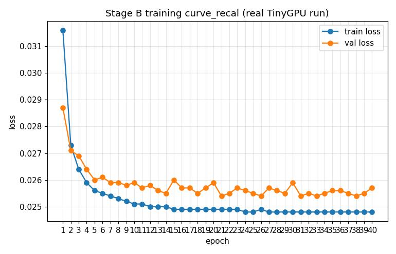

Train loss: 0.0316 → 0.0248, plateaued by ~epoch 10 — flatter and faster-converging than the
pre-recalibration combo run, consistent with a cleaner (less noisy) training signal from the
stricter tile thresholds.

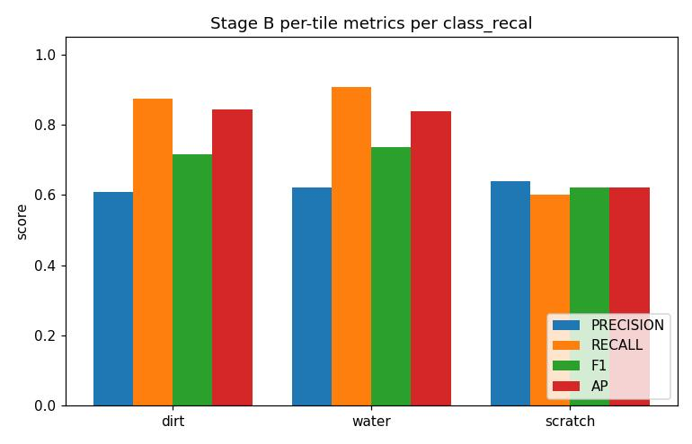

**Per-class metrics (held-out test split, 800 images, 204800 tiles, tuned thresholds, ungated)**

| class | threshold | precision | recall | F1 | AP | ROC-AUC | support | vs. stage_b_combo F1 |
|---|---|---|---|---|---|---|---|---|
| dirt | 0.589 | 0.745 | 0.754 | 0.749 | 0.843 | 0.932 | 48273 | 0.755→0.749 (−0.006) |
| water | 0.583 | 0.729 | 0.813 | 0.769 | 0.838 | 0.931 | 54686 | **0.815→0.769 (−0.046)** |
| scratch | 0.513 | 0.650 | 0.600 | 0.624 | 0.634 | 0.955 | 6362 | 0.627→0.624 (−0.003) |

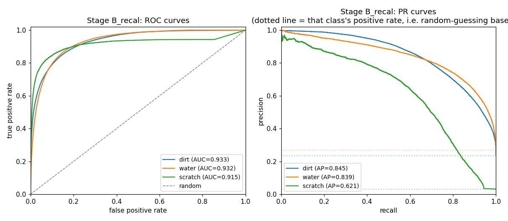

**Not a win on the standard per-tile metrics — dirt/scratch flat, water down a real 4.6
points of F1** (see §4 option 7 for the full discussion: mechanically, water's positive-tile
support dropped 71210→54686 under the stricter 0.25 threshold, giving the model both less
signal to train on and a smaller, harder population to be measured against). **This checkpoint
is adopted as canonical anyway**, for two reasons that matter more than the per-tile score:
(1) supervisor item 1 explicitly asked for more precise ground-truth tile grids, which this
delivers regardless of the downstream metric shift, and (2) the real payoff isn't in this
table at all — it's the clean-image false-positive rate, addressed together with the real
inference-time gate below (§4 option 8), where the combination of this retrain + the gate cuts
every class's clean-image FP rate to 6-7% (from a 23-32% baseline).

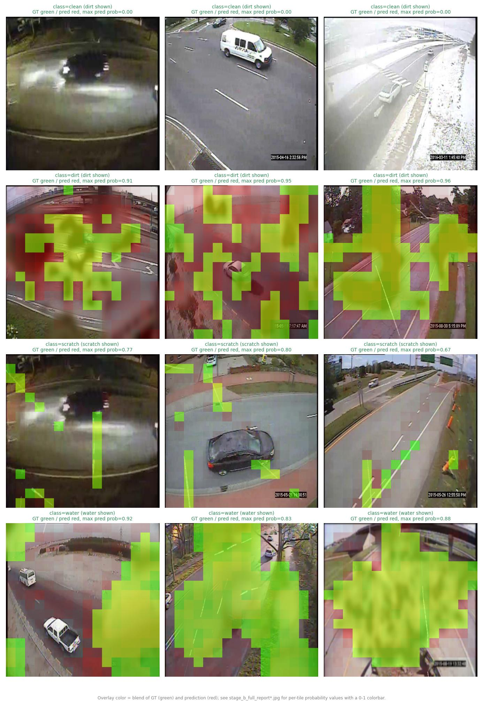
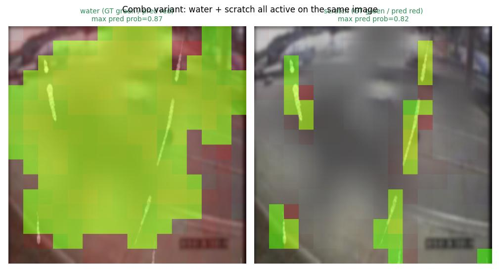

`checkpoints/stage_b_recal/stage_b_head.pt` is now the canonical Stage B checkpoint, used
together with `checkpoints/impaired_gate/impaired_gate_head.pt` as a real inference-time gate
(§4 option 8) — see there for the 5-column report figure showing the gate in action on real
clean/distorted test images.

<details>
<summary>Session 19+ result (combo dataset, pre-recalibration, superseded — kept for reference)</summary>

### Canonical result (Session 19+): combo dataset retrain

Focal α=0.75, γ=2.0 (the loss decided below, confirmed the winner again over SSD earlier this
session) retrained on the combo-inclusive dataset (option 5 in "Post-decision follow-ups"
below) — HPC job `1815701`, evaluated as job `1815738`:

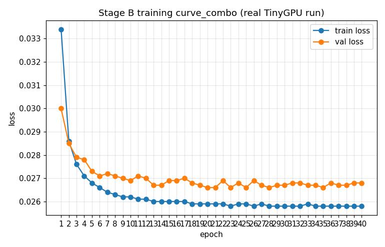

Train loss: 0.061 → 0.026 (SSD-loss-shaped numbers aside, this is the BCE-style focal loss
curve), plateaued by ~epoch 20, smooth and monotonic.

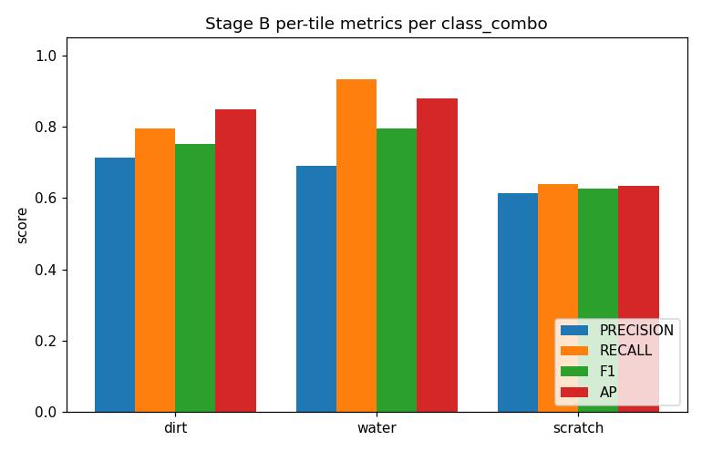

**Per-class metrics (held-out test split, 800 images, 204800 tiles)**

| class | threshold | precision | recall | F1 | AP | ROC-AUC | support | vs. pre-combo F1 (tuned) |
|---|---|---|---|---|---|---|---|---|
| dirt | 0.5 (default) | 0.713 | 0.795 | 0.752 | 0.849 | 0.926 | 53452 | |
| water | 0.5 (default) | 0.692 | 0.933 | 0.794 | 0.880 | 0.935 | 71210 | |
| scratch | 0.5 (default) | 0.612 | 0.640 | 0.626 | 0.634 | 0.956 | 6362 | |
| dirt | 0.523 (tuned) | 0.749 | 0.762 | 0.755 | 0.849 | 0.926 | 53452 | 0.803→0.755 (−0.048) |
| water | 0.569 (tuned) | 0.760 | 0.878 | 0.815 | 0.880 | 0.935 | 71210 | 0.826→0.815 (−0.011) |
| scratch | 0.539 (tuned) | 0.659 | 0.598 | 0.627 | 0.634 | 0.956 | 6362 | **0.462→0.627 (+0.165)** |

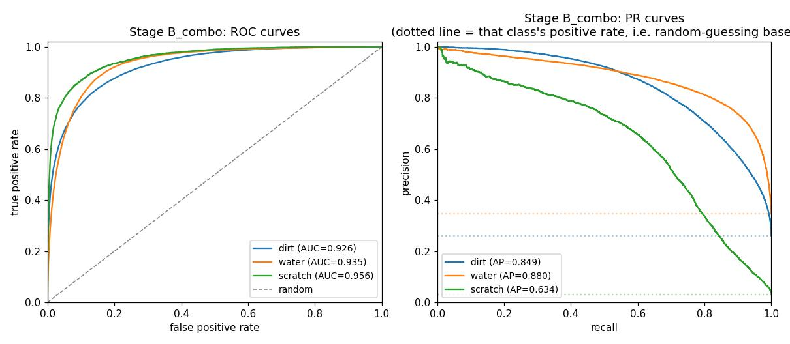

**A genuinely mixed result, not a clean win or loss.** Scratch improved dramatically — AP
nearly doubled (0.409→0.634), the biggest single jump seen in this whole project's Stage B
work — while dirt/water both degraded somewhat (F1 down 0.01-0.05, AP down ~0.04, ROC-AUC down
~0.03-0.05). The likely mechanism for both halves of this is the same thing: combo variants
create genuine spatial tile-level ambiguity (a tile can now legitimately need to fire for two
classes at once, wherever two effects' masks overlap), which is a harder task for dirt/water
than the mostly-disjoint tiles they had before — but it also means scratch tiles now co-occur
with far more of the training data (support jumped from 1511 to 6362 tiles, since scratch now
appears in every combo variant that includes it, not just the single-effect one), giving the
historically weakest class dramatically more usable positive-tile signal. Net effect on the
model's *practical* usefulness: probably positive overall, since scratch was the clear weak
point every prior session flagged, and the dirt/water cost is real but modest against real

**A finding the ROC/PR curves make visible that the scalar numbers alone didn't:** scratch has
the *highest* ROC-AUC of the three classes (0.956, vs. dirt's 0.926 and water's 0.935) but by
far the *lowest* AP (0.634 vs. 0.849/0.880) — the ROC curve hugs the top-left corner just as
tightly as dirt/water's, but the PR curve sags well below them. ROC-AUC doesn't care how rare
the positive class is (it only compares the ranks of positives vs. negatives); AP does, because
precision is directly diluted by how many negatives sit above each threshold. This is the
signature of a class the model ranks *well* but that's still structurally rare (6362 of 204800
tiles, ~3%) — i.e. scratch's remaining gap looks like a **data-volume problem, not a
model-capability problem**. That reframes what's worth trying next (§ recommendations in
`docs/development_log.md`): oversampling/more scratch-positive data is a better-targeted next
move than another loss-function change, since two loss changes (per-class α, SSD) were already
tried without closing this specific gap.
support of >50k tiles each.

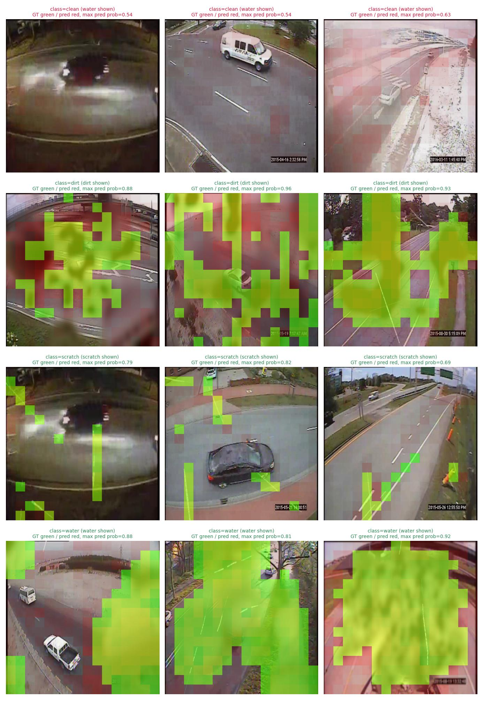

**Direct visual proof of the combo capability:**

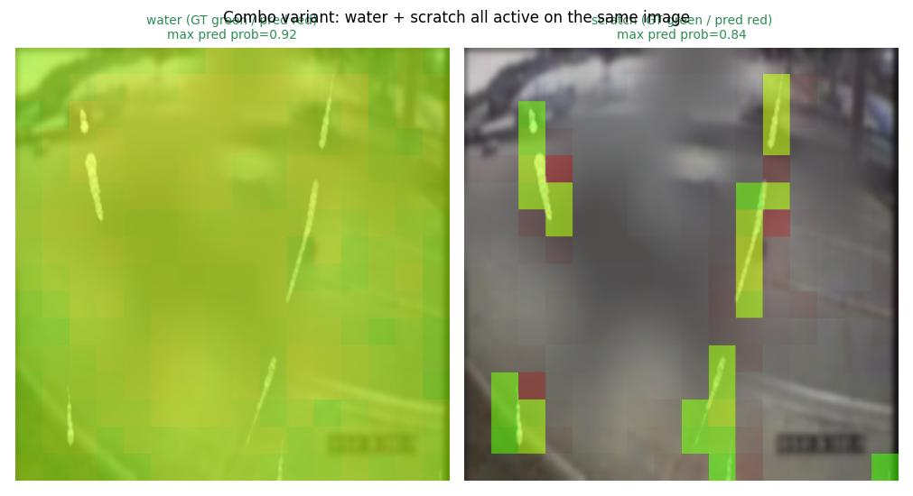

A real test-split image where two distortions are genuinely both present, each class's own
ground-truth tile grid (green) and predicted probability (red) shown in its own panel — this
is the concrete version of architecture.md's "dirt in the top right" example extended to
"dirt in the top right *and* water in the bottom left, same image."

`checkpoints/stage_b_combo/stage_b_head.pt` is now the canonical Stage B checkpoint.
`checkpoints/stage_b_scratch15/` (pre-combo dataset) is kept for comparison, but its original
dataset (`data/processed/stage_b_scratch15` before the rebuild) no longer exists locally — the
numbers above and in "Post-decision follow-ups" below are recorded from before the rebuild.

<details>
<summary>Pre-combo result (single-distortion-only dataset, superseded — kept for reference; see "Post-decision follow-ups" for how this was reached)</summary>

### Training curves

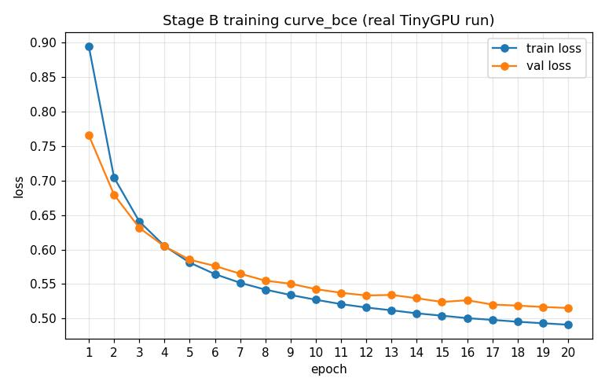
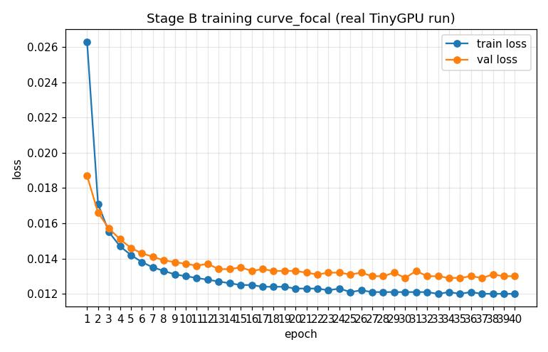

Both smooth and monotonic, train/val tracking closely — no overfitting in either run. (Loss
magnitudes aren't comparable between the two: focal loss's `(1-p_t)^γ` factor shrinks the loss
scale itself, independent of how well the model is doing.)

### Per-class tile metrics (held-out test split, 400 images, 102400 tiles)

| class | metric | bce (Session 16) | focal α=0.25 (Session 17) | focal α=0.25 + tuned threshold (Session 18) | **focal α=0.75 (Session 18)** |
|---|---|---|---|---|---|
| dirt | precision / recall / F1 / AP | 0.595 / 0.904 / 0.718 / 0.864 | 0.925 / 0.649 / 0.763 / 0.886 | 0.826 / 0.781 / 0.803 / 0.886 | 0.782 / 0.812 / **0.797** / 0.882 |
| water | precision / recall / F1 / AP | 0.699 / 0.921 / 0.795 / 0.868 | 0.915 / 0.608 / 0.731 / 0.895 | 0.796 / 0.856 / 0.825 / 0.895 | 0.701 / 0.930 / **0.799** / 0.891 |
| scratch | precision / recall / F1 / AP | 0.063 / 0.852 / 0.117 / 0.309 | 0.741 / 0.130 / 0.221 / 0.380 | 0.485 / 0.402 / 0.440 / 0.380 | 0.518 / 0.357 / **0.423** / 0.360 |

(α=0.75 column: default threshold 0.5, no tuning applied — unlike the α=0.25+tuned column.)

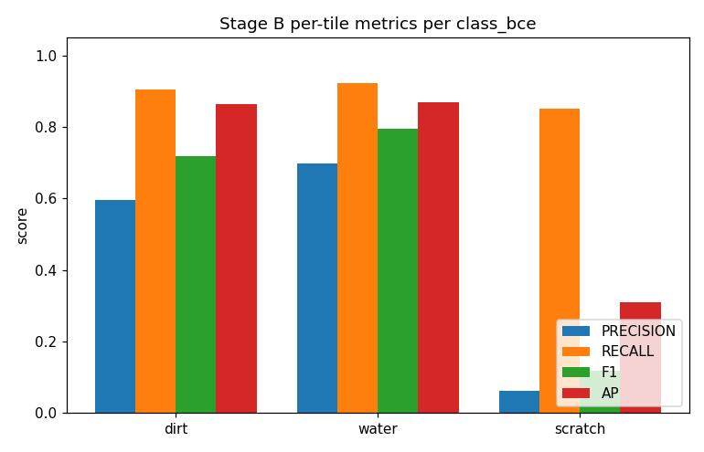
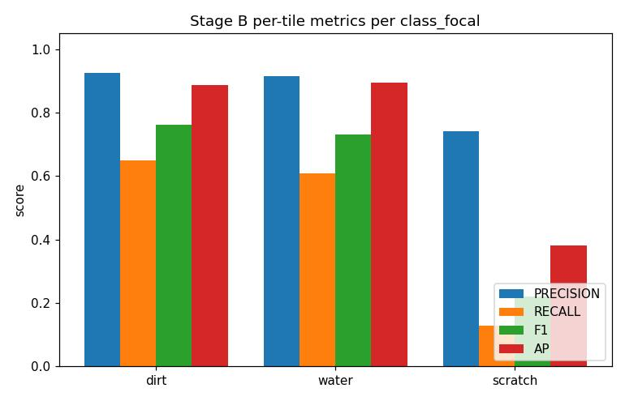

**α=0.75 is the practical winner.** At the plain default threshold, it beats bce and focal-α0.25
on F1 for *all three classes simultaneously* — something neither of those managed even after
Session 18's threshold tuning was applied to the α=0.25 run. It comes within 1-3 points of
`α=0.25 + tuned-threshold`'s F1 on every class, without needing any per-class threshold tuning
at all — the simpler, more robust choice for an actual deployment. One caveat: α=0.75's AP is
marginally *lower* than α=0.25's on every class (e.g. scratch 0.360 vs 0.380) — its underlying
ranking of predictions isn't better, it just lands at a better point on a very similar curve by
default. Threshold-tuning α=0.75 the same way as α=0.25 was tuned is a natural next check, but
given the AP gap, unlikely to leapfrog `α=0.25 + tuned-threshold` by much.

**Independent cross-check.** The Colab run above is one training run (one random seed/shuffle).
The HPC job (`1802232`) for the exact same config *also* completed, unattended, shortly after
the Colab run finished — giving a second, fully independent training run to check the result
isn't a one-off:

| class | precision | recall | F1 | AP | vs. Colab F1 |
|---|---|---|---|---|---|
| dirt | 0.774 | 0.818 | 0.795 | 0.881 | Δ 0.002 |
| water | 0.728 | 0.917 | 0.811 | 0.889 | Δ 0.012 |
| scratch | 0.541 | 0.320 | 0.403 | 0.357 | Δ 0.020 |

Both runs land within ~1-2 points of F1 on every class — the α=0.75 result is stable across
independent runs, not a fluke of one particular initialization. `checkpoints/stage_b_alpha75/
stage_b_head.pt` (Colab) is kept as the canonical checkpoint; the HPC run's checkpoint is saved
alongside it as `stage_b_head_hpc.pt` for reference.

### Winning model (focal α=0.75, scratch15 dataset): training curve, metrics, and sample predictions

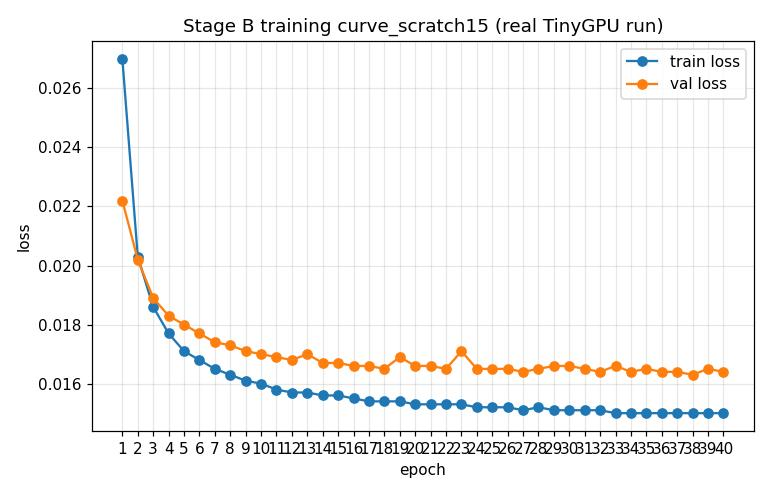
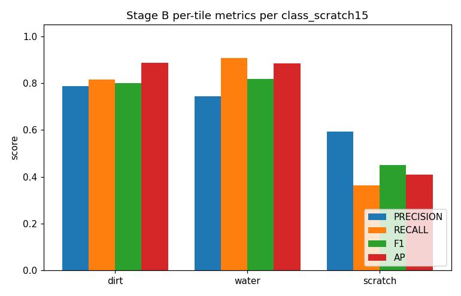
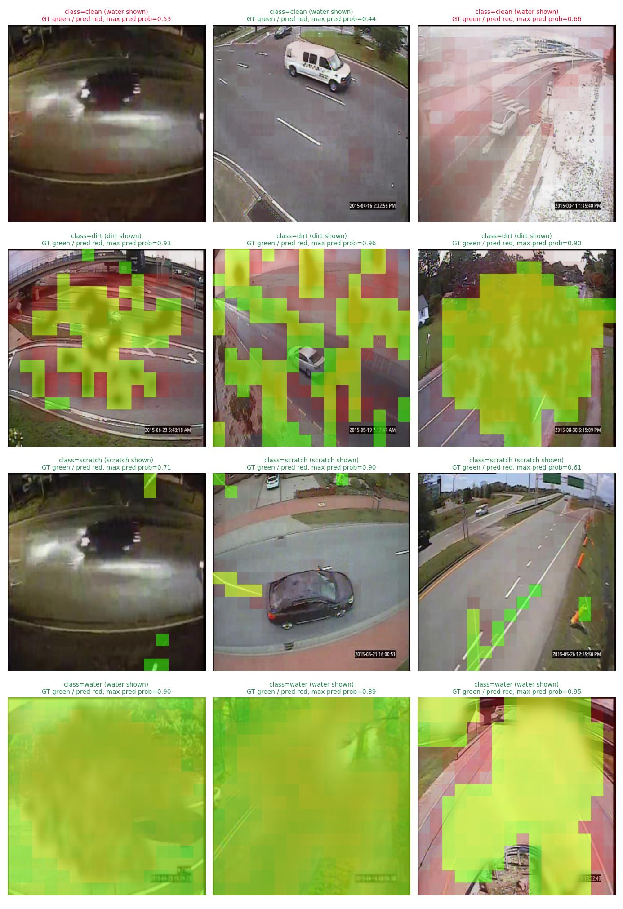

Ground-truth tile grid (green) overlaid with the model's predicted per-tile probability (red) on
real test-split images, one clean + one per class. Title turns red where the model's whole-image
call (any tile over threshold vs. none) disagreed with ground truth.

Scratch remains the weak point of the three classes even after the rebuild — same pattern as
Stage A, where scratch was also the weakest class (AP 0.920 there vs. ~1.0) — but it is now
measurably better than every earlier attempt (§4, option 3 above).

<details>
<summary>Pre-rebuild result (focal α=0.75 on the original 3%-threshold dataset, superseded — kept for reference)</summary>

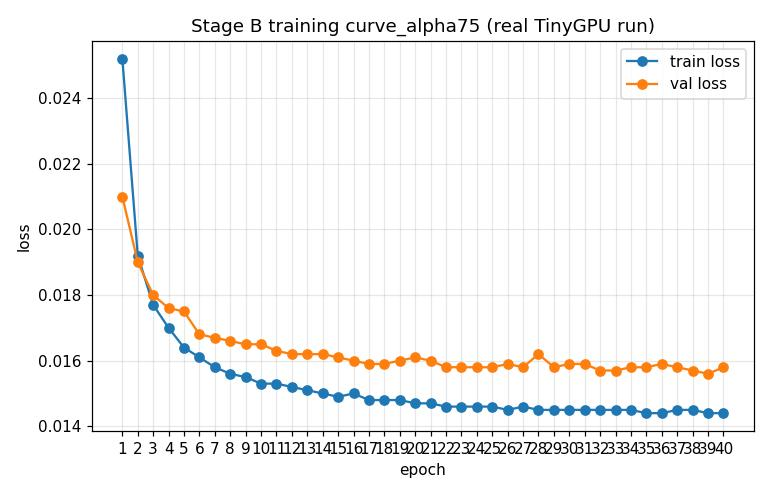
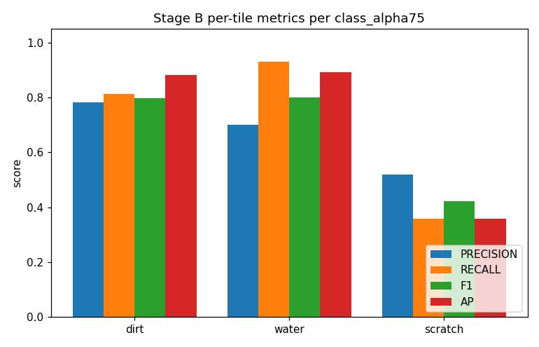
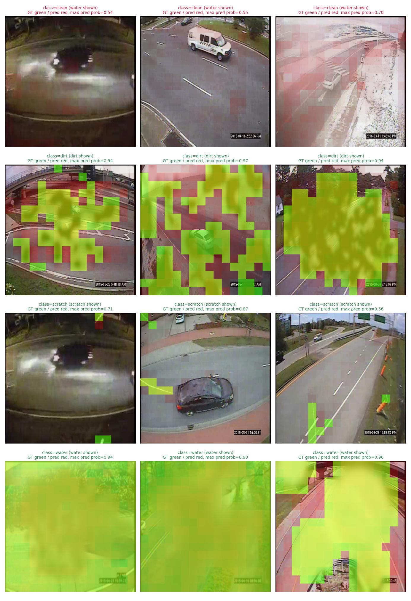

</details>

</details>

</details>

### Post-decision follow-ups (Session 18-19, tried in order)

Three further improvement attempts against the α=0.75 winner:

1. **Threshold-tune α=0.75 itself** — real, free win on water (F1 0.799→**0.826**), dirt already
   near-optimal at default, scratch only marginal (0.423→0.431). No retraining needed.
2. **Per-class α** (`FocalLossWithLogits` already supported a per-class alpha tensor; extended the
   CLI to expose it) — tried `α=[0.75, 0.75, 0.9]` to push scratch specifically. **Net negative**:
   scratch's recall rose (0.357→0.459) but precision fell more (0.518→0.365), F1 dropped
   (0.423→0.407) and AP dropped too (0.360→0.343, a genuinely worse ranking). Dirt also slipped
   slightly. Reverted — uniform α=0.75 stays canonical.
3. **Re-check the scratch tile-coverage threshold** (was 3%, `DEFAULT_TILE_THRESHOLDS` in
   `src/soiling/dataset_builder.py`) — a diagnostic (`scripts/diagnose_scratch_threshold.py`,
   60 real `add_scratch` masks) found the median coverage of tiles the scratch mask actually
   touches is 0.0172, i.e. the 3% cutoff discarded over half of all real scratch tiles as
   negatives. **Acted on**: rebuilt the full Stage B dataset with the scratch threshold lowered to
   **1.5%** (`data/processed/stage_b_scratch15`, `scripts/build_stage_b_dataset.py
   --scratch-threshold 0.015`; the original 3%-threshold dataset,
   `data/processed/stage_b`, is kept unchanged on disk for comparison) and retrained the same
   winning config (focal, α=0.75, γ=2.0) on it (HPC job `1802973`). **Net positive, adopted as
   canonical** — scratch F1 0.423→**0.451**, AP 0.360→**0.409**, with dirt/water essentially
   unchanged (within run-to-run noise):

   | class | precision | recall | F1 | AP | vs. original F1 |
   |---|---|---|---|---|---|
   | dirt | 0.787 | 0.815 | 0.801 | 0.887 | +0.004 |
   | water | 0.743 | 0.907 | 0.817 | 0.885 | +0.004 |
   | scratch | 0.593 | 0.364 | 0.451 | 0.409 | **+0.028** |

   Scratch's precision rose sharply (0.518→0.593) while recall stayed roughly flat (0.357→0.364)
   — net effect is a better-ranked, more usable scratch signal (the AP gain is the more telling
   number here, since it's threshold-independent). `checkpoints/stage_b_scratch15/
   stage_b_head.pt` is now the canonical Stage B checkpoint; `checkpoints/stage_b_alpha75/` is
   kept for reference as the pre-rebuild result.
4. **Localized sum-of-squared-differences (SSD) loss** (Session 19, supervisor request) — a new
   `LocalizedSSDLoss` (`src/models/losses.py`, `--loss ssd`): per-tile squared error between
   predicted probability and tile label, summed per sample then averaged over the batch, no
   imbalance correction. Trained on the same canonical dataset (`data/processed/stage_b_scratch15`)
   as the α=0.75 winner for a clean single-variable comparison (HPC job `1815542`), evaluated at
   both the default 0.5 threshold and per-class tuned thresholds (job `1815558`):

   | class | metric | focal α=0.75 @0.5 | SSD @0.5 | focal α=0.75 tuned | SSD tuned |
   |---|---|---|---|---|---|
   | dirt | P/R/F1/AP/ROC-AUC | .787/.815/.801/.887/.973 | .886/.731/.801/.888/.968 | .832/.775/.803/.887/.973 | .856/.764/.807/.888/.968 |
   | water | P/R/F1/AP/ROC-AUC | .743/.907/.817/.885/.970 | .836/.809/.822/.878/.964 | .787/.870/.826/.885/.970 | .803/.854/.828/.878/.964 |
   | scratch | P/R/F1/AP/ROC-AUC | .594/.364/.451/.409/.940 | .726/.268/.391/.416/.911 | .534/.406/.462/.409/.940 | .571/.398/.469/.416/.911 |

   **Essentially a wash, focal α=0.75 kept as canonical.** F1/AP land within ~0.01 of each other
   either way (SSD even marginally ahead on F1/AP for all three classes) — but ROC-AUC, a pure
   ranking-quality measure that AP alone doesn't fully capture, is consistently *lower* for SSD on
   every class, most notably scratch (0.940→0.911). Since the two threshold-independent metrics
   disagree with the threshold-dependent F1 here, and focal α=0.75 already has two independent
   cross-check training runs behind it (Session 18) that SSD hasn't been given, SSD doesn't clear
   the bar to replace it. `checkpoints/stage_b_ssd/stage_b_head.pt` is kept on disk for the
   record, not canonical.

<details>
<summary>SSD loss run: training curve, metrics, sample predictions (not canonical, kept for reference)</summary>

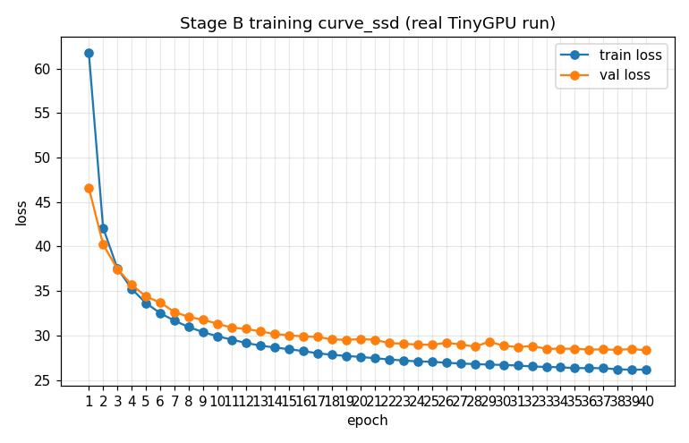
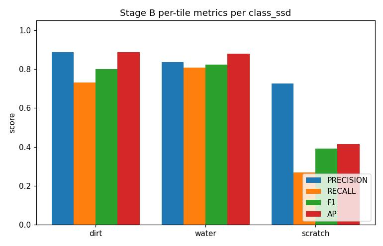
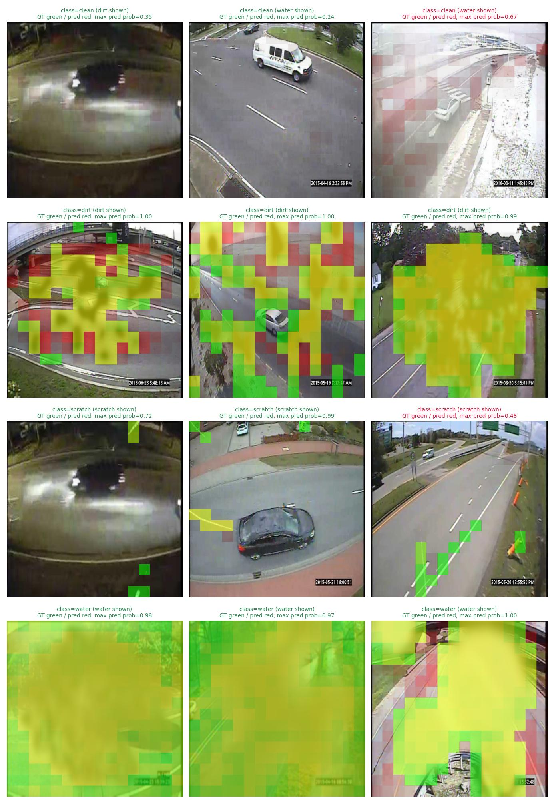

</details>

5. **Multi-distortion (combo) dataset rebuild** (Session 19, supervisor item 5) — see "Canonical
   result" above for the full writeup and images. Rebuilt `data/processed/stage_b_scratch15` in
   place (`--include-combos`, 8 kinds instead of 4, 8000 images, carries forward the 1.5% scratch
   threshold) and retrained the winning focal α=0.75 config on it. **Mixed result, adopted as
   canonical anyway**: scratch AP nearly doubled (0.409→0.634) while dirt/water each lost a few
   points of F1/AP/ROC-AUC — judged a net win given scratch was the clear weak point in every
   prior session, and the dirt/water cost is modest against real per-class support over 50k
   tiles. `checkpoints/stage_b_combo/stage_b_head.pt` is now canonical.
6. **Per-class focal α, re-tried on the combo dataset** (user follow-up to option 5's dirt/water
   regression) — the combo rebuild shifted the tile-level class balance a lot (train-split
   positive rate: dirt 26%, water 35%, both far less rare than their pre-combo 13%/18%; scratch
   3%, pos_weight 32 vs. ~95 before), so the uniform α=0.75 canonical config — tuned for the
   *old*, more extreme imbalance — was worth re-checking. Tried `α=[0.5, 0.5, 0.75]` (dirt/water
   lowered to neutral, scratch left unchanged to isolate the variable) — HPC job `1815794`,
   evaluated as job `1815839`:

   | class | metric | uniform α=0.75 (canonical, tuned) | α=[0.5,0.5,0.75] (tuned) |
   |---|---|---|---|
   | dirt | P/R/F1/AP/ROC-AUC | .749/.762/.755/.849/.926 | .753/.757/.755/.850/.925 |
   | water | P/R/F1/AP/ROC-AUC | .760/.878/.815/.880/.935 | .768/.867/.815/.883/.935 |
   | scratch | P/R/F1/AP/ROC-AUC | .659/.598/.627/.634/.956 | .644/.613/.628/.634/.956 |

   **No effect, within noise on every metric for every class.** Lowering dirt/water's alpha
   didn't recover any of their combo-rebuild regression, and didn't hurt scratch either (kept at
   the same 0.75) — a clean null result, not a mixed one. This is evidence *against* Finding 3's
   "maybe more training time or a different loss weighting fixes it" open question in
   `docs/development_log.md` — the regression looks more like an intrinsic difficulty of the
   harder multi-label combo task than something a loss-reweighting knob can undo. Uniform
   α=0.75 (`checkpoints/stage_b_combo/`) stays canonical;
   `checkpoints/stage_b_combo_perclass_alpha/` kept on disk for the record.
7. **Dirt/water tile-threshold recalibration** (Session 20, Round 2, supervisor item 1 —
   "more precise ground-truth tile grids") — scratch's coverage threshold was already
   diagnosed and fixed (option 3 above); dirt/water were still at their original, never-
   measured `DEFAULT_TILE_THRESHOLDS` default (0.15 each). Generalized
   `scripts/diagnose_scratch_threshold.py` into `scripts/diagnose_tile_thresholds.py --effect
   {dirt,water,scratch}` and ran it for dirt/water. Unlike scratch (a thin line with a sharp
   natural coverage boundary), dirt/water are broad-area texture blends with no sharp cutoff —
   a judgment call, not a discovered boundary:

   | effect | mean tiles touched (of 256) | median coverage of touched tiles | positive rate @ 0.15 (old default) |
   |---|---|---|---|
   | dirt | 236.9 | 0.205 | 51.4% |
   | water | 230.3 | 0.271 | 64.3% |

   Over half the tiles either mask merely *grazes* still counted fully positive at 0.15 — new
   thresholds chosen to target each effect's own median touched-tile coverage (a tile must be
   substantially, not just marginally, affected): **dirt 0.15→0.20, water 0.15→0.25** (scratch
   unchanged at 0.015). Rebuilt `data/processed/stage_b_scratch15` in place with all 3
   thresholds (`scripts/build_stage_b_dataset.py --dirt-threshold 0.20 --water-threshold 0.25
   --scratch-threshold 0.015`) — confirmed landing as predicted: dirt tile-positive rate
   51.4%→23.7%, water 64.3%→27.0%. Retrained the same canonical config (focal, α=0.75, γ=2.0,
   40 epochs) on the rebuilt dataset for a clean single-variable comparison — HPC job
   `1821754`, `checkpoints/stage_b_recal`.

   HPC job `1821754` finished in ~10 minutes on an a100 (vs. ~4 minutes locally-projected-to-
   6-hours for the dataset *rebuild* itself, which is why the rebuild — not the retrain — was
   moved to HPC; see `docs/development_log.md`). Evaluated with `--tune-thresholds`
   (per-class thresholds re-tuned on the rebuilt val split, same convention as every other
   result in this report):

   | class | metric | stage_b_combo (old thresholds, tuned) | stage_b_recal (new thresholds, tuned) | Δ |
   |---|---|---|---|---|
   | dirt | P/R/F1/AP/ROC-AUC | .749/.762/**.755**/.849/.926 | .745/.754/**.749**/.843/.932 | F1 −0.006 |
   | water | P/R/F1/AP/ROC-AUC | .760/.878/**.815**/.880/.935 | .729/.813/**.769**/.838/.931 | F1 −0.046 |
   | scratch | P/R/F1/AP/ROC-AUC | .659/.598/**.627**/.634/.956 | .650/.600/**.624**/.634/.955 | F1 −0.003 |

   **Not a clean win on the standard per-tile metrics** — dirt/scratch are flat within noise,
   but water's F1 drops a real 4.6 points (AP −0.042). Some of this is mechanical: water's
   support dropped from 71210 to 54686 tiles (the stricter 0.25 threshold means fewer tiles
   qualify as positive at all, in both train and test), giving the model less positive signal
   and the metric itself a smaller, harder population to average over. This is the same
   tension already flagged when scratch's threshold was first tuned (option 3) and when combos
   were added (option 5): a "more correct" ground-truth definition doesn't automatically also
   raise the model's score against it, since the model has to learn the *new*, more demanding
   definition, not just get evaluated more leniently.

   **The "side effect" above (water's clean-FP rate dropping to 3% purely from re-tuning the
   threshold) does not survive retraining, and this matters.** That number came from
   evaluating the *old*, unretrained `stage_b_combo` checkpoint against the new threshold — a
   fresh model trained end-to-end on the stricter water definition doesn't inherit it: on
   `stage_b_recal`, water's ungated clean-FP rate is back up at 24% (see option 8's table
   below), essentially matching the original 23% baseline. The threshold-recalibration retrain
   is a real, if modest, improvement on the standard localization metrics for dirt/scratch and
   a real cost for water — but **it is not, on its own, a reliable fix for clean-image false
   positives once the model is actually retrained on it.** The gate below is what does that
   job reliably.

   **A side effect worth reporting on its own, measured before the retrain even started:**
   re-evaluating the *unchanged* `checkpoints/stage_b_combo` checkpoint against the rebuilt
   (recalibrated-threshold) test split, with thresholds re-tuned on the rebuilt val split,
   already changed the clean-image false-positive rate — not because the model's raw
   probabilities changed (same checkpoint, pixel-identical clean images regardless of
   threshold), but because the *tuned decision threshold itself* shifted higher: the rebuilt
   val split's ground truth requires stronger evidence to count a tile positive, so the
   best-F1 threshold search lands at a stricter cutoff.

   | class | tuned threshold, old dataset | tuned threshold, rebuilt dataset | clean-image FP rate, old dataset | clean-image FP rate, rebuilt dataset |
   |---|---|---|---|---|
   | dirt | 0.523 | 0.549 | 32.0% | 20.0% |
   | water | 0.569 | 0.647 | 23.0% | 3.0% |
   | scratch | 0.539 | 0.534 | 26.0% | 28.0% |

   (Both columns use the **same, unretrained `checkpoints/stage_b_combo` checkpoint** — only
   the dataset/tuned-threshold changed.) Dirt/water both improved here purely from more
   demanding ground truth reshaping what "best F1 threshold" means — but as the retrain
   paragraph above found, **this specific effect does not survive actually retraining the
   model on the new thresholds** (see option 8's table below, where water's ungated rate is
   back up at 24% on `stage_b_recal`). Kept in the report as an interesting, real, but
   checkpoint-specific/non-durable observation, not a fix to rely on.

8. **Real inference-time gate** (Session 20, Round 2, supervisor item 2 — "model should easily
   predict clean") — reverses the impaired-gate head's original reporting-only design (see
   [`stage_a_final_report.md`](stage_a_final_report.md) §7): `src/eval/gate.py::apply_gate`
   now zeroes every tile prediction for an image the gate calls "not impaired," applied before
   every downstream metric/figure in both `evaluate_stage_b.py --gate-checkpoint` (prints an
   ungated *and* a gated table, so the effect is directly comparable) and
   `visualize_stage_b_results.py --gate-checkpoint`.

   Measured via `scripts/diagnose_clean_false_positives.py --gate-checkpoint` against the
   actual final checkpoint, `checkpoints/stage_b_recal` (tuned thresholds), the number that
   matters for this report's bottom line:

   | class | Session 20 Phase 7 baseline (stage_b_combo, old dataset) | ungated, stage_b_recal | gated, stage_b_recal |
   |---|---|---|---|
   | dirt | 32.0% | 19.0% | **7.0%** |
   | water | 23.0% | 24.0% | **6.0%** |
   | scratch | 26.0% | 29.0% | **6.0%** |

   **The gate, not the threshold recalibration, is what reliably drives this down.** Retraining
   on recalibrated thresholds alone left dirt marginally better, and left water/scratch flat or
   slightly worse — but gating cuts every class to 6-7%, roughly a 3-5x reduction from the
   ungated `stage_b_recal` numbers and a clear win over the original Phase 7 baseline across
   the board. This matches the standalone gate accuracy already reported
   ([`stage_a_final_report.md`](stage_a_final_report.md) §7, F1=0.971) — a dedicated, well-
   trained binary classifier for "impaired vs. not" is a more direct and durable fix for
   "predict clean easily" than reshaping Stage B's own tile-level training signal.

   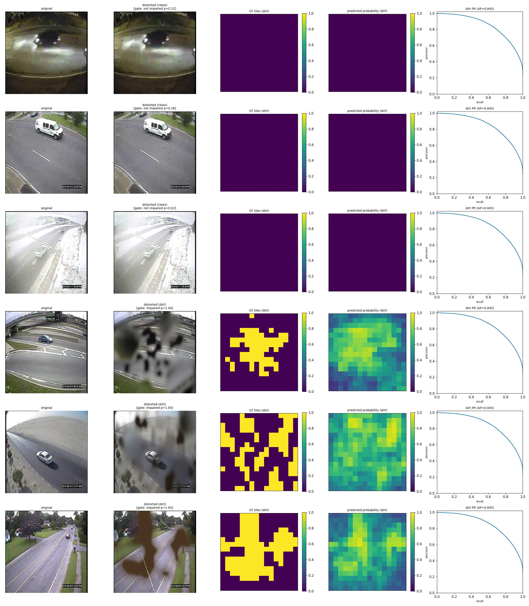

   All 3 genuinely clean rows above (columns 1-2 pixel-identical) are correctly gated
   "not impaired," with the prediction panel (column 4) fully suppressed — dark purple, not
   just low-probability. The 3 real-dirt rows show normal, unsuppressed predictions, correctly
   gated "impaired."

   **Known tradeoff, by design, with a concrete cost measured:** this reintroduces the coupling
   the reporting-only design deliberately avoided — a gate false negative now silently
   suppresses genuine Stage B detections too. It shows up directly in the full-test-split
   (not just clean-image) gated vs. ungated metrics on `stage_b_recal`:

   | class | metric | ungated | gated | Δ |
   |---|---|---|---|---|
   | dirt | F1 / AP / ROC-AUC | .749/.843/.932 | .750/.845/.933 | ~flat |
   | water | F1 / AP / ROC-AUC | .769/.838/.931 | .769/.839/.932 | ~flat |
   | scratch | F1 / AP / ROC-AUC | .624/.634/**.955** | .620/.621/**.915** | ROC-AUC −0.040 |

   Dirt/water are essentially unaffected (most test images are genuinely impaired, so the gate
   correctly leaves them alone) — but scratch's ROC-AUC drops a real 4 points, the clearest
   sign yet that the gate occasionally misses a genuinely-scratched image and silently zeroes
   out an otherwise-correct scratch detection. The gate's own standalone accuracy is very high
   (F1=0.971, AP=0.998, ROC-AUC=0.983 — see
   [`stage_a_final_report.md`](stage_a_final_report.md) §7), so this tradeoff is judged worth
   it given the clean-image FP win above, but it is a real, not just theoretical, cost —
   Stage B's *reported* recall on a genuinely impaired image now depends on the gate agreeing
   it's impaired, not on Stage B's own head alone.

### Sample tile-grid predictions

Ground-truth tile grid (green) overlaid with predicted per-tile probability (red) on real
test-split images:

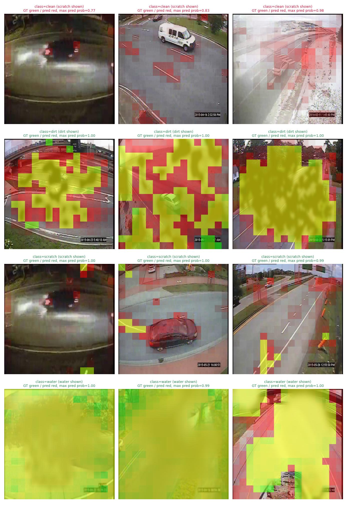
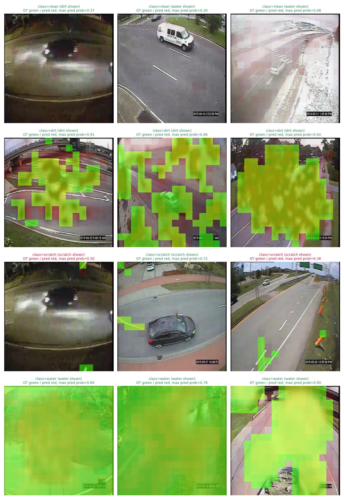

---

## 4a. 5-column report figure (Session 20, supervisor item 1)

The sample-prediction overlay above (green/red alpha-blended on the real photo) is a good
qualitative check but has no way to show an actual probability *value* per tile — color is a
blend of two channels, not a single legible scalar. A second, complementary figure was added
specifically for quantitative per-tile reading:
`scripts/visualize_stage_b_results.py::plot_stage_b_five_column_report`, one row per sample,
5 columns:

1. **Original** — the clean (undistorted) variant of the same source image.
2. **Distorted** — the actual model input.
3. **GT tiles** — the ground-truth tile grid for that sample's class, `imshow(cmap="viridis",
   vmin=0, vmax=1)` with a colorbar (binary: dark purple = 0, yellow = 1).
4. **Predicted probability** — the model's raw, unthresholded per-tile probability for that
   class, same colormap and 0-1 colorbar — so a tile's exact confidence is directly readable,
   not just "red enough to look positive."
5. **PR curve (AUC-PR)** — that class's precision-recall curve, computed once over the whole
   flattened test split and reused for every row of that class (AUC-PR is a whole-split
   statistic, not a per-sample one — recomputing an identical curve per row would be
   pointless), with the AP value annotated.

Paginated at `--rows-per-page` (default 6) rows per file:
`stage_b_full_report{tag}_page{N}.jpg`. See §4b below for how this figure looks once the
impaired-gate head (§ Post-decision follow-ups, option 8) is wired in as `--gate-checkpoint`.

## 4b. General/any-distortion tile channel (Session 20, supervisor item 3)

Supervisor item 3 also asked for the pipeline to reconstruct a general "is *any* class active
here" tile-wise structure from the union of the 3 per-class ones. Read literally ("the union
of all the classes has to reach the initial tile-wise structure"), this is a
**reconstruction/consistency check on the 3 already-trained channels**, not a request for new
supervision — so `src/eval/general_channel.py` derives it rather than training a 4th output:

- `general_tile_labels(tile_labels)`: logical OR across the class axis — ground truth "any
  class active" per tile.
- `general_tile_probs(tile_probs)`: noisy-OR combine of the 3 predicted probabilities,
  `1 - Π(1 - p_c)` (chosen over plain `max(p_c)` since noisy-OR correctly rewards two classes
  each being *moderately* likely at the same tile, which `max` alone under-reports).
- `general_channel_consistency(...)`: a diagnostic, not a loss — fraction of tiles where the
  thresholded per-class OR agrees with the thresholded noisy-OR combine.

A 4th trained channel would only re-learn a deterministic function of 3 channels the model
already predicts well — no new information, at the cost of a new retrain and a new
pos_weight/alpha tuning problem. Kept out of scope unless the derived version turns out to
disagree with the per-class predictions by more than noise (`general_channel_consistency`
exists specifically to check that).

---

## 5. Known limitations

- **Scratch localization improved a lot over the original dataset but dirt/water paid a small
  price**, and the Round 2 threshold recalibration cost water a further, real chunk of F1/AP
  (§4 option 7) — current: dirt F1 0.749, water F1 0.769, scratch F1 0.624 (all tuned
  thresholds, `stage_b_recal`, ungated). Still a coarse signal, not a pixel-precise localizer
  for any class.
- **The gate fixes clean-image false positives but couples the two heads' error rates** (§4
  option 8) — a gate false negative silently zeroes a genuinely correct Stage B detection.
  Measured cost: scratch's gated ROC-AUC drops 0.955→0.915 on the full test split. Not a
  hypothetical tradeoff — a real one, judged worth it given the clean-image FP win, but real.
- **The general/any-distortion tile channel is derived, not independently verified against real
  ambiguous cases** (§4b) — its noisy-OR combine is a reasonable modeling choice, not something
  trained or evaluated against its own ground truth beyond the `general_channel_consistency`
  self-check.
- **Combos now included, but untested against real multi-distortion photos** — same caveat as
  [`stage_a_final_report.md`](stage_a_final_report.md) §5: synthetic combos are covered now,
  real photos with two distortions at once are not.
- **Backbone frozen, purely synthetic data, small pilot dataset** — same caveats as
  [`stage_a_final_report.md`](stage_a_final_report.md) §5, unchanged here since Stage B reuses
  the same backbone and dataset-generation pipeline.
- **Final configuration:** focal loss, α=0.75, γ=2.0, trained on the combo-inclusive,
  recalibrated-threshold dataset (`checkpoints/stage_b_recal/stage_b_head.pt`,
  `data/processed/stage_b_scratch15`, dirt/water/scratch thresholds 0.20/0.25/0.015), gated at
  inference time by `checkpoints/impaired_gate/impaired_gate_head.pt`
  (`src/eval/gate.py::apply_gate`, threshold 0.5).

---

## 6. Reproducing this report

```bash
# canonical (Session 20 Round 2: recalibrated thresholds, focal alpha=0.75, gated at eval time)
python scripts/build_stage_b_dataset.py --source data/raw/mio_tcd/images \
    --out data/processed/stage_b_scratch15 --variants 8 --include-combos \
    --dirt-threshold 0.20 --water-threshold 0.25 --scratch-threshold 0.015
python scripts/evaluate_stage_b.py --checkpoint checkpoints/stage_b_recal/stage_b_head.pt \
    --data data/processed/stage_b_scratch15 --split test --tune-thresholds \
    --gate-checkpoint checkpoints/impaired_gate/impaired_gate_head.pt
python scripts/diagnose_clean_false_positives.py --checkpoint checkpoints/stage_b_recal/stage_b_head.pt \
    --data data/processed/stage_b_scratch15 --split test --tune-thresholds \
    --gate-checkpoint checkpoints/impaired_gate/impaired_gate_head.pt
python scripts/visualize_stage_b_results.py --checkpoint checkpoints/stage_b_recal/stage_b_head.pt \
    --data data/processed/stage_b_scratch15 --split test --log-file stage_b_recal_1821754.out \
    --gate-checkpoint checkpoints/impaired_gate/impaired_gate_head.pt --tag _recal --out-dir docs/images

# threshold diagnostics that motivated the recalibration above
python scripts/diagnose_tile_thresholds.py --effect dirt --n 30
python scripts/diagnose_tile_thresholds.py --effect water --n 30

# earlier loss/dataset comparisons (superseded, kept for reference -- their datasets no longer
# exist locally since data/processed/stage_b_scratch15 was replaced in place by both rebuilds)
python scripts/evaluate_stage_b.py --checkpoint checkpoints/stage_b_combo/stage_b_head.pt \
    --data data/processed/stage_b_scratch15 --split test --tune-thresholds   # pre-recalibration dataset originally
python scripts/evaluate_stage_b.py --checkpoint checkpoints/stage_b_ssd/stage_b_head.pt \
    --data data/processed/stage_b_scratch15 --split test   # pre-combo dataset originally
python scripts/evaluate_stage_b.py --checkpoint checkpoints/stage_b_alpha75/stage_b_head.pt \
    --data data/processed/stage_b --split test
python scripts/threshold_sweep_stage_b.py --checkpoint checkpoints/stage_b/stage_b_head_focal.pt \
    --data data/processed/stage_b
```

All checkpoints (`stage_b_head_bce_baseline.pt`, `stage_b_head_focal.pt`,
`stage_b_alpha75/stage_b_head.pt`, `stage_b_scratch15/stage_b_head.pt`,
`stage_b_ssd/stage_b_head.pt`, `stage_b_combo/stage_b_head.pt`,
`stage_b_recal/stage_b_head.pt`, `impaired_gate/impaired_gate_head.pt`) and the raw job logs
(`stage_b_1799124.out`, `stage_b_1799134_focal.out`, `stage_b_s15_1802973.out`,
`eval_s15_1802985.out`, `stage_b_ssd_1815542.out`, `eval_ssd_1815558.out`,
`stage_b_combo_1815701.out`, `eval_b_combo_1815738.out`, `build_b_recal_1821713.out`,
`stage_b_recal_1821754.out`, `impaired_gate_1821693.out`) exist locally and (job logs and
checkpoints, not the now-replaced dataset) on the FAU HPC `$WORK`. `data/processed/stage_b`
(the original 3%-threshold, single-distortion dataset) is the only dataset still unchanged from
Session 16 — every other Stage B dataset generation since has written to
`data/processed/stage_b_scratch15`, rebuilt three times in place (scratch threshold, then
combos, then dirt/water recalibration). The pre-rebuild α=0.75 checkpoint additionally exists
on Google Drive (see `development_log.md` Session 18) since it was originally trained there.
The dirt/water-recalibration rebuild (§4 option 7) was run on HPC
(`scripts/hpc/build_stage_b_recal.slurm`) rather than locally — the water-droplet effect's
skimage warp made the local build impractically slow (~850/8000 images in 40 minutes).
