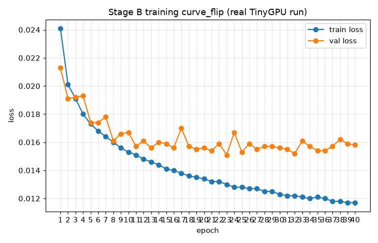
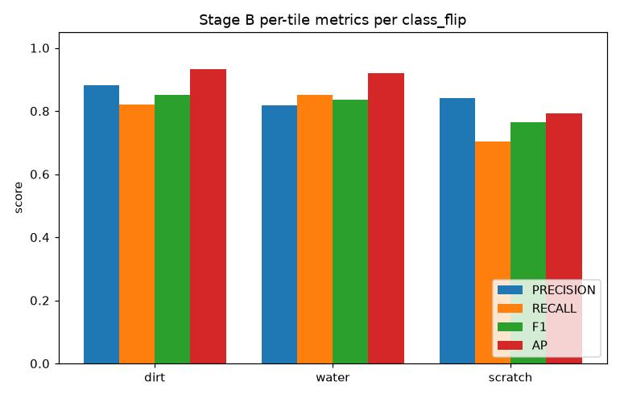
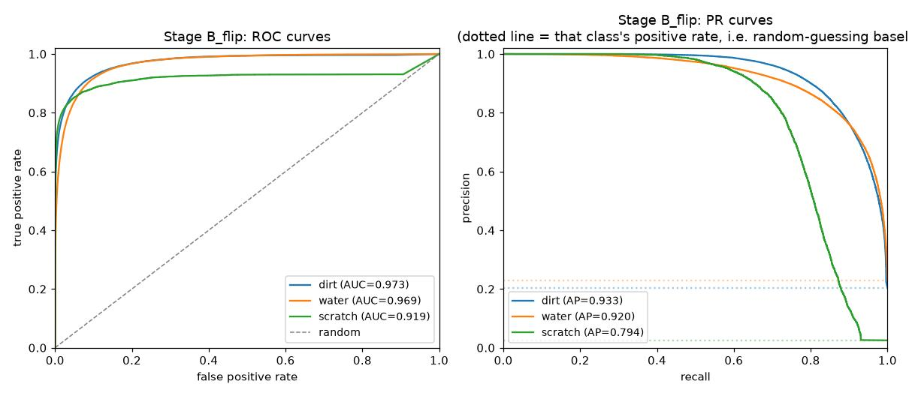
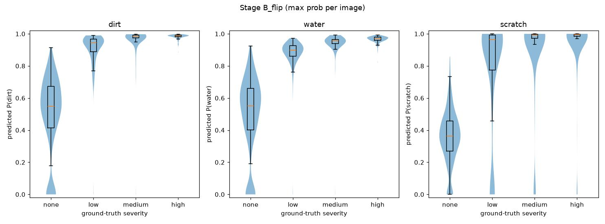
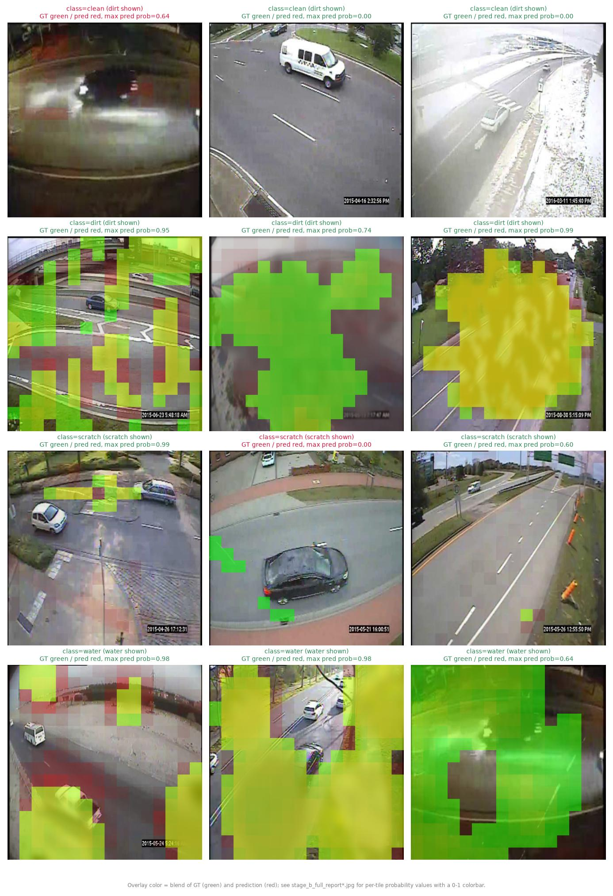
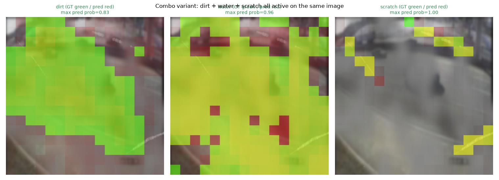
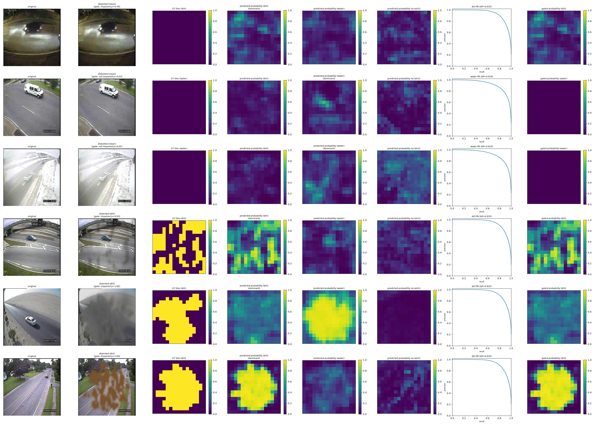
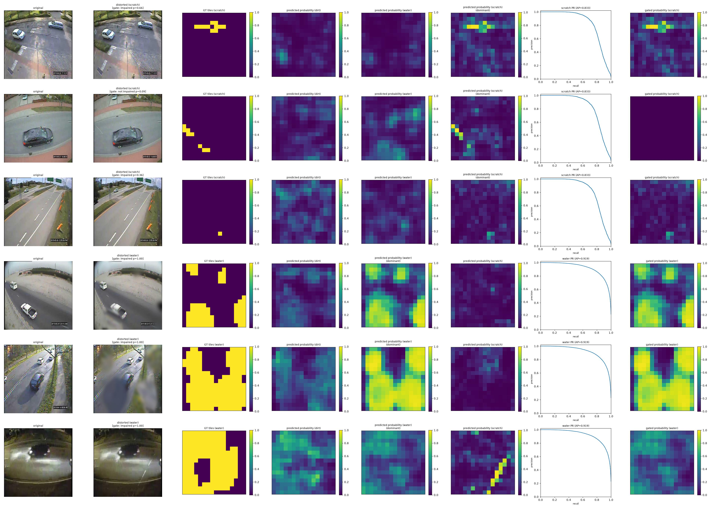

# Stage B Final Report — Tile/Grid Distortion Localization

**Status:** complete. Canonical checkpoint: `checkpoints/stage_b_flip/stage_b_head.pt`
(multi-scale tile head, focal loss α=0.75, γ=2.0, random left-right flips), trained on `data/processed/stage_b`
(14000 images, combo-inclusive, severity-balanced, severity-independent ground truth), gated at
inference time by `checkpoints/impaired_gate_multiscale/impaired_gate_head.pt` at threshold
**0.140** ([`stage_a_final_report.md`](stage_a_final_report.md) §5). The same dataset directory
also carries full-resolution pixel masks (`masks/`), which Stage C
([`stage_c_final_report.md`](stage_c_final_report.md)) trains against. For the full history
(loss-function iteration, threshold diagnostics, every intermediate checkpoint and dataset
rebuild, the Session 22 ground-truth fix, the Session 24 overfitting study), see [`development_log.md`](development_log.md); this
document reports only the current, final result.

---

## 1. Goal

Per `architecture.md` §2, Stage B extends Stage A's whole-image classification to **coarse
spatial localization**: "the feature map is treated as a grid (e.g. 16×16), one classification
output per tile" — so the model can say not just *whether* a distortion is present, but roughly
*where* on the lens, without needing pixel-mask annotation. Same frozen backbone and the same
three classes as Stage A; the output is one prediction per tile instead of one per image.

---

## 2. Pipeline overview

| Step | What | Where |
|---|---|---|
| 1 | Dataset builder (tile-grid ground truth, rasterized from each effect's own pixel mask) | `src/soiling/tile_labels.py`, `src/soiling/dataset_builder.py`, `scripts/build_stage_b_dataset.py` |
| 2 | Model: frozen multi-scale backbone + multi-scale tile head | `src/models/backbone.py`, `src/models/distortion_head.py::StageBMultiScaleHead` |
| 3 | Loss: focal (α=0.75, γ=2.0) | `src/models/losses.py` |
| 4 | Training (random left-right flips, keeps the best-validation epoch) | `scripts/train_stage_b.py --arch multiscale --hflip` |
| 5 | FAU HPC (TinyGPU) submission | `scripts/hpc/stage_b_regularization.sh`, `run_shell.slurm`, `evaluate_stage_b.slurm` |
| 6 | Evaluation (per-tile precision/recall/F1/AP/ROC-AUC, tuned thresholds, gate, per-severity) | `scripts/evaluate_stage_b.py`, `scripts/diagnose_clean_false_positives.py`, `src/eval/` |
| 7 | Visualization (overlay grid + 8-column per-sample report) | `scripts/visualize_stage_b_results.py` |

---

## 3. Key details

### Tile ground truth

Each effect's own full-strength `[0,1]` pixel mask is area-average-pooled to the backbone's P5
grid — **16×16** at `--img-size 512` — and thresholded per tile: **dirt 0.20, water 0.25,
scratch 0.015** (scratch is a thin line and needs a much lower coverage cutoff than dirt/water's
filled regions). Stored as `tile_labels.npy`, `(N, 3, 16, 16)` uint8, row-aligned with
`metadata.csv`. A combo variant can have several classes positive in the same tile.

**Ground truth is severity-independent:** a tile is positive wherever the distortion *is*,
regardless of how faint it is in the image. Severity only changes the image (an alpha-blend
toward the clean photo), so a faint distortion must still be found — the project's explicit
goal. (An earlier version also scaled the mask by the severity alpha, which labeled most of a
faint patch as clean; see `development_log.md` Session 22.)

### Model

`StageBMultiScaleHead`: the frozen YOLOv11-m backbone is tapped at four depths — stride 4, 8, 16
and 32 (P5). Each map is reduced to 64 channels by a 1×1 conv, area-pooled down to the 16×16
tile grid, concatenated, fused by a 3×3 conv and projected to 3 per-tile logits. It is still
exactly one classification output per P5 tile; the difference from a head on P5 alone is that
each tile also sees the finer layers, where faint texture changes are still present. P5 alone
is deep and semantic, and loses most of that signal — the P5-only head reached only 0.20–0.27 AP
on low-severity distortions (§4).

### Layer study and scratch weighting

Identical training (focal α=0.75, 40 epochs, best-validation epoch kept) with different sets of
backbone layers, compared on the **validation** split (AP dirt / water / scratch):

| layers (strides) | AP | mean AP | faint (low-severity) AP | mean faint AP |
|---|---|---|---|---|
| 32 only, same multi-scale head (control) | 0.805 / 0.780 / 0.491 | 0.692 | 0.506 / 0.431 / 0.314 | 0.417 |
| 16 + 32 | 0.898 / 0.888 / 0.733 | 0.840 | 0.717 / 0.667 / 0.577 | 0.654 |
| 8 + 16 + 32 | 0.922 / 0.914 / 0.793 | 0.876 | 0.779 / 0.737 / 0.647 | 0.721 |
| **4 + 8 + 16 + 32 (used)** | **0.932 / 0.921 / 0.822** | **0.892** | **0.806 / 0.775 / 0.691** | **0.757** |
| 2 + 4 + 8 + 16 + 32 | 0.933 / 0.924 / 0.810 | 0.889 | 0.808 / 0.779 / 0.663 | 0.750 |

The control row runs P5 alone through the same bigger head: it beats the original 1×1-conv
head but stays far behind, so the gain comes mainly from the finer layers, not from the head.
Localizing needs finer detail than whole-image classification (Stage A's best set stops at
stride 8); the stride-2 layer adds nothing here, since everything is pooled to 32-px tiles.

Weighting scratch more heavily in the loss (`--class-weights 1,1,2` / `1,1,3`) did not help:
scratch AP 0.820 / 0.825 (unweighted 0.822), while faint-water AP fell to 0.759 / 0.714
(unweighted 0.775). Not adopted.

### Overfitting and augmentation

Without augmentation the head overfits mildly: validation loss bottoms out at epoch 23 of 40
(0.0160) and rises to 0.0173 by epoch 40 while training loss keeps falling. The cause is the
small number of distinct scenes: 11200 training images, but only 800 different source photos
(14 variants each), so the head starts memorizing backgrounds. Keeping the best-validation
epoch already protects the saved model, but it stops at an only moderately trained head.

Each fix was added to the setup above and compared on the **validation** split:

| run | AP | mean AP | faint AP | mean faint AP | val loss: best → epoch 40 |
|---|---|---|---|---|---|
| no regularization (previous) | 0.932 / 0.921 / 0.822 | 0.892 | 0.806 / 0.775 / 0.691 | 0.757 | 0.0160 → 0.0173 |
| weight decay 0.05 (AdamW) | 0.932 / 0.921 / 0.830 | 0.894 | 0.803 / 0.775 / 0.703 | 0.760 | 0.0156 → 0.0172 |
| dropout 0.2 | 0.932 / 0.924 / 0.823 | 0.893 | 0.804 / 0.776 / 0.685 | 0.755 | 0.0158 → 0.0170 |
| **left-right flip (canonical)** | **0.934 / 0.924 / 0.837** | **0.898** | **0.808 / 0.782 / 0.716** | **0.769** | **0.0151 → 0.0158** |
| flip + weight decay | 0.933 / 0.923 / 0.841 | 0.899 | 0.806 / 0.779 / 0.722 | 0.769 | 0.0150 → 0.0160 |
| flip + weight decay + dropout | 0.931 / 0.921 / 0.840 | 0.897 | 0.803 / 0.770 / 0.718 | 0.764 | 0.0153 → 0.0160 |

Weight decay and dropout only delay the overfitting. A random left-right flip (image and tile
labels mirrored together) attacks its cause by showing each scene in two versions, and gives
the lowest validation loss and the best faint-distortion AP. Adding weight decay changes nothing
beyond noise, and dropout costs faint accuracy, so the flip alone is used. Other augmentations
are deliberately not used: brightness/contrast/color changes would alter what a faint
distortion looks like (the label would no longer match), crops or rescaling would break the
fixed tile grid, and a vertical flip is not a realistic camera view.

### Loss and decision threshold

**Focal loss (α=0.75, γ=2.0).** Tile-level class imbalance is severe (scratch tiles ~2%
positive); plain `BCEWithLogitsLoss(pos_weight=...)` over-predicted scratch almost everywhere,
and α=0.75 beat both RetinaNet's default α=0.25 and a sum-of-squared-differences alternative.
Each class gets its own decision threshold, tuned on the val split for best F1
(`src/eval/thresholds.py`), since the three classes' precision/recall curves differ a lot.

### Inference-time gate

The image-level impaired gate ([`stage_a_final_report.md`](stage_a_final_report.md) §5) zeroes
every tile of an image it calls "not impaired" (`src/eval/gate.py::apply_gate`). Its threshold
(**0.140**) is chosen on the val split to keep ≥95% of impaired images
(`evaluate_impaired_gate.py --recall-target 0.95`) — a gate's job is to drop clean images
without discarding real distortions, so best-F1 is the wrong criterion for it. A gate false
negative still silently suppresses a genuine detection; its measured cost is in §4.

---

## 4. Results

HPC job `1823352` (a100), 40 epochs with random left-right flips, best validation loss at
epoch 23 (0.0151); by epoch 40 it has risen only to 0.0158.



**Per-tile metrics (held-out test split, 1400 images, 358400 tiles, tuned thresholds)**



| class | threshold | precision | recall | F1 | AP | ROC-AUC | support | gated F1 | gated AP | gated ROC-AUC |
|---|---|---|---|---|---|---|---|---|---|---|
| dirt | 0.614 | 0.879 | 0.823 | 0.850 | 0.935 | 0.976 | 72748 | 0.850 | 0.933 | 0.973 |
| water | 0.592 | 0.817 | 0.852 | 0.834 | 0.919 | 0.969 | 82441 | 0.835 | 0.920 | 0.969 |
| scratch | 0.547 | 0.839 | 0.733 | 0.782 | 0.833 | 0.980 | 9019 | 0.766 | 0.794 | 0.919 |

The model without flips scored AP 0.934 / 0.916 / 0.820 on the same test split.



**Clean-image false positives** (`diagnose_clean_false_positives.py`: share of the 100 clean
test images with *any* of their 256 tiles above the class threshold — a strict measure):

| class | ungated | gated |
|---|---|---|
| dirt | 23% | **8%** |
| water | 42% | **12%** |
| scratch | 18% | **10%** |

The gate removes most of the clean-image false alarms at almost no cost for dirt and water;
scratch pays the most (gated AP 0.833→0.794), because the gate occasionally misses a
thin scratch.

**Per-severity breakdown** (`--by-severity`, ungated, per tile) — how well are faint
distortions found?

| class | severity | precision | recall | F1 | AP | ROC-AUC | support |
|---|---|---|---|---|---|---|---|
| dirt | low | 0.800 | 0.654 | 0.719 | 0.808 | 0.957 | 25387 |
| dirt | medium | 0.807 | 0.888 | 0.846 | 0.938 | 0.989 | 23960 |
| dirt | high | 0.819 | 0.941 | 0.876 | 0.968 | 0.995 | 23401 |
| water | low | 0.706 | 0.700 | 0.703 | 0.766 | 0.954 | 27252 |
| water | medium | 0.752 | 0.920 | 0.827 | 0.925 | 0.988 | 26524 |
| water | high | 0.803 | 0.934 | 0.864 | 0.958 | 0.992 | 28665 |
| scratch | low | 0.807 | 0.558 | 0.659 | 0.670 | 0.963 | 2769 |
| scratch | medium | 0.806 | 0.765 | 0.785 | 0.841 | 0.988 | 3178 |
| scratch | high | 0.805 | 0.857 | 0.830 | 0.903 | 0.995 | 3072 |

Faint distortions remain the hardest, but the gap is now moderate: low-severity AP is 0.67–0.81
versus 0.89–0.97 at high severity. For comparison, the P5-only head scored against the same
labels reached only 0.27 / 0.24 / 0.20 low-severity AP (dirt / water / scratch) — the
multi-scale features roughly triple it. Without flips the low-severity AP was 0.808 / 0.758 / 0.651.




A multi-distortion (combo) image, one panel per active class — several classes can be
positive in the same tiles:



### Per-sample report figure

`scripts/visualize_stage_b_results.py::plot_stage_b_eight_column_report` — one row per sample:
original / distorted / ground-truth tiles / raw predicted probability (one column per class,
dominant one marked) / PR curve / gated probability. The raw columns and the PR curve always use
ungated predictions; the last column shows the post-gate result for direct comparison.




Strong dirt is localized closely (rows 4 and 6). The grey, fog-like dirt in row 5 is found but
labeled **water** — the dirt and water generators share the same fog-texture family and differ
mainly in color, so the two classes genuinely overlap there (§5). Clean rows show low, noisy
raw probabilities; the gate suppresses the ones it recognizes as clean (rows 2–3), but lets the
dark night scene in row 1 through.

### General/any-distortion tile channel

A derived (not trained) "is *any* class active here" channel (`src/eval/general_channel.py`):
logical OR of the ground truth, noisy-OR `1 - Π(1-p_c)` of the predictions, and
`general_channel_consistency` as a self-check. A 4th trained channel would only re-learn a
deterministic function of the 3 the model already predicts.

---

## 5. Known limitations

- **Faint scratches are the weakest case** — low-severity scratch recall 0.56 (AP 0.67).
- **Dirt vs. water confusion on grey haze.** Both classes draw from the same vendored
  fog/mud texture family (`src/soiling/effects.py::_DIRT_WATER_TEXTURE_MODS`); a grey fog
  layer can legitimately look like either.
- **Clean-image false alarms remain** at 8–12% of clean images even after gating (strict
  any-tile measure), and the gate trades that against occasionally suppressing a real
  detection (scratch gated AP 0.833→0.794).
- **Few distinct scenes.** 800 training photos; the flip reduces the overfitting but does not
  replace more real variety.
- **Synthetic distortions only**, untested against real soiled-lens photos; small pilot
  dataset (1000 source photos) — same caveats as
  [`stage_a_final_report.md`](stage_a_final_report.md) §6.

---

## 6. Reproducing this report

```bash
python scripts/build_stage_b_dataset.py --source data/raw/mio_tcd/images \
    --out data/processed/stage_b --variants 14 --include-combos --include-severity \
    --dirt-threshold 0.20 --water-threshold 0.25 --scratch-threshold 0.015 --save-pixel-masks
python scripts/train_impaired_gate.py --data data/processed/stage_b --arch multiscale \
    --img-size 512 --epochs 20 --device cuda --out checkpoints/impaired_gate_multiscale
python scripts/train_stage_b.py --data data/processed/stage_b --arch multiscale --hflip \
    --epochs 40 --loss focal --focal-alpha 0.75 --focal-gamma 2.0 --device cuda \
    --out checkpoints/stage_b_flip
python scripts/evaluate_stage_b.py --checkpoint checkpoints/stage_b_flip/stage_b_head.pt \
    --data data/processed/stage_b --split test --tune-thresholds --by-severity \
    --gate-checkpoint checkpoints/impaired_gate_multiscale/impaired_gate_head.pt --gate-threshold 0.140
python scripts/diagnose_clean_false_positives.py --checkpoint checkpoints/stage_b_flip/stage_b_head.pt \
    --data data/processed/stage_b --split test --tune-thresholds \
    --gate-checkpoint checkpoints/impaired_gate_multiscale/impaired_gate_head.pt --gate-threshold 0.140
python scripts/visualize_stage_b_results.py --checkpoint checkpoints/stage_b_flip/stage_b_head.pt \
    --data data/processed/stage_b --split test --tune-thresholds \
    --gate-checkpoint checkpoints/impaired_gate_multiscale/impaired_gate_head.pt --gate-threshold 0.140 \
    --log-file stage_b_flip_1823352.out --tag _flip --out-dir docs/images
```

The current builder writes severity-independent ground truth directly. A dataset built before
Session 22 is converted in place with `scripts/make_gt_severity_independent.py --data <dir>`
(which is how the on-disk dataset was produced). `build_b_severity_1822268.out` /
`build_b_pixel_masks_1822558.out` (dataset build), `stage_b_flip_1823352.out` (training) and
`final_b_1823372.out` (test evaluation, clean-image check and figures) are the raw stdout of the
TinyGPU jobs; the overfitting study is `scripts/hpc/stage_b_regularization.sh` (logs
`study_logs/b_reg_*`). The previous model without flips is kept as
`checkpoints/stage_b_multiscale`. Superseded checkpoints and their numbers are in
`docs/development_log.md`.
