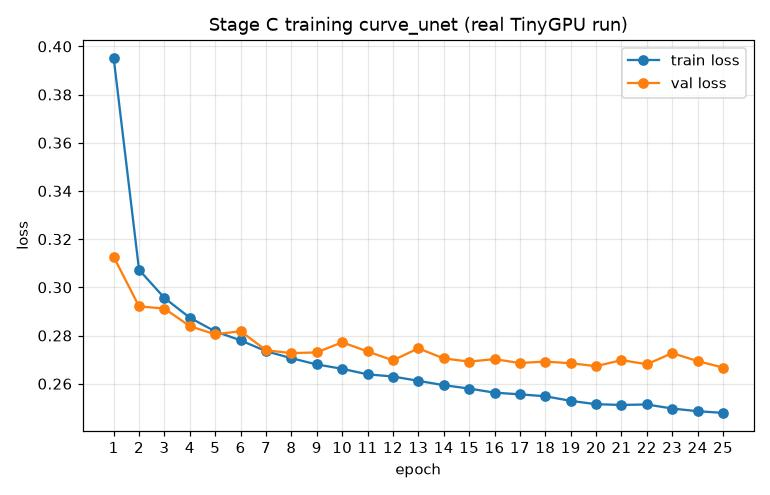
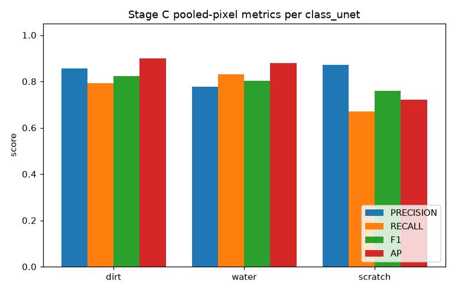
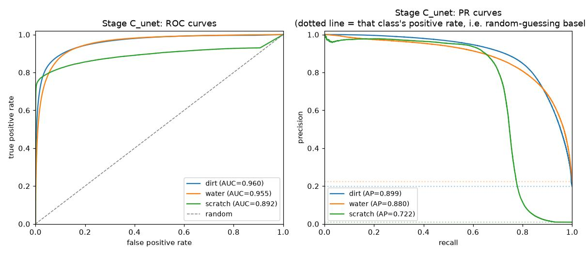
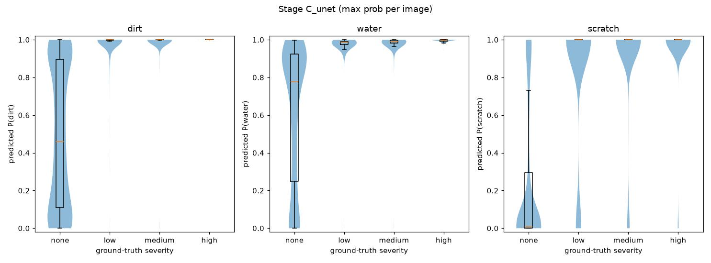
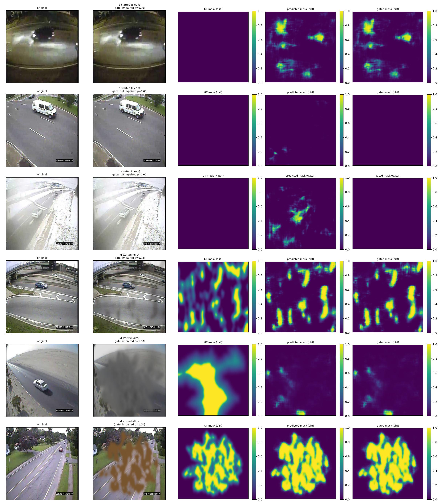
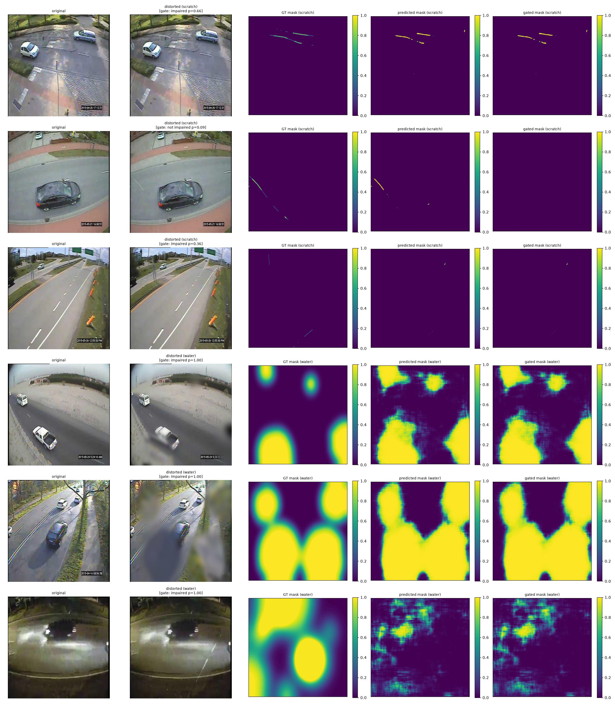

# Stage C Final Report — Pixel-Level Distortion Segmentation

**Status:** complete. Canonical checkpoint: `checkpoints/stage_c_unet/stage_c_head.pt`
(U-Net-style decoder on the frozen backbone, Dice + BCE), trained on the pixel masks of
`data/processed/stage_b_scratch15` (the same 14000 images, splits and severities as Stage B),
gated at inference time by `checkpoints/impaired_gate_multiscale/impaired_gate_head.pt` at
threshold **0.140** ([`stage_a_final_report.md`](stage_a_final_report.md) §5). The full
history — the P5-only v1 decoder, the ground-truth fix, the 50-epoch comparison — is in
[`development_log.md`](development_log.md) Sessions 21–22; this document reports only the
current, final result.

---

## 1. Goal

`architecture.md` §2's third and most precise stage: a "small FCN/UNet-style decoder →
per-pixel classes" that outputs, for every pixel, how likely it is to be covered by dirt,
water or scratch. Loss per `architecture.md` §4: **Dice + BCE**. Same frozen COCO-pretrained
YOLOv11-m backbone as Stages A/B; only the decoder is trained.

---

## 2. Pipeline overview

| Step | What | Where |
|---|---|---|
| 1 | Pixel-mask ground truth, written by the Stage B builder (`--save-pixel-masks`) | `src/soiling/dataset_builder.py`, `scripts/build_stage_b_dataset.py` |
| 2 | Dataset (image + 3-channel mask, both at 512×512) | `src/data/stage_c_dataset.py` |
| 3 | Model: frozen multi-scale backbone + U-Net-style decoder | `src/models/backbone.py`, `src/models/distortion_head.py::StageCUNetHead` |
| 4 | Loss: Dice + BCE (0.5 / 0.5, batch-level Dice) | `src/models/losses.py::DiceBCELoss` |
| 5 | Training (keeps the best-validation epoch) | `scripts/train_stage_c.py --arch unet`, `scripts/hpc/train_stage_c_unet.slurm` |
| 6 | Evaluation (pooled-cell precision/recall/F1/AP/ROC-AUC, tuned thresholds, gate, per-severity) | `scripts/evaluate_stage_c.py`, `scripts/hpc/evaluate_stage_c.slurm` |
| 7 | Visualization (per-sample report at full resolution) | `scripts/visualize_stage_c_results.py` |

---

## 3. Key details

### Ground truth

The distortion effects already produce the exact per-pixel mask behind each synthetic image,
so no annotation or pseudo-labeling is needed. The Stage B builder stores it as
`masks/<image>.png` (one channel per class, 0–255). The mask marks where each distortion is
at full strength, **independent of severity**: a faint patch is labeled as fully present,
because the goal is to find faint distortions too; severity only changes the image.

### Model

`FrozenYOLOBackbone(return_layers=...)` exposes four depths: stride 4 (256 ch), 8, 16 and 32
(P5, 512 ch each). `StageCUNetHead` reduces each to 64 channels (1×1 conv), then works from
coarse to fine: upsample 2×, concatenate the next finer map, 3×3 conv-BN-ReLU. Logits are
predicted at stride 4 and bilinearly upsampled 4× to the 512×512 input. The skip connections
are what make it work: P5's 16×16 grid alone cannot represent a 1–7 px scratch (a P5-only FCN
decoder reached scratch AP 0.17, see `development_log.md`).

### Loss

`DiceBCELoss`: 0.5 × BCE + 0.5 × soft Dice. Dice is summed over the whole batch per class,
not per image — most (image, class) pairs have an empty mask, and per-image Dice on an empty
mask stays near 1 unless every pixel is ~0, pushing the model to under-predict.

### Evaluation

The 367M pixels of the test split are too many for the sort-based AP/ROC-AUC, so both the
probability map and the mask are area-pooled to a **64×64 grid** (8×8-pixel cells) during
evaluation only; training uses full resolution. A cell counts as distorted with the same
per-class coverage cutoffs as a Stage B tile (**dirt 0.20, water 0.25, scratch 0.015**) — a
thin scratch rarely fills half of a cell, so a single 0.5 cutoff would ignore most of it.
Decision thresholds are tuned per class on the val split (best F1). Scratch's tuned
threshold is very low (0.002) because a thin predicted line covers only a small part of each
cell, so its pooled probability is small.

---

## 4. Results

HPC job `1822980` (a100), 25 epochs, ~50 s/epoch, best validation loss at the last epoch
(0.2667). A 50-epoch run reached the same accuracy (mean low-severity AP 0.647 vs 0.645) and
was not adopted.



**Pooled-cell metrics (held-out test split, 1400 images, 5.7M cells, tuned thresholds)**



| class | threshold | precision | recall | F1 | AP | ROC-AUC | support | gated F1 | gated AP | gated ROC-AUC |
|---|---|---|---|---|---|---|---|---|---|---|
| dirt | 0.121 | 0.849 | 0.794 | 0.821 | 0.898 | 0.961 | 1137437 | 0.823 | 0.899 | 0.960 |
| water | 0.260 | 0.771 | 0.831 | 0.800 | 0.878 | 0.954 | 1286477 | 0.803 | 0.880 | 0.955 |
| scratch | 0.002 | 0.866 | 0.702 | 0.775 | 0.756 | 0.947 | 53245 | 0.758 | 0.722 | 0.892 |



The gate leaves dirt and water unchanged and costs scratch some AP (0.756→0.722): when it
wrongly calls a scratched image clean, the whole correct scratch mask is erased.

**Per-severity breakdown** (`--by-severity`, ungated) — how well are faint distortions found?

| class | severity | precision | recall | F1 | AP | ROC-AUC | support |
|---|---|---|---|---|---|---|---|
| dirt | low | 0.718 | 0.621 | 0.666 | 0.728 | 0.933 | 397373 |
| dirt | medium | 0.747 | 0.857 | 0.798 | 0.882 | 0.981 | 373754 |
| dirt | high | 0.764 | 0.917 | 0.834 | 0.917 | 0.990 | 366310 |
| water | low | 0.596 | 0.683 | 0.637 | 0.664 | 0.930 | 425232 |
| water | medium | 0.656 | 0.903 | 0.760 | 0.856 | 0.978 | 414043 |
| water | high | 0.714 | 0.906 | 0.798 | 0.906 | 0.985 | 447202 |
| scratch | low | 0.751 | 0.528 | 0.620 | 0.544 | 0.892 | 16323 |
| scratch | medium | 0.809 | 0.729 | 0.767 | 0.750 | 0.960 | 18841 |
| scratch | high | 0.820 | 0.831 | 0.826 | 0.835 | 0.981 | 18081 |

Faint distortions are found reasonably well for dirt and water (low-severity AP 0.73 / 0.66)
and less well for scratch (0.54, recall 0.53) — a faint, thin line is the hardest target.



### Per-sample report figure

`plot_stage_c_report` — one row per sample: original / distorted (with the gate's verdict) /
ground-truth mask / predicted mask / gated mask, all at full 512×512 resolution.




What the pages show: strong dirt and water patches and clearly visible scratches are traced
closely, including their shape. A large, grey, fog-like dirt layer (page 1, row 5) is barely
marked. A faint scratch (page 2, row 3) is mostly missed. On clean images the model sometimes
predicts blobs (page 1, rows 1 and 3); the gate removes some of these (row 3) but not all
(row 1, a night scene). Page 2, row 2 shows the gate's cost: a correctly segmented scratch
is erased because the gate called the image clean.

---

## 5. Known limitations

- **Faint scratches** remain the weakest case (low-severity AP 0.54, recall 0.53).
- **Large, smooth, grey haze** (fog-like dirt/water textures) is under-segmented, and dirt
  vs. water are sometimes confused there — both classes use the same vendored fog-texture
  family (see [`stage_b_final_report.md`](stage_b_final_report.md) §5).
- **Clean-image false alarms and gate misses.** Some clean images get spurious blobs that the
  gate lets through, and the gate occasionally erases a real, correct scratch mask.
- **Metrics are on 8×8-pixel cells**, not individual pixels (§3); they measure localization
  at that granularity.
- **Synthetic distortions only**; the real camera-pair pseudo-masks `architecture.md` §5
  describes (difference image + threshold/morphology) are not yet tested. Small pilot dataset
  (1000 source photos) — same caveats as the other stages.

---

## 6. Reproducing this report

```bash
python scripts/build_stage_b_dataset.py --source data/raw/mio_tcd/images \
    --out data/processed/stage_b_scratch15 --variants 14 --include-combos --include-severity \
    --dirt-threshold 0.20 --water-threshold 0.25 --scratch-threshold 0.015 --save-pixel-masks
python scripts/train_stage_c.py --data data/processed/stage_b_scratch15 --arch unet \
    --epochs 25 --batch-size 16 --img-size 512 --device cuda --out checkpoints/stage_c_unet
python scripts/evaluate_stage_c.py --checkpoint checkpoints/stage_c_unet/stage_c_head.pt \
    --data data/processed/stage_b_scratch15 --split test --tune-thresholds --by-severity \
    --gate-checkpoint checkpoints/impaired_gate_multiscale/impaired_gate_head.pt --gate-threshold 0.140
python scripts/visualize_stage_c_results.py --checkpoint checkpoints/stage_c_unet/stage_c_head.pt \
    --data data/processed/stage_b_scratch15 --split test --tune-thresholds \
    --gate-checkpoint checkpoints/impaired_gate_multiscale/impaired_gate_head.pt --gate-threshold 0.140 \
    --log-file stage_c_unet_1822980.out --tag _unet --out-dir docs/images
```

The gate is trained as in [`stage_a_final_report.md`](stage_a_final_report.md) §5.
`stage_c_unet_1822980.out` (training), `eval_stage_c_unet_g2_1823057.out` (evaluation) and
`viz_stage_c_g2_1823058.out` (figures) are the raw stdout of the TinyGPU jobs; the v1 decoder
(`checkpoints/stage_c`, `stage_c_1822831.out`) and the 50-epoch run (`checkpoints/
stage_c_unet50`) are kept for comparison.
