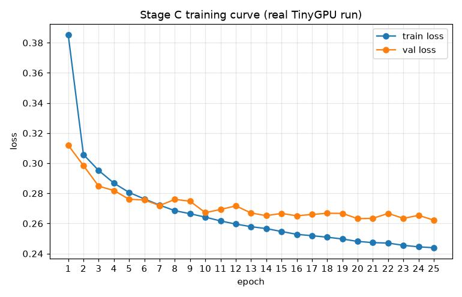
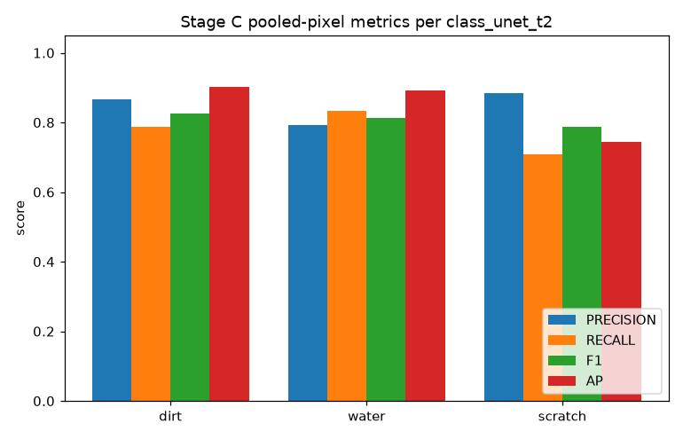
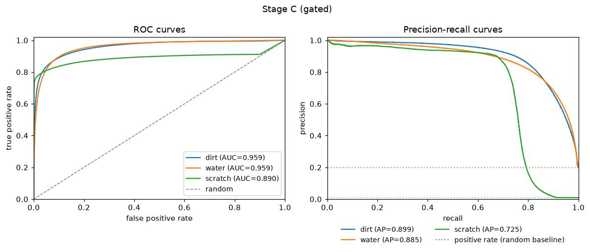
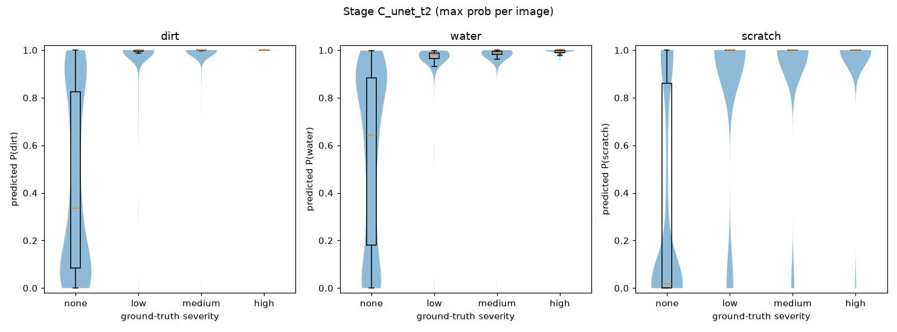
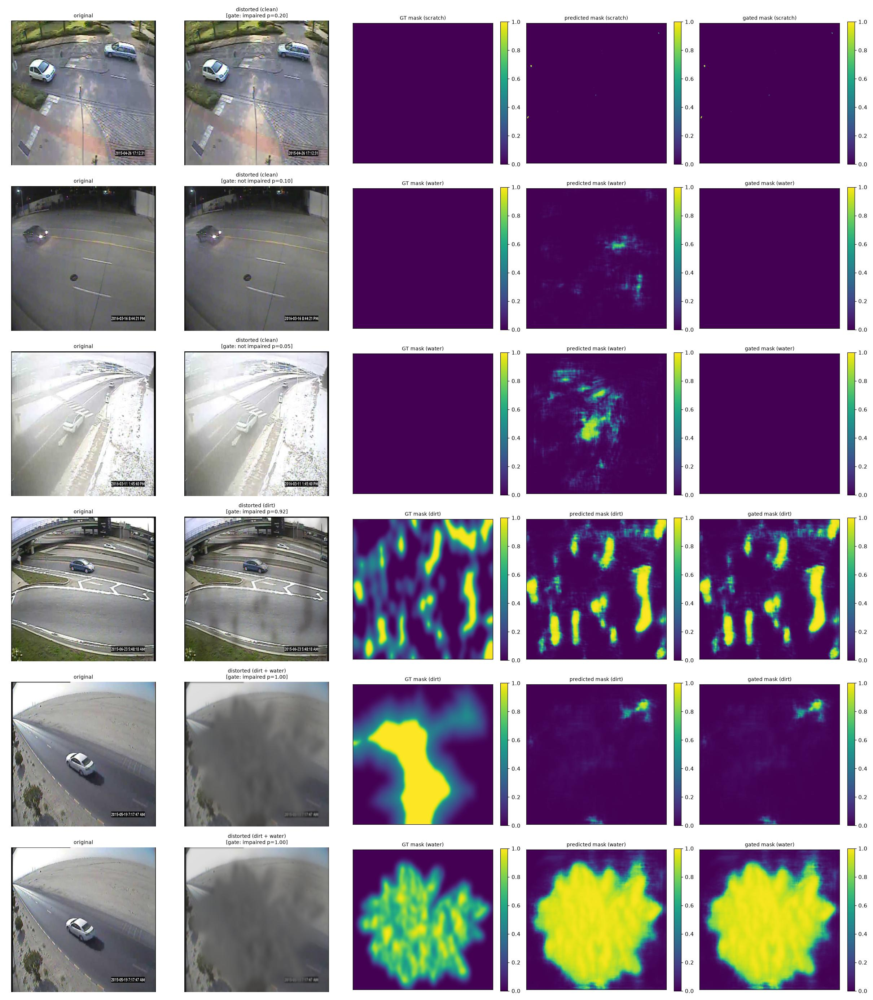
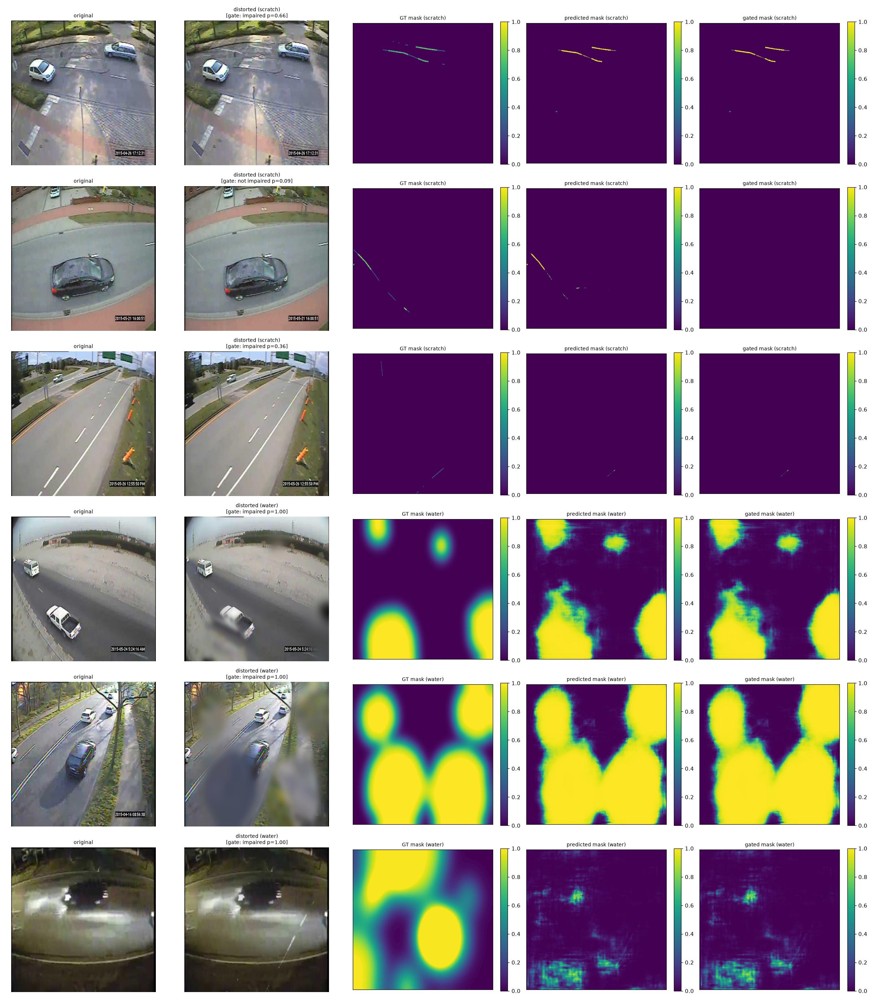

# Stage C Final Report — Pixel-Level Distortion Segmentation

**Status:** complete. Canonical checkpoint: `checkpoints/stage_c_unet_t2/stage_c_head.pt`
(U-Net-style decoder on all five backbone depths, strides 2–32, Dice + BCE), trained on the pixel masks of
`data/processed/stage_b` (the same 14000 images, splits and severities as Stage B),
gated at inference time by `checkpoints/impaired_gate_multiscale/impaired_gate_head.pt` at
threshold **0.140** ([`stage_a_final_report.md`](stage_a_final_report.md) §5). The full
history — the P5-only v1 decoder, the ground-truth fix, the layer study, the scratch-weighting
test — is in [`development_log.md`](development_log.md) Sessions 21–23; this document reports only the
current, final result.

---

## 1. Goal

`architecture.md` §2's third and most precise stage: a "small FCN/UNet-style decoder →
per-pixel classes" that outputs, for every pixel, how likely it is to be covered by dirt,
water or scratch. Loss per `architecture.md` §4: **Dice + BCE**. Same frozen COCO-pretrained
YOLOv11-m backbone as Stages A/B; only the decoder is trained.

---

## 2. Pipeline overview

| Step | What | Where |
|---|---|---|
| 1 | Pixel-mask ground truth, written by the Stage B builder (`--save-pixel-masks`) | `src/soiling/dataset_builder.py`, `scripts/build_stage_b_dataset.py` |
| 2 | Dataset (image + 3-channel mask, both at 512×512) | `src/data/stage_c_dataset.py` |
| 3 | Model: frozen multi-scale backbone + U-Net-style decoder | `src/models/backbone.py`, `src/models/distortion_head.py::StageCUNetHead` |
| 4 | Loss: Dice + BCE (0.5 / 0.5, batch-level Dice) | `src/models/losses.py::DiceBCELoss` |
| 5 | Training (keeps the best-validation epoch) | `scripts/train_stage_c.py --arch unet`, `scripts/hpc/train_stage_c_unet.slurm` |
| 6 | Evaluation (pooled-cell precision/recall/F1/AP/ROC-AUC, tuned thresholds, gate, per-severity) | `scripts/evaluate_stage_c.py`, `scripts/hpc/evaluate_stage_c.slurm` |
| 7 | Visualization (per-sample report at full resolution) | `scripts/visualize_stage_c_results.py` |

---

## 3. Key details

### Ground truth

The distortion effects already produce the exact per-pixel mask behind each synthetic image,
so no annotation or pseudo-labeling is needed. The Stage B builder stores it as
`masks/<image>.png` (one channel per class, 0–255). The mask marks where each distortion is
at full strength, **independent of severity**: a faint patch is labeled as fully present,
because the goal is to find faint distortions too; severity only changes the image.

### Model

The frozen backbone is tapped at five depths (`--taps 2,4,8,16,32`). At 512×512 input:

| stride | backbone layer | map size | channels |
|---|---|---|---|
| 2 | 0 | 256×256 | 64 |
| 4 | 2 | 128×128 | 256 |
| 8 | 4 (P3) | 64×64 | 512 |
| 16 | 6 (P4) | 32×32 | 512 |
| 32 | 10 (P5) | 16×16 | 512 |

`StageCUNetHead` reduces each map to 64 channels (1×1 conv), then works from coarse to fine:
upsample to the next map's size, concatenate that finer map, 3×3 conv-BN-ReLU. Logits are
predicted at stride 2 and bilinearly upsampled 2× to the 512×512 input. The skip connections
are what make it work: P5's 16×16 grid alone cannot represent a 1–7 px scratch (a P5-only FCN
decoder reached scratch AP 0.17, see `development_log.md`).

### Layer study and scratch weighting

Identical training (25 epochs, best-validation epoch kept), compared on the **validation**
split (AP dirt / water / scratch):

| layers (strides) | AP | mean AP | faint (low-severity) AP | mean faint AP |
|---|---|---|---|---|
| 16 + 32 | 0.877 / 0.872 / 0.515 | 0.755 | 0.682 / 0.628 / 0.345 | 0.552 |
| 8 + 16 + 32 | 0.898 / 0.886 / 0.672 | 0.819 | 0.734 / 0.694 / 0.493 | 0.640 |
| 4 + 8 + 16 + 32 (previous) | 0.902 / 0.889 / 0.744 | 0.845 | 0.743 / 0.684 / 0.564 | 0.664 |
| **2 + 4 + 8 + 16 + 32 (canonical)** | **0.907 / 0.896 / 0.775** | **0.859** | **0.758 / 0.703 / 0.601** | **0.687** |

For per-pixel output every finer map helps, and the finest one (stride 2) helps thin
scratches most. Weighting scratch more heavily in the loss (`--class-weights 1,1,2` / `1,1,3`)
raised scratch AP to 0.785 / 0.794 but lowered faint-dirt AP to 0.746 / 0.736, so it was not
adopted — the goal was a scratch gain that costs the other classes nothing.

### Loss

`DiceBCELoss`: 0.5 × BCE + 0.5 × soft Dice. Dice is summed over the whole batch per class,
not per image — most (image, class) pairs have an empty mask, and per-image Dice on an empty
mask stays near 1 unless every pixel is ~0, pushing the model to under-predict.

### Evaluation

The 367M pixels of the test split are too many for the sort-based AP/ROC-AUC, so both the
probability map and the mask are area-pooled to a **64×64 grid** (8×8-pixel cells) during
evaluation only; training uses full resolution. A cell counts as distorted with the same
per-class coverage cutoffs as a Stage B tile (**dirt 0.20, water 0.25, scratch 0.015**) — a
thin scratch rarely fills half of a cell, so a single 0.5 cutoff would ignore most of it.
Decision thresholds are tuned per class on the val split (best F1). Scratch's tuned
threshold is very low (0.004) because a thin predicted line covers only a small part of each
cell, so its pooled probability is small.

---

## 4. Results

HPC job `1823237`, 25 epochs, best validation loss at the last epoch (0.2622). (Training the
previous stride-4–32 model for 50 instead of 25 epochs gave no gain.)



**Pooled-cell metrics (held-out test split, 1400 images, 5.7M cells, tuned thresholds)**



| class | threshold | precision | recall | F1 | AP | ROC-AUC | support | gated F1 | gated AP | gated ROC-AUC |
|---|---|---|---|---|---|---|---|---|---|---|
| dirt | 0.090 | 0.864 | 0.786 | 0.823 | 0.901 | 0.961 | 1137437 | 0.825 | 0.902 | 0.961 |
| water | 0.242 | 0.788 | 0.835 | 0.811 | 0.890 | 0.958 | 1286477 | 0.813 | 0.891 | 0.958 |
| scratch | 0.004 | 0.881 | 0.742 | 0.805 | 0.780 | 0.963 | 53245 | 0.787 | 0.744 | 0.905 |

For comparison, the previous stride-4–32 decoder scored AP 0.898 / 0.878 / 0.756 on the same
test split.



The gate leaves dirt and water unchanged and costs scratch some AP (0.780→0.744): when it
wrongly calls a scratched image clean, the whole correct scratch mask is erased.

**Per-severity breakdown** (`--by-severity`, ungated) — how well are faint distortions found?

| class | severity | precision | recall | F1 | AP | ROC-AUC | support |
|---|---|---|---|---|---|---|---|
| dirt | low | 0.755 | 0.601 | 0.669 | 0.735 | 0.934 | 397373 |
| dirt | medium | 0.778 | 0.855 | 0.815 | 0.892 | 0.982 | 373754 |
| dirt | high | 0.795 | 0.917 | 0.852 | 0.927 | 0.991 | 366310 |
| water | low | 0.639 | 0.672 | 0.655 | 0.686 | 0.936 | 425232 |
| water | medium | 0.694 | 0.912 | 0.788 | 0.885 | 0.983 | 414043 |
| water | high | 0.762 | 0.918 | 0.833 | 0.930 | 0.990 | 447202 |
| scratch | low | 0.769 | 0.556 | 0.645 | 0.557 | 0.923 | 16323 |
| scratch | medium | 0.826 | 0.776 | 0.800 | 0.772 | 0.977 | 18841 |
| scratch | high | 0.828 | 0.875 | 0.851 | 0.852 | 0.990 | 18081 |

Faint distortions are found reasonably well for dirt and water (low-severity AP 0.74 / 0.69)
and less well for scratch (0.56, recall 0.56) — a faint, thin line is the hardest target.



### Per-sample report figure

`plot_stage_c_report` — one row per sample: original / distorted (with the gate's verdict) /
ground-truth mask / predicted mask / gated mask, all at full 512×512 resolution.




What the pages show: strong dirt and water patches and clearly visible scratches are traced
closely, including their shape. A large, grey, fog-like dirt layer (page 1, row 5) is barely
marked. A faint scratch (page 2, row 3) is mostly missed. Clean images get few false marks: a
tiny spurious scratch spot on a night scene (page 1, row 1), and water blobs on a snowy scene
that the gate removes (row 3). Page 2, row 2 shows the gate's cost: a correctly segmented
scratch is erased because the gate called the image clean.

---

## 5. Known limitations

- **Faint scratches** remain the weakest case (low-severity AP 0.56, recall 0.56). Weighting
  scratch in the loss improves it slightly but costs faint-dirt accuracy (§3), so it is not used.
- **Large, smooth, grey haze** (fog-like dirt/water textures) is under-segmented, and dirt
  vs. water are sometimes confused there — both classes use the same vendored fog-texture
  family (see [`stage_b_final_report.md`](stage_b_final_report.md) §5).
- **Clean-image false alarms and gate misses.** Some clean images get spurious marks that the
  gate lets through, and the gate occasionally erases a real, correct scratch mask.
- **Metrics are on 8×8-pixel cells**, not individual pixels (§3); they measure localization
  at that granularity.
- **Synthetic distortions only**; the real camera-pair pseudo-masks `architecture.md` §5
  describes (difference image + threshold/morphology) are not yet tested. Small pilot dataset
  (1000 source photos) — same caveats as the other stages.

---

## 6. Reproducing this report

```bash
python scripts/build_stage_b_dataset.py --source data/raw/mio_tcd/images \
    --out data/processed/stage_b --variants 14 --include-combos --include-severity \
    --dirt-threshold 0.20 --water-threshold 0.25 --scratch-threshold 0.015 --save-pixel-masks
python scripts/train_stage_c.py --data data/processed/stage_b --arch unet --taps 2,4,8,16,32 \
    --epochs 25 --batch-size 16 --img-size 512 --device cuda --out checkpoints/stage_c_unet_t2
python scripts/evaluate_stage_c.py --checkpoint checkpoints/stage_c_unet_t2/stage_c_head.pt \
    --data data/processed/stage_b --split test --tune-thresholds --by-severity \
    --gate-checkpoint checkpoints/impaired_gate_multiscale/impaired_gate_head.pt --gate-threshold 0.140
python scripts/visualize_stage_c_results.py --checkpoint checkpoints/stage_c_unet_t2/stage_c_head.pt \
    --data data/processed/stage_b --split test --tune-thresholds \
    --gate-checkpoint checkpoints/impaired_gate_multiscale/impaired_gate_head.pt --gate-threshold 0.140 \
    --log-file stage_c_unet_t2_1823237.out --tag _unet_t2 --out-dir docs/images
```

The gate is trained as in [`stage_a_final_report.md`](stage_a_final_report.md) §5. The layer
study and weighting runs are `scripts/hpc/layer_study.sh` (logs in `study_logs/`).
`stage_c_unet_t2_1823237.out` (training) and `final_c_1823301.out` (test evaluation and
figures) are the raw stdout of the TinyGPU jobs; earlier decoders (`checkpoints/stage_c`,
`checkpoints/stage_c_unet`, `checkpoints/stage_c_unet50`) are kept for comparison.
