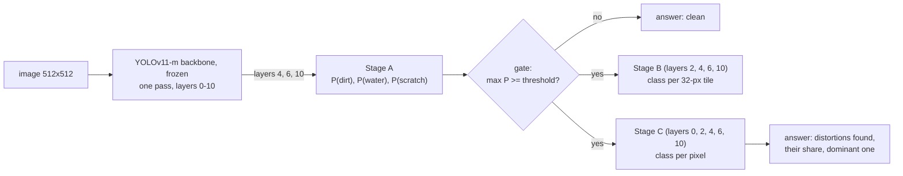
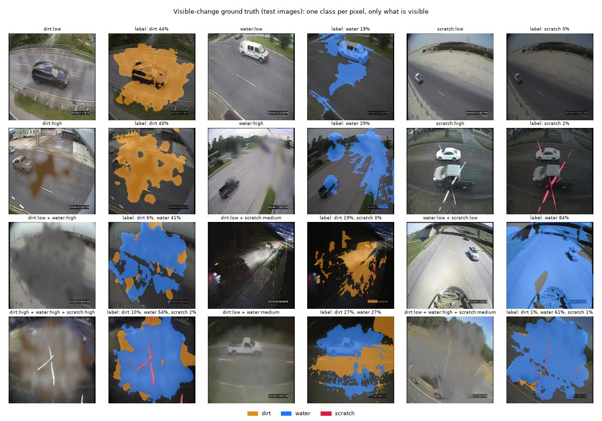
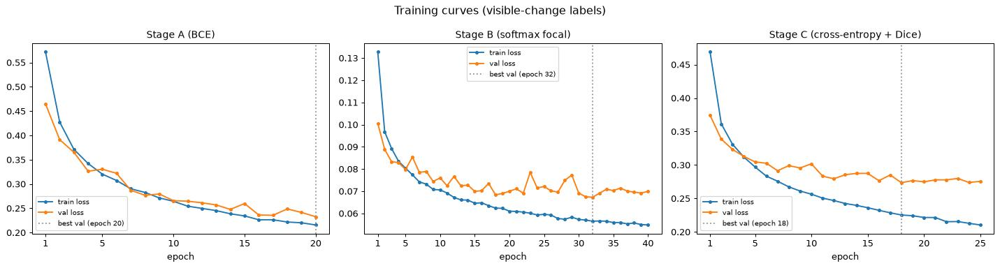
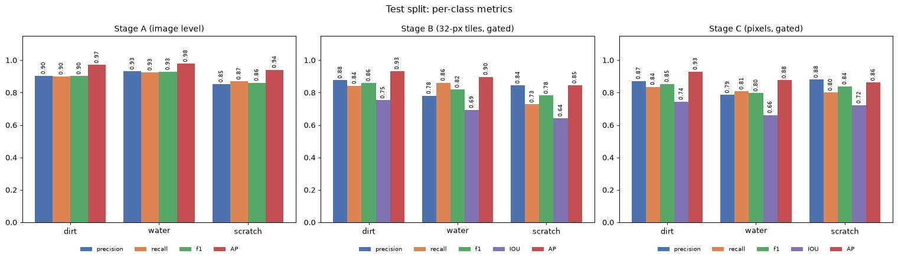
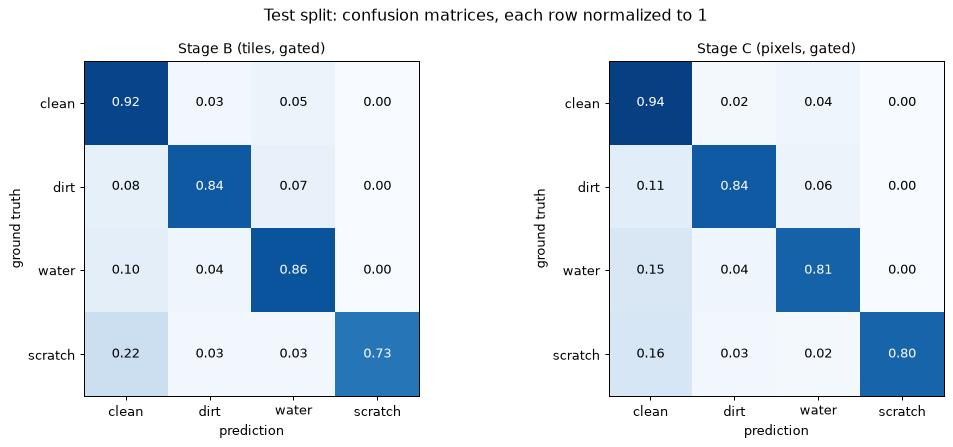
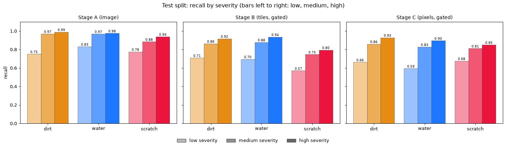
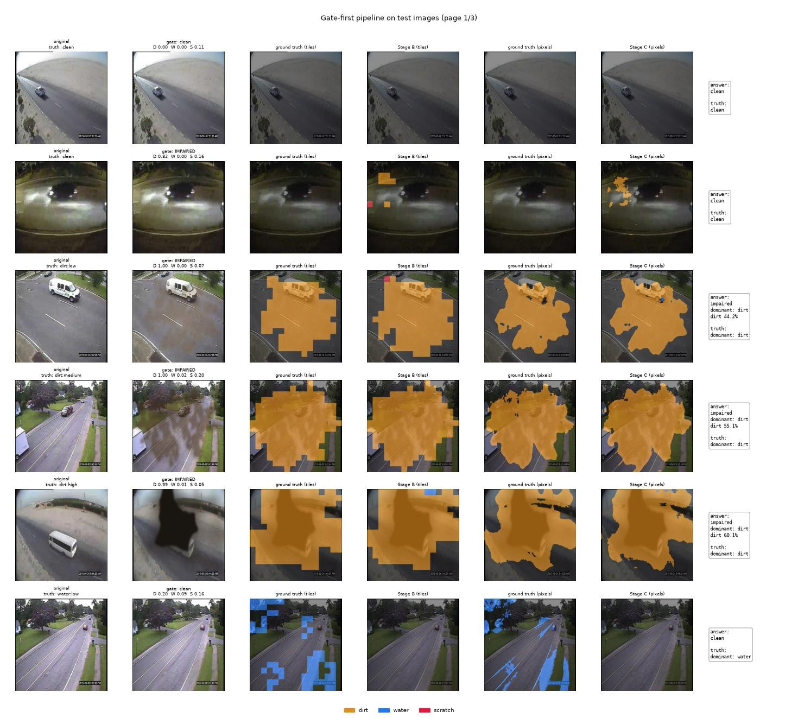
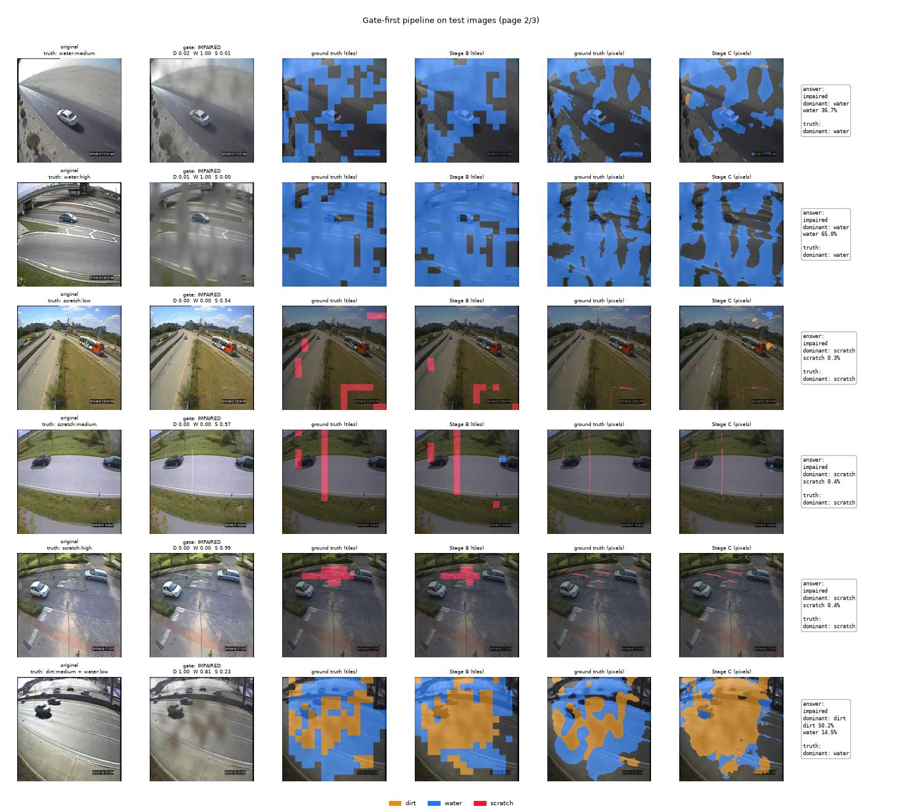
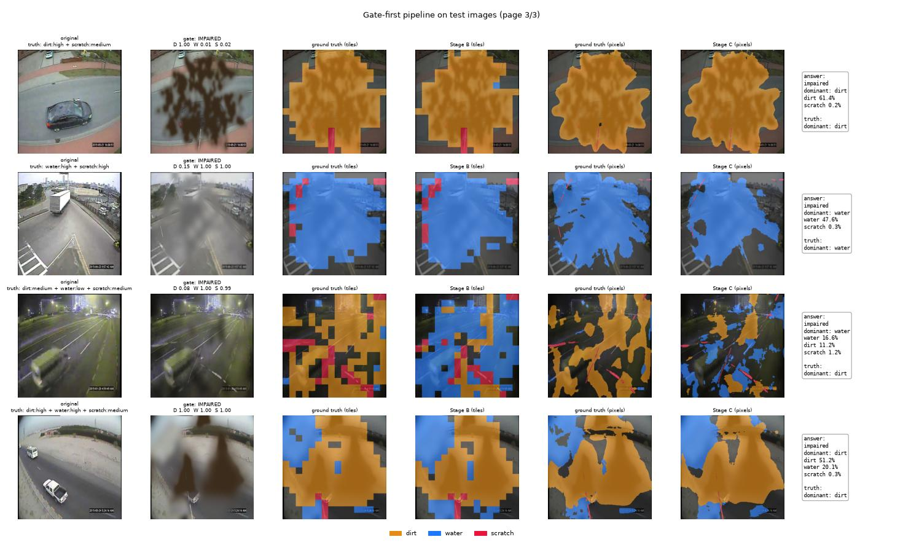

# Gate-first pipeline with visible-change labels — report

**Status:** complete (Session 27). Canonical models: `checkpoints/visible_a_w` (Stage A, also the
gate), `checkpoints/visible_b_w` (Stage B), `checkpoints/visible_c_v` (Stage C); decision
settings in `checkpoints/visible_pipeline.json`. Dataset: `data/processed/visible` (built as
`data/processed/visible_1835773` on the HPC). This design replaces the multi-label Stages A/B/C
of [`stage_a_final_report.md`](stage_a_final_report.md),
[`stage_b_final_report.md`](stage_b_final_report.md) and
[`stage_c_final_report.md`](stage_c_final_report.md), which stay as the record of how the
heads, layers and losses were chosen.

---

## 1. What changed and why

The earlier stages predicted three independent yes/no maps (dirt, water, scratch) and applied
the impaired gate afterwards. Two things did not match the intended design:

1. **The gate was not first.** It zeroed Stage B/C outputs post hoc instead of deciding
   whether B and C run at all.
2. **Overlapping distortions had two labels.** Where dirt lay under water, both were labeled,
   even when the dirt was completely hidden. The report figures then showed one row per class
   for the same image, and nothing named the dominant distortion.

The new design:



- **Stage A is the gate.** "Impaired" means "some distortion is present", which is exactly
  what Stage A predicts. The separate gate head was the weakest model (35% of clean images let
  through at 94% recall), was trained on only one clean image in 14, and its post-hoc use
  erased faint scratches (Stage C scratch AP 0.769 → 0.725). The gate is now
  max(P(dirt), P(water), P(scratch)) ≥ threshold, set on the validation split so that 98% of
  impaired images pass (faint distortions must not be lost here).
- **One class per location.** Stages B and C predict clean / dirt / water / scratch with a
  4-class softmax. Each tile and each pixel gets the one distortion that is visible there.
- **Colored class maps** (dirt orange, water blue, scratch red) and an **image-level answer**
  computed from the pixel map: every distortion covering at least 0.05% of the image, with its
  share, and the dominant one (largest visible area).
- **One backbone pass.** All heads read the same frozen 512-px backbone pass (Stage A moved from
  640 to 512 px).
- **One dataset** for all stages, so Stage A's "which distortions are present" means exactly
  the same as the maps.

---

## 2. Visible-change ground truth

The label of a pixel is the distortion that is **actually visible** there, measured from the
rendered image rather than taken from the generator's soft masks (`src/soiling/visible_labels.py`).

1. **Reproducible generator.** The vendored texture code calls `pythonperlin.perlin(seed=None)`,
   which reseeds numpy from operating-system entropy on every call. That was why dirt and water
   could never be re-rendered exactly (noted since Session 6). `src/soiling/effects.py` now
   passes a seed drawn from the already-seeded numpy state: the same seed gives the identical
   image, and an effect's shape does not depend on the image it is drawn on.
2. **Each effect's visible contribution.** For every distortion in an image, the image is
   rendered again without it (the others with their recorded seeds). The pixel-wise difference
   between the real image and that re-render — largest change over the color channels, lightly
   smoothed — is how much that distortion changes each pixel. A layer hidden under a later one
   (dirt under a thick water film) changes almost nothing; one on top, or seen through a
   transparent droplet, changes a lot. The contribution only counts near the effect's own mask
   (mask > 0.02, dilated 7 px), which excludes the thin-water renderer's faint 20% film over the
   whole frame.
3. **Label.** Each pixel gets the distortion with the largest contribution, if that exceeds
   **10 gray levels** (the same visibility cutoff as the Session 26 label audit), otherwise
   clean. A visible scratch — always the top layer, and thin — wins over the dirt or water
   under it. Clean-up: gaps up to 5 px within a class are closed, regions under 32 px removed,
   clean holes under 64 px filled.
4. **Tiles** (Stage B): each class's area share of a 32-px tile is compared with its own
   cutoff (dirt 0.20, water 0.25, scratch 0.015 — a thin line needs far less area); the tile
   takes the class that exceeds its cutoff by the largest factor, else clean.
5. **Image labels** (Stage A): a class is present if at least 20 pixels carry it; the dominant
   class is the one with the largest area.

Consequences, by design: a hidden layer disappears from the labels; a faint haze is labeled
where it visibly changes the image (edges, cars, bright sky) but not over flat asphalt where it
changes nothing; a faint distortion is labeled wherever it is visible, so the faint-distortion
goal stays measurable.



**Dataset** (`scripts/build_visible_dataset.py`, HPC job `1835773`, 58 min on 16 cores):
14000 images from the same 1000 MIO-TCD photos, splits (by photo) 11200 / 1400 / 1400, 14
variants per photo (clean; dirt, water, scratch at low / medium / high severity; the 4
combinations). Per split:

| split | images | clean (nothing visible) | with visible dirt / water / scratch |
|---|---|---|---|
| train | 11200 | 843 | 4797 / 4800 / 4734 |
| val | 1400 | 104 | 599 / 600 / 593 |
| test | 1400 | 100 | 600 / 600 / 597 |

Every applied effect was visible when it was drawn (Session 26 rule), so the images that differ
from 4800 / 600 lost the class later: dirt fully hidden under water (3 in train), or a faint
scratch with fewer than 20 visible pixels left after the clean-up (66 in train). Share of all training
pixels: clean 65.6%, dirt 17.9%, water 16.3%, **scratch 0.18%**; of training tiles: clean
58.2%, dirt 20.8%, water 19.0%, scratch 2.0%.

---

## 3. Models and training

| Stage | Backbone layers (strides) | Head | Output | Loss |
|---|---|---|---|---|
| A (+ gate) | 4, 6, 10 (8–32) | GAP per layer → FC(64) → FC(3) | P(dirt), P(water), P(scratch) | BCE with `pos_weight` |
| B | 2, 4, 6, 10 (4–32) | 32-ch laterals → pool to 16×16 → 3×3 fuse | 4 classes per tile | softmax focal (γ 2), class weights ∝ 1/√frequency |
| C | 0, 2, 4, 6, 10 (2–32) | U-Net decoder, predicts at stride 2 | 4 classes per pixel | class-weighted cross-entropy + Dice |

The layers, head sizes, flips for Stage B and epoch counts are the ones chosen in Sessions
23–25. The class weights (clean / dirt / water / scratch) are 0.41 / 0.68 / 0.71 / 2.21 for
tiles and 0.17 / 0.32 / 0.34 / 3.17 for pixels: scratch is 0.2% of all pixels.

**Decision settings (validation split, `checkpoints/visible_pipeline.json`):** Stage A's
per-class thresholds (best F1), the gate threshold (98% of impaired images kept) and, for the
tile and pixel maps, a per-class offset added to the log-probabilities before taking the most
likely class (best mean F1 of the three distortion classes). The class weights make the
networks lean toward rare classes; the offsets remove that lean at decision time. Without them,
Stage B marked a scratch tile on 57% of clean images (300-image check). Finally, the answer's
**minimum share** per class: the smallest share of the pixel map that counts a distortion as
found (best F1 per class for "is this distortion in the image").

| Stage | job | GPU | epochs | best epoch (val loss) | time per epoch |
|---|---|---|---|---|---|
| A | `1835836` | rtx3080 / rtx2080ti (`work`) | 20 | 20 (0.233) | 35 s |
| B | `1835837` | `work` | 40 | 32 (0.067) | 36 s |
| C | `1835902` | V100 | 25 | 18 (0.274) | 110 s |



Stage A's validation loss follows the training loss to the last epoch. Stage B and C level off
on validation (B after ~20 epochs, C after ~12) while the training loss keeps falling — the
same mild overfitting as in Session 24, from the limited number of distinct scenes (800
training photos); the checkpoint of the best validation epoch is kept.

---

## 4. Results (test split, 1400 images)

All decision settings were tuned on the validation split (§3): gate threshold 0.278; tile
offsets −0.2 / 0.0 / −0.8 and pixel offsets −0.4 / −0.8 / −2.6 (dirt / water / scratch, added to
the log-probabilities); minimum share of the pixel map for the answer: dirt 10%, water 5%,
scratch 0.07% of the image. The test split has 1300 images with a visible distortion and 100
without.

### 4.1 Stage A and the gate

| class | threshold | precision | recall | F1 | AP | faint (low severity) recall / AP |
|---|---|---|---|---|---|---|
| dirt | 0.318 | 0.903 | 0.900 | 0.902 | 0.971 | 0.751 / 0.836 |
| water | 0.422 | 0.931 | 0.925 | 0.928 | 0.978 | 0.832 / 0.878 |
| scratch | 0.440 | 0.852 | 0.869 | 0.861 | 0.941 | 0.776 / 0.757 |

**Gate** (max of the three probabilities; ROC-AUC 0.938). The threshold is a trade-off between
losing faint distortions and letting clean images through; it is set on validation and
measured on test:

| validation recall target | threshold | impaired kept | faint kept | clean passed |
|---|---|---|---|---|
| 0.90 | 0.675 | 90.8% | 84.2% | 23% |
| 0.95 | 0.468 | 95.0% | 90.8% | 44% |
| **0.98 (used)** | **0.278** | **98.5%** | **97.4%** | **70%** |
| 0.99 | 0.172 | 99.4% | 99.1% | 81% |

The 98% setting keeps almost every faint distortion; clean images that pass the gate are
handled by the maps and the answer's minimum shares (§4.4). As a pure clean-image filter, the
separate gate head was better (35% passed at 94% kept), but it lost faint scratches.

### 4.2 Stage B — class per 32-px tile (gated)

| class | precision | recall | F1 | IoU | AP |
|---|---|---|---|---|---|
| dirt | 0.877 | 0.842 | 0.859 | 0.753 | 0.933 |
| water | 0.781 | 0.861 | 0.819 | 0.694 | 0.898 |
| scratch | 0.845 | 0.727 | 0.782 | 0.642 | 0.845 |

### 4.3 Stage C — class per pixel (gated, every pixel of the 512×512 image)

| class | precision | recall | F1 | IoU | AP |
|---|---|---|---|---|---|
| dirt | 0.872 | 0.836 | 0.854 | 0.745 | 0.930 |
| water | 0.786 | 0.808 | 0.797 | 0.662 | 0.878 |
| scratch | 0.881 | 0.800 | 0.839 | 0.722 | 0.862 |





The confusion matrices show where the errors are: mostly a distortion's edge called clean (or
the reverse), and dirt and water taken for each other (4–7% of their pixels or tiles) — both are
fog-like textures and overlap in combinations. Scratch is rarely confused with anything but
clean. The gate changes the overall Stage B/C metrics by at most 0.005, since nearly every impaired image
passes it.

**Per severity** (recall; the full table with F1 and AP is in `results/visible_eval.json`):

| class | Stage A low / med / high | Stage B low / med / high | Stage C low / med / high |
|---|---|---|---|
| dirt | 0.75 / 0.97 / 0.99 | 0.71 / 0.86 / 0.92 | 0.66 / 0.86 / 0.93 |
| water | 0.83 / 0.97 / 0.98 | 0.70 / 0.88 / 0.94 | 0.60 / 0.83 / 0.90 |
| scratch | 0.78 / 0.88 / 0.94 | 0.57 / 0.75 / 0.80 | 0.68 / 0.81 / 0.85 |



Faint distortions remain the hardest at every level. Faint water at pixel level (recall 0.60)
is the weakest case: a thin film changes the image only slightly and in patches, and those
patches are what the labels mark. Stage C finds faint scratches better than Stage B (0.68 vs
0.57): a thin line covers little of a 32-px tile.

### 4.4 The image-level answer

| measure | value |
|---|---|
| impaired vs. clean correct (1400 images) | 95.5% |
| clean images answered "clean" | 95% |
| dominant distortion correct (1300 impaired images) | **91.8%** — faint 80.9%, medium 95.3%, strong 98.3% |
| exact set of distortions correct | 85.4% |
| "dirt / water / scratch present" — precision / recall / F1 | 0.99 / 0.88 / 0.93 · 0.97 / 0.93 / 0.95 · 0.97 / 0.89 / 0.93 |

The minimum shares matter: counting every pixel of the map as "found", the same models answer
only 33% of clean images "clean" and get the exact set right for 28% of images (dominant
distortion 86.8%) — small stray regions add distortions that are not there. Dirt needs 10% of
the image because false dirt regions on clean night scenes reach a few percent; a real dirt
patch smaller than that is not named in the answer (dirt recall 0.88) but is still drawn in the
maps.

### 4.5 Per-image results

Each row: the original photo / the distorted image with the gate's decision and Stage A's
probabilities / tile ground truth / Stage B / pixel ground truth / Stage C / the answer next to
the truth. Two clean images, each distortion alone at every severity, and every combination.





What the pages show: strong dirt, water and scratches are mapped closely at both levels, also in
combinations (page 3, rows 1, 2 and 4: the answer names the dominant distortion and lists the
others). Errors visible on the pages: a faint water film passed by the gate as clean (page 1,
row 6); a clean night scene that passes the gate and gets a small false dirt region in the maps
(page 1, row 2 — below dirt's minimum share, so the answer is "clean"); and a night image with
faint dirt, faint water and scratches where dirt and water are partly swapped and the answer
names water instead of dirt (page 3, row 3).

---

## 5. Limitations

- **Labels are only as visible as 10 gray levels.** A faint haze over flat road is labeled clean
  because it changes nothing there; the model is neither rewarded nor penalized for it.
- **Faint water** is the weakest pixel-level case (recall 0.60), and **dirt vs. water** remain the
  most frequent confusion.
- **The gate passes 70% of clean images** at the setting that keeps 97% of faint distortions; the
  answer's minimum shares then bring false "impaired" answers down to 5% of clean images, but
  only because small regions are ignored — a real dirt patch under 10% of the image is not named
  in the answer (it is still drawn in the maps).
- **Stages B and C overfit mildly** (§3); more distinct scenes would help.
- Numbers are **not directly comparable** with the earlier multi-label reports: the labels, the
  task (one class per location) and the measures (per-pixel instead of 8×8 cells) changed.

---

## 6. Reproduction

```bash
python scripts/build_visible_dataset.py --source data/raw/mio_tcd/images --out data/processed/visible --workers 16
python scripts/train_visible.py --stage a --data data/processed/visible --device cuda --out checkpoints/visible_a_w
python scripts/train_visible.py --stage b --data data/processed/visible --device cuda --out checkpoints/visible_b_w
python scripts/train_visible.py --stage c --data data/processed/visible --device cuda --out checkpoints/visible_c_v
python scripts/evaluate_visible.py --data data/processed/visible \
    --a checkpoints/visible_a_w/stage_a_head.pt --b checkpoints/visible_b_w/stage_b_head.pt \
    --c checkpoints/visible_c_v/stage_c_head.pt --device cuda \
    --config checkpoints/visible_pipeline.json --out-json results/visible_eval.json
python scripts/visualize_visible.py --data data/processed/visible \
    --a checkpoints/visible_a_w/stage_a_head.pt --b checkpoints/visible_b_w/stage_b_head.pt \
    --c checkpoints/visible_c_v/stage_c_head.pt --config checkpoints/visible_pipeline.json \
    --results results/visible_eval.json \
    --logs visible_a_w_1835836.out,visible_b_w_1835837.out,visible_c_v_1835902.out --out-dir docs/images
```

On TinyGPU: `scripts/hpc/train_visible.sh` and `scripts/hpc/evaluate_visible.sh`. Job logs:
`build_visible_1835773.out` (dataset), `visible_a_w_1835836.out`, `visible_b_w_1835837.out`,
`visible_c_v_1835902.out` (training), `eval_visible_1835912.out` (evaluation and figures).

Using the pipeline in code:

```python
from src.pipeline import DistortionPipeline
pipe = DistortionPipeline("checkpoints/visible_a_w/stage_a_head.pt", "checkpoints/visible_b_w/stage_b_head.pt",
                          "checkpoints/visible_c_v/stage_c_head.pt", config="checkpoints/visible_pipeline.json")
result = pipe.predict(images)[0]   # images: (N, 3, 512, 512) RGB in [0, 1]
result["answer"]      # {"impaired": True, "dominant": "water", "shares": {"water": 0.41, "dirt": 0.06}}
result["pixel_map"]   # (512, 512) 0 clean / 1 dirt / 2 water / 3 scratch; tile_map (16, 16)
```
